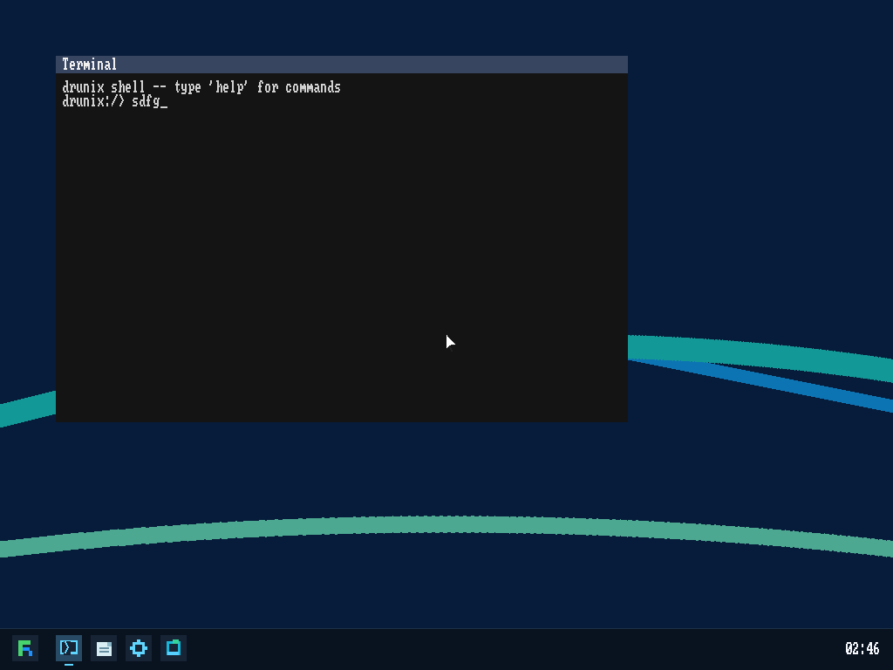

# Drunix

## Project Summary

Drunix is a 32-bit x86 hobby operating system that boots through GRUB2 with the Multiboot1 protocol and runs a freestanding C kernel. The kernel provides protected-mode interrupt handling, paging, a physical and heap allocator, ATA disk I/O, a DUFS filesystem, a mount-tree VFS with synthetic `/dev`, `/proc`, and `/sys` namespaces, preemptive scheduling built around generic wait queues, Linux-style `clone` user threads, ref-counted process resources for address spaces, file descriptors, filesystem state, and signal actions, a TTY subsystem with job control, an ELF user-program loader, and per-process virtual-memory bookkeeping for demand-paged heaps, grow-down stacks, copy-on-write fork, and anonymous `mmap` regions. User programs can be written in C or in a small freestanding C++ subset backed by the repo-owned user runtime.

The normal boot path asks GRUB for a 1024x768x32 linear framebuffer and starts a simple GUI desktop. The boot shell is opened as the main desktop app inside that GUI shell, with keyboard input, PS/2 mouse pointer support, taskbar/menu launching, framebuffer text rendering, double-buffered flicker-free compositing with an overlay mouse cursor, and a VGA text-mode fallback when a suitable framebuffer is unavailable. The disk image includes a small mixed-language userland: the shell and `chello` exercise the C runtime path, while the utility programs exercise the C++ runtime path.

<a href="docs/drunix-desktop.png">
  
</a>

## Dependencies

Required:

- `make`
- `python3`
- `nasm`
- `qemu-system-i386`
- `x86_64-elf-gcc`
- `x86_64-elf-g++`
- `x86_64-elf-ld`
- `i486-linux-musl-gcc`
- `i686-elf-grub-mkrescue`
- `xorriso`

Optional:

- `i386-elf-gdb` for `make debug`
- `pandoc` for `make epub`, `make pdf`, and `make docs`
- `typst` for `make pdf` and `make docs`
- `rsvg-convert` from `librsvg` for `make epub` and `make docs` — converts SVG diagrams to PNG
- `zip`, `unzip`, and `perl` for `make epub` and `make docs` — used to repackage the EPUB after post-processing

## Install Dependencies

### macOS

Install Homebrew first, then:

```sh
brew install make nasm python qemu x86_64-elf-gcc i686-elf-grub xorriso
brew install i386-elf-gdb pandoc typst
brew install librsvg
```
Verify the compiler tools you need are on `PATH`:

```sh
x86_64-elf-gcc --version
x86_64-elf-g++ --version
x86_64-elf-ld --version
i486-linux-musl-gcc --version
```

The `x86_64-elf-*` tools build the freestanding Drunix kernel and native
Drunix user programs. The `i486-linux-musl-gcc` tool builds static Linux i386
ABI probes such as `linuxprobe` and generated BusyBox binaries. One portable
way to install that musl toolchain on macOS is the Homebrew musl-cross package
with the i486 target enabled:

```sh
brew tap filosottile/musl-cross
brew install musl-cross --with-i486
i486-linux-musl-gcc --version
```

### Windows

The simplest supported setup is WSL2 with Ubuntu. Inside the WSL shell:

```sh
sudo apt update
sudo apt install -y build-essential python3 curl nasm qemu-system-x86 xorriso grub-pc-bin mtools pandoc typst zip unzip perl librsvg2-bin
```

You still need an `x86_64-elf` cross toolchain and `i386-elf-gdb` on your `PATH`. If your package set does not provide them directly, build and install the usual OSDev cross toolchain, then verify these commands exist:

```sh
x86_64-elf-gcc --version
x86_64-elf-g++ --version
x86_64-elf-ld --version
i486-linux-musl-gcc --version
i386-elf-gdb --version
i686-elf-grub-mkrescue --version
```

If your package set does not include `i486-linux-musl-gcc`, install a musl
cross toolchain and put its `bin` directory on `PATH`:

```sh
mkdir -p "$HOME/toolchains"
curl -L -o /tmp/i486-linux-musl-cross.tgz https://musl.cc/i486-linux-musl-cross.tgz
tar -C "$HOME/toolchains" -xzf /tmp/i486-linux-musl-cross.tgz
export PATH="$HOME/toolchains/i486-linux-musl-cross/bin:$PATH"
i486-linux-musl-gcc --version
```

If your distro provides `grub-mkrescue` instead of `i686-elf-grub-mkrescue`, create a compatibility symlink or wrapper so the command name used by the Makefile exists.

### Linux

Package names vary by distro, but you need the same toolchain listed above.

Ubuntu / Debian:

```sh
sudo apt update
sudo apt install -y build-essential python3 curl nasm qemu-system-x86 xorriso grub-pc-bin mtools pandoc typst zip unzip perl librsvg2-bin
```

Fedora:

```sh
sudo dnf install -y make python3 curl nasm qemu-system-i386 xorriso grub2-tools-extra mtools pandoc typst zip unzip perl librsvg2-tools
```

Arch:

```sh
sudo pacman -S --needed make python curl nasm qemu-desktop xorriso grub mtools pandoc typst zip unzip perl librsvg
```

As on Windows, make sure the `x86_64-elf` cross compiler/linker and optional `i386-elf-gdb` are installed and visible on `PATH`.

Verify the compiler tools you need are on `PATH`:

```sh
x86_64-elf-gcc --version
x86_64-elf-g++ --version
x86_64-elf-ld --version
i486-linux-musl-gcc --version
```

If `i486-linux-musl-gcc` is not packaged by your distro, use the musl
cross-toolchain tarball shown in the Windows section and add its `bin`
directory to `PATH`.

If you use a different musl triplet, override the Makefile defaults:

```sh
make LINUX_I386_CC=<your-triplet>-gcc \
     LINUX_I386_CROSS_COMPILE=<your-triplet>- user/busybox
```

If your distro installs `grub-mkrescue` but not `i686-elf-grub-mkrescue`, add a symlink or wrapper with the `i686-elf-grub-mkrescue` name because that is what this repo's Makefile invokes.

## Build And Run

For a clean first boot, build the kernel, ISO, disk image, and launch QEMU:

```sh
make fresh
```

`make run-fresh` is kept as the longer compatibility name.

On a normal QEMU boot, Drunix opens the shell inside the framebuffer desktop. If the bootloader does not provide a usable 32-bit RGB framebuffer, the kernel falls back to the legacy VGA text presentation path.

The GRUB menu also offers two console-only entries. `Drunix (text console)`
passes `nodesktop` and uses the full framebuffer text grid when a framebuffer
is available. `Drunix (VGA text console)` boots `kernel-vga.elf`, whose
Multiboot header does not request a graphics framebuffer, and passes
`nodesktop vgatext` so the kernel uses the classic 80x25 VGA text backend.
Hold SHIFT at boot to interrupt the default, or edit `iso/boot/grub/grub.cfg`
to change `set default=0` to `set default=1` or `set default=2`.

Useful targets:

Common workflows:

- `make fresh` / `make run-fresh` rebuild `disk.img` as needed, then launch QEMU
- `make run` rebuilds the kernel and ISO as needed, then launches QEMU without rebuilding `disk.img`
- `make build` builds the bootable ISO and both disk images without launching QEMU
- `make check` runs the headless in-kernel test suite
- `make all` defaults to the fresh boot workflow
- `make rebuild` wipes build outputs, rebuilds the kernel and disk image, and boots from scratch
- `make clean` removes build outputs

Build-only targets:

- `make kernel` rebuilds `kernel.elf`, `kernel-vga.elf`, and `os.iso`
- `make iso` rebuilds `os.iso`
- `make disk` / `make images` rebuild `disk.img` and `dufs.img`

Run and debug targets:

- `make run-stdio` same as `run` but streams QEMU's debug console output to the terminal
- `make run-grub-menu` boots into the GRUB menu so you can pick `nodesktop` or VGA-text entries by hand
- `make debug` starts QEMU paused with the GDB remote stub and kernel symbols loaded
- `make debug-fresh` rebuilds `disk.img` first, then starts `make debug`
- `make debug-user APP=shell` starts `debug` and loads symbols for `user/shell`

In-kernel tests (KTEST):

- `make test` boots with the in-kernel unit tests enabled. Test output is
  routed silently to `debugcon.log` and `/proc/kmsg`, so the on-screen
  desktop is visually identical to `make run` and you can inspect visual
  bugs while the suite also runs. Grep `debugcon.log` for
  `KTEST: SUMMARY pass=N fail=M` to see the result.
- `make test-fresh` same as `test` but rebuilds `disk.img` first
- `make test-headless` builds with tests enabled, boots QEMU with
  `-display none`, waits for the summary line in `debugcon-ktest.log`, and
  exits non-zero if any case failed. Use this in CI / scripted runs.
- `make check` is a short alias for `make test-headless`
- `make KTEST=1 run` equivalent to `make test`

Halt-inducing and userland integration tests (all headless):

- `make test-halt` verifies the double-fault path via a dedicated TSS
- `make test-linux-abi` boots a static Linux/i386 ELF and checks syscall
  return values and errno-compatible negatives
- `make test-threadtest` boots a raw `clone(2)` threading smoke test and
  checks shared memory, TID writes, and clear-child-TID cleanup
- `make test-busybox-compat` runs the unattended BusyBox compatibility suite
  and extracts the on-disk report
- `make test-ext3-linux-compat` generates an ext3 root, validates it with
  host `e2fsprogs`, boots the in-kernel ext3 writer smoke tests, and fscks
  the mutated image
- `make test-ext3-host-write-interop` uses host `debugfs` to write into the
  ext3 image, reads it back, and fscks the result
- `make validate-ext3-linux` runs the host ext3 validators (`e2fsck`,
  `dumpe2fs`, and the repo's compat checkers) without booting QEMU
- `make test-all` runs the in-kernel unit tests, the Linux ABI smoke, and
  the halt-inducing tests in sequence; exits non-zero if any fail

Documentation:

- `make epub` builds the EPUB edition
- `make pdf` builds the PDF book from the Markdown sources with Pandoc and Typst
- `make docs` builds both the EPUB and the PDF

### Root filesystem selection

`disk.img` is an MBR disk image. Its first primary partition appears as
`/dev/sda1` inside Drunix and holds the configured root filesystem. The default
root is ext3. `dufs.img` is the secondary MBR disk image; its first primary
partition appears as `/dev/sdb1` and is mounted at `/dufs` during ext3-root
boots.

Build with `ROOT_FS=dufs` to use the legacy DUFS filesystem as the root instead:

```sh
make ROOT_FS=dufs run-fresh
```

### Build Options

Mouse cursor speed in the framebuffer desktop is controlled at build time:

```sh
make MOUSE_SPEED=6 os.iso
```

`MOUSE_SPEED` defaults to `4`. Values below `1` use `1`; values above `16` use
`16`. The option affects framebuffer mouse motion only. VGA text fallback
pointer motion remains unscaled, at one pixel per raw mouse unit before cell
coordinates are derived.

To compile out the desktop entirely — useful for text-console-only builds or
to shave a few KB of `.text` — build with `NO_DESKTOP=1`:

```sh
make NO_DESKTOP=1 run-fresh
```

The kernel skips `desktop_init` and boots straight to the console. With a
framebuffer, this uses the full framebuffer text grid. The runtime `nodesktop`
GRUB cmdline flag is still honored on a normal build, so you only need
`NO_DESKTOP=1` when you want the desktop gone at compile time.

To force the 80x25 VGA text backend at build time, use `VGA_TEXT=1`:

```sh
make VGA_TEXT=1 run-fresh
```

`VGA_TEXT=1` implies `DRUNIX_NO_DESKTOP` and defines `DRUNIX_VGA_TEXT`, so the
kernel ignores a Multiboot framebuffer even if one is reported. Lowercase
aliases `no_desktop=1` and `vga_text=1` are also accepted.

### Userland C++ Support

User programs can be written in C or in a freestanding C++ subset. C programs
continue to compile with `x86_64-elf-gcc`; C++ programs compile with
`x86_64-elf-g++` and link against the repo-owned user runtime in `user/lib`.

The current C++ userland supports global constructors and destructors,
classes, virtual dispatch, `new`, `delete`, `new[]`, and `delete[]`.
Allocation uses the existing `malloc` and `free` implementation backed by
`SYS_BRK`.

Exceptions, RTTI, `libstdc++`, and `libsupc++` are not part of the current
runtime. Code that depends on those features should fail at compile or link
time instead of pulling in hosted runtime libraries implicitly.

The C smoke binary is `/bin/chello`, built from `user/chello.c`. The C++
smoke binary is `/bin/cpphello`, built from `user/cpphello.cpp`. The Linux
i386 ABI smoke binary is `/bin/linuxhello`, built from handwritten assembly
that invokes Linux `write(2)` and `exit(2)` syscall numbers directly.
`user/Makefile` keeps the runtime lanes explicit: C programs link the C
runtime objects, C++ programs link those same C runtime objects plus the C++
runtime objects, and the Linux smoke binary links no Drunix runtime at all.
The book-level walkthrough is Chapter 30, `docs/ch30-cpp-userland.md`.

## Debugging

Start QEMU paused with a GDB stub and attach GDB:

```sh
make debug
```

Other useful debug flows:

- `make run-stdio` streams QEMU debug console output to your terminal
- `make KLOG_TO_DEBUGCON=1 run` mirrors ordinary `klog()` output to QEMU debugcon
- `make test-halt` boots a special image that verifies the dedicated double-fault path

Runtime logs:

- `serial.log` captures COM1 output
- `debugcon.log` captures QEMU debug console output on port `0xE9`

Fatal kernel faults write diagnostics to serial and debugcon so they remain visible even when the framebuffer or VGA display path is no longer reliable.
