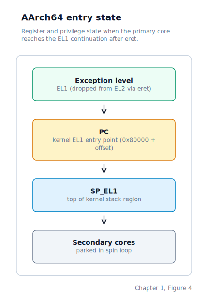

\newpage

## Chapter 1 — Boot Handoff

### The Moment the Machine Wakes Up

When you press the power button, the processor starts executing instructions from a fixed address in **firmware** — a permanently installed program stored on a chip on the motherboard. The firmware's job is narrow: find something bootable, perform the minimum setup the hardware requires, and hand control to it.

That handoff moment is where our kernel begins. Before a single line of our C code can run, the machine must already have established some baseline state: the CPU must be in a mode that can address useful amounts of memory, there must be a stack to call C functions from, and any boot information the firmware prepared must be preserved somewhere safe. Getting from firmware exit to C entry is the subject of this chapter.

The two architectures this book follows reach that moment along different roads:

- **x86 PC**: We delegate loading to **GRUB2** (the GNU GRand Unified Bootloader), a mature bootloader that implements the **Multiboot1** standard — a published contract that defines exactly how the bootloader leaves the CPU and what information it passes to the kernel. GRUB loads our kernel at 1 megabyte, switches the CPU to 32-bit **protected mode** (the modern execution mode with full address-space access and memory protection, as opposed to the 16-bit real mode the CPU starts in), and jumps to our entry point with two registers holding boot information.

- **AArch64 (Raspberry Pi 3, QEMU `raspi3b`)**: There is no GRUB equivalent. The QEMU `raspi3b` machine model places the kernel image at physical address `0x80000` and starts all four CPU cores simultaneously in AArch64 state at a privileged level called **EL2** (Exception Level 2 — explained in detail in the AArch64 section below). There is no Multiboot-equivalent information structure; boot parameters are determined by the platform itself. Our stub code has to sort out the cores, lower the privilege level, set up a stack, and zero uninitialised memory before calling into C.

Both paths end at the same place: the kernel's C entry function running with a valid stack and a zeroed data region. The road there is different for each arch.

### On x86: from GRUB to the C entry

#### How GRUB recognises our kernel

GRUB needs to know which files on a bootable disc are kernels it should offer to load. The Multiboot1 specification solves this with a small **Multiboot header** — a fixed pattern of bytes that the kernel embeds near the start of its binary. GRUB scans the first 8 KB of every file it is considering and looks for the pattern.

Our header's mandatory first twelve bytes are: a magic number (`0x1BADB002`) that GRUB searches for, a flags field, and a checksum chosen so that the three values add to zero modulo 2³². Drunix also sets the Multiboot video-mode flag, which asks GRUB to include a linear-framebuffer description in the boot information it hands us; the preferred mode we request is `1024x768` at 32 bits per pixel.

The linker is instructed to place the header at the very start of the binary so it always lands within GRUB's 8 KB scan window, regardless of how large the kernel grows.

#### The handoff registers

When GRUB validates the header, loads the kernel image into RAM, and jumps to our entry point, it makes two promises:

- `EAX` (the accumulator register in x86 convention) contains the value `0x2BADB002` — a second magic number that tells the kernel it was started by a Multiboot-compliant bootloader and that `EBX` can be trusted.
- `EBX` (the base register) holds a 32-bit physical address pointing to a **Multiboot info structure** — a memory block GRUB filled in with the RAM map, the boot command line, framebuffer details, and any additional modules loaded alongside the kernel.

The CPU state at the moment GRUB transfers control to `_start` looks like this:

`EIP` is the instruction pointer — the register the CPU always advances to point at the next instruction. GRUB sets it to the address of `_start` by jumping there. `ESP` is the stack pointer; its value is undefined on entry, which is the first problem the assembly stub must fix.

#### The assembly entry point

Our entry point is the symbol `_start`, marked in the **ELF** (Executable and Linkable Format — the standard binary container for Linux and x86 systems) binary as the executable's starting address. GRUB reads the ELF header, finds `_start`, and jumps there.

`_start` does three things before any C code runs.

First, it sets up a stack. GRUB leaves `ESP` in an undefined state, so the very first instruction points `ESP` at a block of memory the kernel owns — sixteen kilobytes of space reserved in the kernel's **BSS** segment (the region that holds uninitialised globals; it costs nothing on disk because the loader zeroes it at startup, but it is real allocated RAM once the image is loaded).

Second, `_start` preserves the Multiboot values. The moment any C function is called, the compiler is free to overwrite `EAX` and `EBX`, so those registers are pushed onto the stack before the first call. They are pushed in the order required by the standard x86 **cdecl calling convention**, so that `start_kernel` receives them as ordinary C function arguments.

Third, `_start` calls `start_kernel`. From C's perspective this looks like any other function call; the assembly stub has taken a raw machine state and shaped it into a valid C call frame.

If `start_kernel` ever returns — it should never exit — `_start` executes an infinite self-loop to prevent the CPU from executing random bytes beyond the end of the code.

#### Where the kernel lives in memory

We load our kernel at **1 megabyte** (`0x100000`), fixed at link time. The reason is that everything below one megabyte on an x86 PC is a patchwork of reserved regions — the BIOS interrupt vector table, the VGA video buffer, BIOS ROM shadows — and none of it is safe to use as general RAM. Starting at 1 MB puts the kernel in the "extended memory" region, which is guaranteed to be real, usable RAM.

The linker script lays the sections out in a fixed order:

The linker exposes symbols marking the start and end of the kernel image. The physical memory manager in Chapter 8 reads those symbols at boot time to learn which pages the kernel occupies, so it can mark them as reserved and never hand them out as allocations.

#### Building the bootable image

The build turns our kernel into a bootable ISO — a disc format that **QEMU** (Quick Emulator, the open-source hardware emulator we use throughout this book) treats exactly as a real PC treats a CD. We compile and link the kernel into an ELF binary positioned at `0x100000`, write a GRUB configuration file with a single menu entry pointing at it, and run `grub-mkrescue` to assemble everything into one self-contained bootable image.

We launch QEMU with that ISO as a virtual optical drive and a separate image as a primary **ATA** (Advanced Technology Attachment — the interface protocol connecting hard drives to the system bus) hard drive. The virtual firmware finds GRUB on the disc, GRUB loads our kernel, and the hard-drive image sits untouched until the ATA driver in Chapter 11 begins reading sectors from it.

The first time this works — QEMU opens, GRUB's menu appears, and a moment later our own kernel is executing on what looks to it like real hardware — is a genuine milestone. Every instruction the CPU runs from that point on is code we wrote.

### On AArch64: from raspi3b loader to the C entry

#### The platform hand-off

Let's walk through the AArch64 path. It is different enough from the x86 side that it is worth taking slowly, because several things happen here that have no x86 equivalent.

The first difference is that there is no GRUB, no Multiboot header, no disc image, and no scanning. QEMU's `raspi3b` machine model (a software model of the Raspberry Pi 3 Model B) simply places our kernel image — a flat binary, not an ELF — at physical address `0x80000` and starts all four CPU cores. Each core wakes up, finds itself pointing at address `0x80000` in AArch64 state — the 64-bit execution state of the ARM architecture — and begins running whatever is there. That means our stub code runs four times simultaneously, once per core, from the very first instruction. We will need to deal with that.

The second difference is the privilege level we arrive in. Each core starts at **EL2** — and before we can say what EL2 means, we need to talk about why the ARM architecture has multiple privilege levels in the first place.

**Exception Levels** are the AArch64 architecture's privilege hierarchy. The idea is similar to x86's ring model, but ARM names the levels rather than numbering them from zero. Think of them as numbered rings where a lower number means more privilege:

- **EL3** is the highest level, used by secure-monitor firmware.
- **EL2** is the hypervisor level, used by software that manages virtual machines.
- **EL1** is the standard operating-system level, used by normal kernels.
- **EL0** is user level, used by applications.

We are writing an ordinary EL1 kernel. We do not need hypervisor privileges — those exist so that a piece of software at EL2 can run multiple guest operating systems at EL1 without them interfering with each other. We are not doing any of that. Starting in EL2 is just an artifact of how the QEMU `raspi3b` model is initialised, and we need to get out of it. But before we can drop from EL2 to EL1, we need to sort out those four cores.

#### Identifying the primary core

All four cores wake up and begin executing our stub simultaneously. We only want one of them — the **primary core** — to continue with the rest of initialisation; the others should wait until the kernel is ready to give them work. We are not abandoning those three secondary cores — the kernel will wake them later, once it has a scheduler and something to give them — but for now, one active core is enough and four would be chaos.

The ARM architecture gives us a way to tell them apart. A system register called `MPIDR_EL1` holds each core's affinity values — essentially its unique identifier within the cluster. We read `MPIDR_EL1` and check the low bits. Core 0 is our primary. Any other core branches into a spin loop, repeatedly checking a memory location that the primary core will eventually write. Until then, they park.

#### Lowering from EL2 to EL1

With the three secondary cores quietly waiting, we turn our attention to the privilege drop. Dropping from EL2 to EL1 is not automatic — the ARM architecture requires us to program several system registers to define what EL1 will look like before we issue the instruction that actually causes the switch. This matters because EL1 inherits nothing from EL2 by default; if we do not configure it explicitly, we cannot predict what state the CPU will be in when we arrive there.

We configure three registers before making the jump:

- **`HCR_EL2`** (Hypervisor Configuration Register, EL2) — This register controls how EL1 behaves from the perspective of the hypervisor level sitting above it. The critical bit we set is `RW`, which tells the hardware that EL1 will execute AArch64 instructions rather than 32-bit AArch32 instructions. Setting this might feel odd — we obviously want 64-bit mode — but EL1 can actually be configured to run in 32-bit compatibility mode, and without explicitly asking for AArch64 we cannot rely on getting it.

- **`SCTLR_EL1`** (System Control Register, EL1) — This register governs EL1's basic CPU behaviour: whether the MMU is on, whether caches are enabled, and similar global controls. Before we have set up page tables or configured caches, we write the architecturally-required reset value to put EL1 into a clean, known state. We are not enabling anything yet; we are just making sure EL1 does not inherit whatever random state the hardware reset left behind.

- **`ELR_EL2`** (Exception Link Register, EL2) — This register's normal job is to hold a return address when the CPU takes an exception, so the exception handler knows where to resume when it is finished. We repurpose it: by writing the address of our EL1 continuation label into `ELR_EL2`, we tell the hardware "when you return from EL2, jump here." It is a small trick, but it is the ARM architecture's intended mechanism for this exact transition.

With those three registers set, we execute **`eret`** (Exception Return) — the instruction that lowers the exception level. The CPU reads `ELR_EL2`, drops to EL1, and begins executing at the address we placed there. Just like that, we are in EL1, running as an ordinary operating system kernel.

The machine state at this transition point looks like this:

#### Establishing a stack and zeroing BSS

We are now in EL1, but we still cannot call C code yet — we still need a stack. AArch64 uses `SP_EL1` as the stack pointer while executing at EL1. We point it at the top of a reserved block of memory in the kernel image, sized to give us a safe call depth for initialisation. This is the same problem we solved on x86 — GRUB left `ESP` undefined, so `_start` set it up — and we solve it the same way: explicitly, before anything else.

There is one more step that x86 handled for us automatically but that we have to do ourselves here. We zero the **`.bss`** segment. BSS (Block Started by Symbol) is the part of the binary that holds uninitialised global variables. The file on disk says nothing about these bytes — the convention is that the loader will zero them before the program starts. On x86, GRUB honoured that convention as part of loading our ELF image. On AArch64, we loaded a raw binary, so there was no loader to do this. Any C code that expects uninitialised globals to start as zero — which in C they are guaranteed to — would see garbage instead. So we do it ourselves: the stub walks from the linker-exported `__bss_start` symbol to `__bss_end`, writing zeroes.

With the stack set and BSS zeroed, we call the kernel's C entry function. That is the AArch64 bring-up — four cores reduced to one, a privilege drop controlled down to EL1, a stack established, and the data region cleaned up. Everything C needs is in place.

### Where the Machine Is by the End of Chapter 1

At this point — just before the kernel's C entry function runs — the machine state differs by architecture, but both paths have reached the same conceptual milestone: the kernel is executing its own code with a known stack and a zeroed BSS.

**On x86:**

- GRUB has finished. It will never run again.
- The CPU is in 32-bit protected mode with only the minimal descriptor tables GRUB set up for its own use. Interrupts are disabled.
- The kernel binary is loaded at physical address `0x100000`, with every section placed according to the linker script.
- A 16 KB stack is set up in the kernel's BSS segment, and `ESP` points at its top.
- The Multiboot magic number and the info-structure pointer are on the stack, ready to be received by `start_kernel` as ordinary C function arguments.

**On AArch64:**

- The QEMU `raspi3b` loader has placed the kernel at physical address `0x80000` and ceded control to it.
- The CPU is in EL1 — the standard operating-system privilege level. Secondary cores are parked, waiting for a signal to start.
- The stack pointer is set to the top of a reserved block in the kernel image.
- BSS is zeroed.
- There is no Multiboot info structure; boot parameters are platform-fixed.

From here the kernel takes over completely. Chapter 2 covers the next step: building a proper **GDT** (Global Descriptor Table — the structure that defines memory segments and privilege levels for the x86 CPU) and taking full ownership of the processor's mode.
