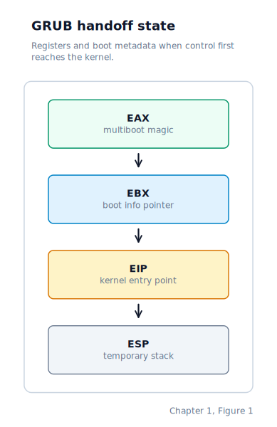
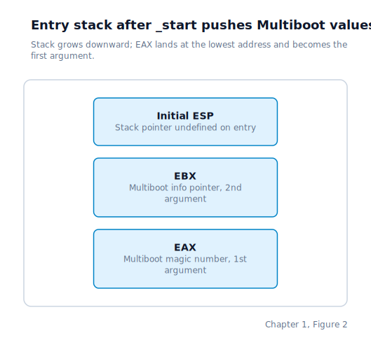
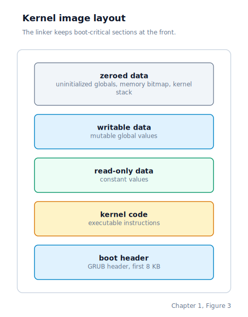

\newpage

## Chapter 1 — Booting with GRUB2

### The Moment the Machine Wakes Up

When you power on a computer, it runs a tiny program baked into the motherboard called firmware. Its job is to find something bootable on the attached disks and hand control to it — a process we call booting.

When you press the power button, the processor starts executing instructions from a fixed address in **firmware** — a permanently installed program stored on a chip on the motherboard. On older machines this firmware is called the **BIOS** (Basic Input/Output System); on newer ones it is called **UEFI** (Unified Extensible Firmware Interface). Both do the same thing at this stage: they scan the attached disks looking for something bootable and hand control to the first program they find.

At this instant the CPU is running in **16-bit real mode**. Real mode is a backwards-compatibility mode in which the processor behaves like an Intel 8086 from 1978: 16-bit registers, 1 MB of addressable memory, and no memory protection of any kind. A bootloader has to live with these restrictions until it can switch the CPU into a modern mode.

Writing a bootloader that handles all of this reliably — across USB sticks, real hard disks, and emulators — is a small project on its own. It has to call BIOS services to read disk sectors and then parse whatever on-disk format holds the kernel. After that, it has to set up descriptor tables — small in-memory tables that tell the CPU how memory is partitioned — and flip the CPU from real mode into 32-bit protected mode. Rather than reinvent that work, we delegate it to **GRUB2**, the GNU GRand Unified Bootloader. GRUB is the same program that loads every major Linux distribution, so it is battle-tested on every PC you are likely to encounter.

By the time GRUB hands control to our kernel, it has already done four things on our behalf:

1. Loaded the kernel image from the bootable disc into RAM.
2. Switched the CPU from 16-bit real mode into 32-bit **protected mode** — the modern mode where the full 4 GB address space is visible and memory protection is available.
3. Asked the BIOS for a map of usable RAM (the details of that map are covered in Chapter 7).
4. Jumped into our kernel at a known entry point with a documented calling convention.

That last point is what makes GRUB useful: there is a published standard, called **Multiboot**, that describes exactly how GRUB hands control over. If our kernel follows the Multiboot rules, GRUB will load it; if it does not, GRUB refuses and prints an error.

### How GRUB Recognises Our Kernel

The Multiboot1 specification has two sides. The kernel must publish a small header — a fixed pattern of bytes within the first 8 KB of the executable file — that tells GRUB "I am Multiboot-compliant". GRUB, in return, promises to jump to the kernel with a specific CPU state and with a pointer to a structure describing the machine.

The header is embedded near the start of the kernel binary. Its first twelve bytes are the mandatory fields: a magic number GRUB scans for (`0x1BADB002`), a flags field, and a checksum that makes the three values add up to zero modulo 2³². Drunix sets the Multiboot video-mode flag as well, so the header also includes a preferred graphics mode: `1024x768` at 32 bits per pixel. That does not guarantee the exact mode will be available on every machine, but it asks GRUB to include linear-framebuffer metadata in the Multiboot info structure when it can.

The linker is instructed to place the header at the very front of the binary so it always lands within GRUB's 8 KB scan window.

When GRUB finds the header, validates the checksum, loads the kernel, and jumps into it, two registers carry information across the handoff boundary:

- `EAX` (the accumulator register) contains the value `0x2BADB002` — a different magic number that tells the kernel it was loaded by a Multiboot-compliant bootloader and that the other register can be trusted.
- `EBX` (the base register) contains a 32-bit physical address pointing to a **Multiboot info structure** — a block of memory GRUB filled in with the RAM map, the boot command line, framebuffer details when graphics mode was established, and any modules loaded alongside the kernel.

The CPU state at the moment GRUB transfers control to `_start` looks like this:

`EIP` is the instruction pointer — the register the CPU always advances to point at the next instruction to execute. GRUB sets it to the address of `_start` by jumping there. `ESP` is the stack pointer; its value is undefined on entry, which is the first problem the assembly stub has to fix.

### The Assembly Entry Point

Our entry point is the symbol `_start`, marked by the linker as the executable's starting address. To find it, GRUB reads the **ELF** (Executable and Linkable Format, the standard binary container on Linux/x86) header, locates `_start`, and jumps there.

`_start` does three things in order before any C code runs.

First, it sets up a stack. GRUB leaves `ESP` in an undefined state, so the very first instruction points `ESP` at a block of memory the kernel owns. That block is sixteen kilobytes of space reserved in the kernel's **BSS** segment — the region of an executable that holds uninitialised globals. BSS costs nothing in the file on disk (the loader just zeroes the range at startup), but it is real allocated RAM once the image is loaded.

Second, `_start` preserves the Multiboot values. The moment any C function is called, the compiler is free to overwrite `EAX` and `EBX` with other values, so those registers must be saved to the stack before the first call. The values are pushed in the order required by the standard x86 **cdecl calling convention**, so that `start_kernel` receives them as ordinary C function arguments.

Third, `_start` calls `start_kernel`. From C's perspective this looks like any other function call; the assembly trampoline has taken a raw machine state and shaped it into a valid C call frame.

If `start_kernel` ever returns — it should never exit — `_start` executes an infinite self-loop to prevent the CPU from falling off the end of the code and interpreting random bytes as instructions.

### Where the Kernel Lives in Memory

We load our kernel at **1 megabyte** (`0x100000`), fixed at link time. This is the conventional load address for a Multiboot kernel. The reason is that everything below one megabyte on an x86 PC is a patchwork of legacy regions — the BIOS interrupt vector table, the VGA video buffer, BIOS ROM shadows — and none of it is safe to use as general RAM. Starting at one megabyte puts the kernel in the "extended memory" region, which is guaranteed to be real, usable RAM. Multiboot chose 1 MB because it is high enough to avoid firmware regions but low enough to fit on machines with only 4 MB of RAM, the minimum the spec targeted.

The linker script lays the sections out in a fixed order:

The linker is told to keep the Multiboot header at the very beginning of the binary, so no matter how large the kernel grows the header always sits within GRUB's 8 KB scan window.

The linker exposes symbols that mark the start and end boundaries of the kernel image. The physical memory manager in Chapter 8 reads these symbols at boot time to learn exactly which physical pages the kernel occupies, so it can mark them as reserved and never hand them out as general allocations.

### Building the Bootable Image

The build turns our kernel source into a bootable ISO image — a disc format that **QEMU** (Quick Emulator, the open-source hardware emulator we use to run our kernel on a virtual machine) treats exactly as a real PC treats a CD. We compile and link the kernel into an ELF binary positioned at `0x100000`. A GRUB configuration file holds a single menu entry telling GRUB to load that binary using the Multiboot protocol — that is all GRUB needs from us. The tool `grub-mkrescue` then assembles the staging directory, a GRUB stage-1 loader, and the necessary boot records into one self-contained bootable ISO.

We launch QEMU with that ISO as a virtual optical drive and a separate image as a primary **ATA** (Advanced Technology Attachment — the interface protocol connecting hard drives to the system bus) hard drive. The virtual firmware finds GRUB on the disc, GRUB loads our kernel, and the hard-drive image sits untouched until the ATA driver in Chapter 11 begins reading sectors from it.

The first time this works — QEMU opens, GRUB's menu appears, and a moment later our own kernel is executing on what looks to it exactly like real hardware — is a genuine milestone. Every instruction the CPU runs from that point on is code we wrote.

### Where the Machine Is by the End of Chapter 1

At this moment, just before `start_kernel` runs:

- GRUB has finished. It will never run again.
- The CPU is in 32-bit protected mode, but with only the minimal descriptor tables GRUB set up for its own use. Interrupts are disabled.
- The kernel binary is loaded at physical address `0x100000`, with every section placed according to the linker script.
- A 16 KB stack is set up in the kernel's BSS segment, and `ESP` points at its top.
- The Multiboot magic number and the info-structure pointer are sitting on the stack, ready to be received by `start_kernel` as ordinary C function arguments.

From here the kernel takes over completely. Chapter 2 covers the next step: building a proper **GDT** (Global Descriptor Table — the structure that defines memory segments and privilege levels for the CPU) and taking full ownership of the processor's mode.
