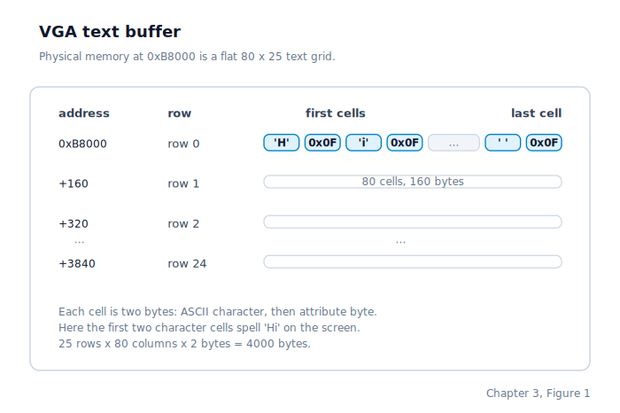

\newpage

## Chapter 3 — The Kernel Entry and Display Output

### Where the CPU Lands When C Begins

Chapter 2 ended with our own **GDT** (Global Descriptor Table) in place and the CPU running in 32-bit protected mode under our rules rather than GRUB's. The next instruction after that setup is a plain C function call: the assembly stub hands control to `start_kernel`, and from that point on the machine is mostly following code the C compiler generated for us.

`start_kernel` receives the same two values Chapter 1 left on the stack: the Multiboot magic number and a pointer to the **Multiboot info structure**. A Multiboot info structure is a block of boot-time metadata GRUB prepared for us, including flags and the firmware's memory map. `start_kernel` is not the kernel's permanent event loop, but it is the one straight-line bootstrap path that brings the machine from "GRUB just jumped here" to "the first user process is running".

### The Startup Sequence

The body of `start_kernel` is a strict sequence. The order is not cosmetic. Each step either depends on state created by the previous one or is deliberately delayed until the machine is safe enough to survive it.

The first step makes the CPU's floating-point and SIMD state usable early enough that later process code can save and restore it correctly. **SSE** stands for Streaming SIMD Extensions, and **SIMD** means Single Instruction, Multiple Data: one instruction operating on several values at once. We are not turning the whole kernel into vectorized code here. We are simply claiming ownership of that part of the CPU before any later subsystem depends on it.

Next comes memory setup. The kernel copies the Multiboot flags out of the boot structure before physical-page tracking begins, because the page-tracking metadata may overwrite the place where GRUB left that structure behind. The **PMM** (Physical Memory Manager, the part of the kernel that tracks which 4 KB physical pages are free) then walks the firmware memory map and marks usable and reserved page frames.

Immediately after that, the kernel turns on paging. Paging means the CPU stops treating addresses as direct physical locations and instead sends them through the **MMU** (Memory Management Unit, the hardware that translates virtual addresses into physical ones). We are still early in the boot, but from this point forward the CPU is running with virtual memory active.

Once paging is live, the kernel maps any framebuffer GRUB reported above the early identity range, then activates its heap allocator so that later initialization code can request and release variable-sized memory blocks on demand. Right after that, whatever text is already visible in the VGA buffer is captured into an in-memory mirror so the legacy console driver can take over cleanly if the graphical path is unavailable. That detail matters because the console code is about to become the narrator for every later bootstrap step.

The next milestone is rebuilding the descriptor tables under full kernel control. The small boot-time GDT is replaced with the kernel's permanent one: null, kernel code, kernel data, user code, user data, and a **TSS** (Task State Segment, a hardware structure the CPU uses when switching from user privilege back into kernel privilege). The kernel code and data selectors stay at `0x08` and `0x10`, because later interrupt-entry code expects those exact selector values.

After the GDT comes the first real interrupt table under kernel control: the **IDT** (Interrupt Descriptor Table, the table that tells the CPU which handler belongs to each exception or interrupt vector). At this moment the interrupt flag is still clear, so ordinary hardware interrupts cannot arrive yet. But exceptions, breakpoints, and the basic trap path now have somewhere valid to go, which makes the machine much less fragile.

Only then does the kernel start wiring up devices. It clears the **IRQ** (Interrupt ReQuest) dispatch table, gives the **PIT** (Programmable Interval Timer, the hardware timer that ticks at a fixed rate) ownership of IRQ 0, reads the real-time clock once to seed the wall clock, and prepares the **TTY** (TeleTYpewriter, the terminal input layer that turns raw key events into line-oriented input) so keyboard interrupts can become line-oriented input.

Storage comes up next. The **ATA** (AT Attachment) disk driver is initialised and published into the block-device registry so higher layers can find the disk by name. Then the DUFS and ext3 filesystem implementations are published into the filesystem registry so the virtual filesystem layer can mount the configured root filesystem later.

Only after those pieces are ready does the kernel perform the dangerous part: it remaps the PIC, programs the timer hardware, and executes `sti`, the instruction that finally lets maskable hardware interrupts reach the CPU. This is the line where the kernel stops being a carefully choreographed single-threaded bootstrap and becomes a machine that can be interrupted at almost any instruction boundary.

With interrupts live, the kernel mounts its namespaces through the **VFS** (Virtual File System, the layer that gives the rest of the kernel one uniform file API no matter which underlying filesystem answers a path lookup): ext3 at `/` by default, DUFS at `/dufs` during ext3-root boots, a synthetic device tree at `/dev`, and a synthetic process-information tree at `/proc`.

The last stretch launches the first user program. The scheduler table is cleared, the shell executable is located on disk, loaded as an **ELF** (Executable and Linkable Format, the standard executable file format on x86/Linux) image, marked runnable, and selected as the first process to run. One final privilege drop switches into ring 3 and does not return. From that instant on, the shell is in user mode, the timer can preempt it, and the kernel is reacting to events instead of marching through startup code.

### Why the Screen Driver Matters So Early

All the way through that sequence, the kernel keeps printing status lines. Early boot still relies on the **VGA** (Video Graphics Array) text buffer because it is simple, fixed, and available before any dynamic display setup. Later in `start_kernel`, after memory management and the filesystem are ready, the kernel switches the user-facing shell into a desktop surface. If GRUB supplied a usable 32-bit RGB linear framebuffer, that desktop is presented as pixels; otherwise it falls back to the VGA text buffer.

The VGA text buffer is a region of physical memory at address `0xB8000`. The display hardware continuously reads from that memory and interprets it as an 80-column by 25-row grid of character cells. If we change bytes in that region, the next refresh shows different characters on the monitor. There is no higher-level protocol involved yet. The "driver" is just memory writes plus a few controller-register updates.

Each screen cell occupies two consecutive bytes. The first byte is the character code, stored as **ASCII** (American Standard Code for Information Interchange, the classic one-byte character encoding for English letters, digits, and punctuation). The second byte is an attribute byte: its low four bits encode the foreground colour and its high four bits encode the background colour. The kernel's default attribute is `0x0F`, which means bright white text on a black background.

The buffer is laid out row by row as one flat 4,000-byte region:

Each attribute byte is split into two colour nibbles:

| Bits | Field | Example |
|------|-------|---------|
| `0-3` | Foreground colour | Bright white |
| `4-7` | Background colour | Black |

Given a row `r` and column `c`, the byte offset into the buffer is `2 * (r * 80 + c)`. Writing a character means placing the ASCII code at that offset and the attribute byte at the next byte. A tiny helper does exactly this pair of writes for every visible character.

### The Blinking Cursor

The underline cursor that marks the next write position is not stored in the text buffer itself. It lives in VGA controller registers. To reach those registers, the kernel uses **I/O ports**: a second x86 address space that is separate from ordinary memory and can only be accessed with the `IN` and `OUT` instructions.

The VGA controller exposes two ports at `0x3D4` and `0x3D5`. Port `0x3D4` is an index register: writing a value there selects which internal VGA register to access next. Port `0x3D5` is the data register. The cursor position occupies two internal registers: register `0x0E` holds the high byte and `0x0F` holds the low byte of the cursor's linear character index (not byte offset). To move the cursor, the kernel writes the index and then the byte to each port in turn.

Because C has no built-in syntax for `IN` or `OUT`, the kernel wraps those instructions in tiny inline-assembly helpers. From this point on, that wrapper becomes part of everyday kernel life: the VGA controller, keyboard controller, timer, real-time clock, and ATA controller all talk through I/O ports.

### Printing Strings

`print_string` walks a null-terminated string one byte at a time. For each byte it either interprets a control character or draws one character cell:

- A newline (`\n`) advances the cursor to the start of the next row.
- A carriage return (`\r`) moves the cursor to column zero of the current row.
- A backspace (`\b`) moves the cursor back one cell, writes a space to erase the character there, and leaves the cursor ready for the next keystroke. This is the mechanism the shell uses to display character deletion.
- A tab (`\t`) expands into spaces up to the next multiple of eight columns.
- Any other byte is written to the current cell and the cursor advances.

The function also understands a small subset of ANSI colour escape sequences, so later kernel log lines can switch colours without changing the basic text-mode design. After each visible character, it checks whether the cursor has fallen off the bottom of the 25-row screen. If it has, the screen is scrolled upward by one line before output continues.

A second entry point, `print_bytes`, uses the same output path but stops after a caller-supplied byte count instead of waiting for a terminating zero byte. That matters later when the kernel needs to print arbitrary byte streams that may contain embedded `0x00` bytes.

### Scrolling

Scrolling happens when the cursor would move past the final row. The kernel copies rows 1 through 24 upward into rows 0 through 23, then clears row 24 to spaces in the default colour. It performs that copy twice: once in the hardware VGA buffer at `0xB8000`, and once in the kernel's shadow copy of the screen.

### The Scrollback Buffer

Before the driver discards the top visible row, it saves that row into a 500-row ring buffer called `scrollback`. A ring buffer is a fixed-size array treated as a loop: when the write position reaches the end, it wraps back to the beginning and starts overwriting the oldest entries.

Three pieces of state work together to make scrollback possible:

| Structure | Stored state | Purpose |
|-----------|--------------|---------|
| Scrollback ring | Rows that already scrolled off the top of the live screen | Provides history rows when the user looks backward |
| Shadow VGA | Copy of the 25 live screen rows | Preserves the current visible text independent of hardware redraws |
| View offset (`sb_view`) | How many rows back from live view are being shown | Chooses whether redraw uses only live rows or a history-and-live mix |
| Saved cursor (`shadow_cursor`) | Logical write position in the live screen image | Restores the cursor when the display returns to live view |

The scrollback ring holds the rows that have already disappeared off the top of the live screen. The **shadow VGA** is a 4,000-byte in-memory mirror of the current 25 visible rows. Every visible write updates both the hardware buffer and this mirror, so the kernel always has an authoritative copy of the live screen contents even when the hardware cursor is hidden or the user is looking backward through history.

The integer `sb_view` says how far back the user is looking. When `sb_view` is zero, the display shows the live screen exactly as recorded in `shadow_vga`. When `sb_view` is `N`, the repaint routine takes `N` rows from scrollback history and places them above the lower `25 - N` rows from the live shadow screen. Scrolling backward and forward simply adjusts `sb_view` and redraws the hardware buffer from that combined view.

A separate variable, `shadow_cursor`, tracks the logical write position even when the hardware cursor is hidden. When `sb_view` is non-zero, the driver pushes the hardware cursor off-screen so it does not appear in the middle of old history. The moment new output arrives, the driver snaps the view back to live mode, restores the visible cursor, and continues writing at `shadow_cursor`.

### The Framebuffer Desktop

The Multiboot header asks GRUB for a `1024x768x32` graphics mode. When GRUB succeeds, it sets the framebuffer flag in the Multiboot info structure and provides the physical address, pitch, dimensions, pixel depth, and RGB mask layout for the linear framebuffer. Drunix accepts only 32-bit RGB framebuffers for now. That keeps the renderer small: each pixel can be written as a packed 32-bit value after the colour components are shifted into the mask positions GRUB reported.

The framebuffer may live high in physical memory, well above the first 128 MB identity map used during early paging. Before drawing to it, the kernel identity-maps the full visible framebuffer range as supervisor-writable memory. That mapping is also copied into later user page directories without the user-access bit, so the kernel can keep drawing while user processes run but ring-3 code cannot write directly to video memory. When the CPU supports the needed cache mode, the kernel marks the visible framebuffer as **write-combining** memory: consecutive stores can be gathered into larger bus transactions, which makes the later back-buffer flushes much cheaper than a long stream of isolated pixel writes.

The graphical desktop now splits its presentation path by display backend. VGA fallback still presents a character grid directly to the text buffer, but framebuffer mode now presents the shell as one window inside a small desktop rather than as the only desktop surface. The launcher can open built-in Files, Processes, and Help windows. A window table records which windows are open, where they live in pixel space, their z-order, their focus state, and whether a title bar is currently being dragged. The desktop uses the same hit-testing rules for the launcher, taskbar buttons, window bodies, title bars, and close buttons, so the mouse and keyboard paths agree about which surface is active. The shell still writes text and ANSI colour changes through the same console path, but the desktop owns the pixel rectangle around that text: padding, title bar, border, underline cursor, scrollbar, and pointer are all drawn as framebuffer pixels. The terminal computes how many `8x16` glyph cells fit inside its padded pixel rectangle, so the shell remains text-oriented while the desktop around it is no longer just a full-screen cell buffer painted into pixels.

Framebuffer drawing goes through an off-screen **back buffer** when the boot framebuffer fits the reserved buffer size. Drawing primitives write the next version of the desktop into that hidden memory first, then the presenter copies only dirty rectangles into the visible framebuffer. The mouse pointer is treated as a cursor overlay rather than ordinary window pixels: the overlay is composited during the back-to-front copy, so moving the pointer only re-presents the union of its old and new rectangles. During a window drag, the desktop can often move the existing window pixels inside the back buffer, redraw only the exposed background behind the old position, and flush the bounding box that covers both positions. If the back buffer is unavailable, the same renderer falls back to direct framebuffer drawing; the picture is still correct, but drag and pointer updates have fewer flicker protections.

Mouse input comes from the PS/2 mouse on IRQ12. The driver decodes three-byte packets into movement and button events, the desktop tracks a pixel-positioned pointer, and the framebuffer renderer presents the small arrow cursor. Pointer motion, shell output, scrollback, and window dragging are intentionally presented with dirty rectangles rather than full-screen repaints. On a framebuffer, repainting the whole desktop for every mouse packet or typed character would erase and redraw too much visible state. Dirty presentation restores only the parts that actually changed. While a framebuffer update is being composed and flushed, the presenter briefly masks interrupts and, if necessary, switches back to the kernel page directory so an interrupt handler cannot re-enter the desktop halfway through a frame.

### Where the Machine Is by the End of Chapter 3

By the end of this chapter, the CPU has crossed the line from "bootstrapping the kernel" to "running a real system":

- The one-time bootstrap path has finished.
- The kernel owns the GDT and IDT, paging is active, and the heap is available.
- The timer, keyboard, TTY layer, ATA driver, and filesystem registrations are in place.
- Hardware interrupts are enabled, so the CPU can now be preempted by timer ticks and input events.
- The VGA text driver can draw characters, manage colours, move the cursor, scroll, and show history from its 500-row scrollback ring.
- When GRUB provides a supported linear framebuffer, the kernel presents the shell inside a windowed framebuffer desktop with an 8x16 font, launcher, taskbar window selection, draggable title bars, built-in Files, Processes, and Help windows, and a PS/2 mouse pointer.
- DUFS is mounted at `/`, with `devfs` at `/dev` and `procfs` at `/proc`.
- The shell has been loaded from disk and launched in ring 3 as the first user-space process.

The important thing to hold in your head going into Chapter 4 is that the machine is no longer a fragile boot stub. We have a working kernel console, a valid trap path, and a live user process. From here on, when something goes wrong, the CPU has somewhere to go and the kernel has somewhere to tell us about it.
