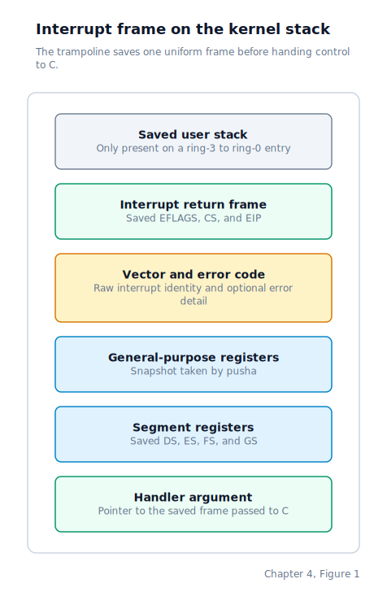

\newpage

## Chapter 4 — Interrupts and Exceptions

### When Straight-Line Execution Stops

Chapter 3 ended with the kernel still executing in a straight line. The **GDT** (Global Descriptor Table) is live, the early **IDT** (Interrupt Descriptor Table) is loaded, and the machine is one `sti` instruction away from becoming truly asynchronous. The important change in this chapter is not just that we fill in another table. It is that, from this point onward, the CPU may stop the current instruction stream between two instructions and enter the kernel for a completely different reason.

That is what an **interrupt** is. An interrupt is a signal that makes the CPU save enough state to resume later, switch to a handler chosen by an interrupt vector number, and run that handler before returning to the interrupted code.

On x86 there are two broad kinds of interrupt.

The first is a **CPU exception**. An exception is raised by the processor itself when the current instruction cannot complete normally: divide by zero, invalid opcode, page fault, and so on. Exception vectors 0 through 31 are defined by the architecture. Many of them also have short mnemonics such as `#DE` (Divide Error), `#UD` (Invalid Opcode), `#GP` (General Protection fault), and `#PF` (Page Fault). Some exceptions push an extra 32-bit **error code** onto the stack before entering the handler. That error code gives the kernel more detail about why the fault happened.

The second is a **hardware IRQ** (Interrupt ReQuest). A hardware IRQ is raised by a physical device that wants service: the timer fires, the keyboard receives a scancode, or the disk controller finishes a transfer. On the classic PC-compatible x86 machine these signals first pass through the **PIC** (Programmable Interrupt Controller, specifically the 8259A pair), which forwards one pending IRQ to the CPU as an interrupt vector.

Both sources use the same lookup table. The IDT has 256 entries, and each entry tells the CPU which handler address to jump to, which code segment to enter, and what privilege rules apply to that entry.

Once the kernel has finished setting the table up, the vector space it actively uses looks like this:

| Vector  | Source                | Meaning                                           |
|---------|-----------------------|---------------------------------------------------|
| 0–31    | CPU                   | Architectural exceptions (`#DE`, `#UD`, `#GP`, `#PF`, ...) |
| 32–39   | Master PIC            | Remapped IRQs 0–7 (timer, keyboard, ...)          |
| 40–47   | Slave PIC             | Remapped IRQs 8–15 (RTC, ATA, ...)                |
| 48–127  | —                     | Unused                                            |
| 128     | Software `int 0x80`   | System-call entry gate                            |
| 129–255 | —                     | Unused                                            |

### The Shape of an IDT Entry

Each IDT entry is eight bytes long. Intel calls this entry a **gate** because it is a controlled way for execution to cross into a handler. In C the layout is:

```c
typedef struct {
    uint16_t offset_low;   // handler address, bits 0-15
    uint16_t selector;     // code segment selector (0x08 = kernel CS)
    uint8_t  zero;         // must be zero
    uint8_t  type_attr;    // present bit, privilege level, gate type
    uint16_t offset_high;  // handler address, bits 16-31
} __attribute__((packed)) idt_entry_t;
```

The handler address is split into a low half and a high half. The `selector` field names the code segment the CPU should load when entering the handler. In this kernel that selector is always `0x08`, the kernel code segment established by the GDT. The `type_attr` byte says whether the entry is present, which privilege ring may trigger it with a software interrupt, and what kind of gate it is.

The full eight-byte entry looks like this:

| Bytes | Field | Meaning |
|-------|-------|---------|
| `0-1` | Offset low | Low half of the handler address |
| `2-3` | Selector | Kernel code segment selector |
| `4` | Zero | Required zero byte |
| `5` | Type and attributes | Present bit, privilege level, and gate kind |
| `6-7` | Offset high | High half of the handler address |

The `type_attr` byte itself is packed as follows:

| Bits | Field | Meaning |
|------|-------|---------|
| `0-3` | Gate kind | Interrupt gate, trap gate, or task gate |
| `4` | System bit | Kept clear for IDT gates |
| `5-6` | DPL | Highest caller privilege allowed for software entry |
| `7` | Present | Entry is valid |

Most entries use `0x8E`: present, **DPL** (Descriptor Privilege Level) 0, 32-bit interrupt gate. An **interrupt gate** has one especially useful property: on entry, the CPU clears the interrupt enable flag in `EFLAGS`, so another hardware IRQ cannot interrupt the current handler halfway through.

Vector `0x80`, the software interrupt the kernel uses for system calls, is the exception. It uses `0xEF`: present, DPL 3, 32-bit **trap gate**. A **trap gate** does not clear the interrupt enable flag, which means timer ticks and keyboard IRQs can still arrive while the kernel is servicing a system call from user space.

There is one more special case: vector 8, `#DF` (Double Fault), is installed as a **task gate** instead of a normal interrupt gate. A task gate points at a dedicated **TSS** (Task State Segment, a CPU-defined structure that can hold a complete hardware task context, including a stack pointer). The kernel uses that task gate to enter the double-fault path on a known-good emergency stack even if the ordinary ring-0 stack is already damaged.

### Why the PIC Must Be Remapped

Before the kernel can accept hardware IRQs, it has to correct an awkward piece of PC history. The original IBM PC wired IRQs 0 through 7 onto CPU vectors 8 through 15. That arrangement was acceptable in 16-bit real mode, but in protected mode those vector numbers already belong to CPU exceptions.

Left alone, the first timer tick would arrive on vector 8, which is the same vector the CPU uses for `#DF`:

| IRQ line | Vector | Collision |
|----------|--------|-----------|
| IRQ 0 | `8` | Collides with double fault |
| IRQ 1 | `9` | Collides with a reserved exception slot |
| IRQ 2 | `10` | Collides with invalid TSS |
| IRQ 3 | `11` | Collides with segment not present |
| IRQ 4 | `12` | Collides with stack-segment fault |
| IRQ 5 | `13` | Collides with general protection fault |
| IRQ 6 | `14` | Collides with page fault |
| IRQ 7 | `15` | Collides with a reserved exception slot |

That overlap is disastrous because the kernel could no longer tell whether vector 8 meant "the timer fired" or "the CPU hit a catastrophic exception path". The fix is to **remap** the PIC so the hardware IRQs live somewhere else in the IDT.

The function `pic_remap` sends the PIC four setup bytes called **ICW1** through **ICW4** (Initialisation Command Words). Together they move IRQs 0 through 7 to vectors 32 through 39, and IRQs 8 through 15 to vectors 40 through 47:

| IRQ line | Typical source | Vector |
|----------|----------------|--------|
| IRQ 0 | Timer | `32` |
| IRQ 1 | Keyboard | `33` |
| IRQ 2 | Cascade link to slave PIC | `34` |
| IRQ 3 | Serial port | `35` |
| IRQ 4 | Serial port | `36` |
| IRQ 5 | Legacy peripheral | `37` |
| IRQ 6 | Floppy controller | `38` |
| IRQ 7 | Parallel port | `39` |
| IRQ 8 | Real-time clock | `40` |
| IRQ 9 | Legacy peripheral | `41` |
| IRQ 10 | Legacy peripheral | `42` |
| IRQ 11 | Legacy peripheral | `43` |
| IRQ 12 | PS/2 mouse | `44` |
| IRQ 13 | Math coprocessor | `45` |
| IRQ 14 | Primary ATA channel | `46` |
| IRQ 15 | Secondary ATA channel | `47` |

After remapping, the kernel also writes an **interrupt mask** to each PIC. An interrupt mask is a byte in which each set bit disables one IRQ input line. The kernel begins with only IRQ 0 (timer) and IRQ 1 (keyboard) unmasked, because those are the only device handlers registered at this stage. Leaving an unhandled IRQ line enabled would let the CPU jump into a live vector whose higher-level software path does not exist yet.

The PIC is programmed entirely through **I/O ports** — the separate x86 port-address space introduced in Chapter 3. Ports `0x20` and `0x21` control the master PIC, and ports `0xA0` and `0xA1` control the slave PIC.

### Loading the Table Before Enabling Interrupts

Once the kernel has filled in the IDT entries, it loads the table with `lidt`. The `lidt` instruction writes the base address and size of the IDT into the **IDTR** (Interrupt Descriptor Table Register), which is the CPU's dedicated register for "where the interrupt table lives".

This step happens before the kernel enables ordinary hardware interrupts. That split matters. After `lidt`, the CPU already has a valid destination for exceptions and debugger traps. Only later, after the PIC is remapped and the early device handlers are registered, does the kernel execute `sti` (Set Interrupt Flag) to re-enable maskable hardware interrupts. In other words, the exception path comes alive first; asynchronous device delivery comes alive second.

### Why the GNU Debugger Needs the IDT Early

This early `lidt` is not just for normal faults. It also matters for the **GNU Debugger** (**GDB**), which often resumes the target and relies on a trap or temporary breakpoint to stop again a moment later. Those stops still enter the kernel through the CPU's ordinary exception mechanism.

If the kernel has not loaded its own IDT yet, a trap taken while stepping through early boot has nowhere valid to go. Instead of returning neatly to the debugger, the CPU can fall into firmware state or low memory. Loading the IDT early gives those traps a valid landing point even though the machine is still not accepting ordinary device IRQs yet.

### Why the IDT Points at Assembly Stubs

An IDT entry stores a raw machine address. The CPU jumps there directly when an interrupt arrives. A normal C function is not prepared for that.

On interrupt entry the CPU pushes an **interrupt return frame** onto the current stack: the saved instruction pointer `EIP`, code segment `CS`, and flags register `EFLAGS`. If the interrupt crosses a privilege boundary from ring 3 to ring 0, the CPU also pushes the user stack pointer `ESP` and stack segment `SS`. Some exceptions push an error code as well.

None of that matches the C calling convention. A C function expects to start with a normal return address at the top of the stack and with any arguments laid out according to the compiler's ABI rules. So the IDT does not point straight at C functions. It points at tiny **ISR** (Interrupt Service Routine) assembly stubs.

Those stubs do the minimum amount of machine-specific cleanup needed to turn "raw CPU interrupt entry" into "something shared C code can understand". For exceptions that do not receive a CPU-pushed error code, the stub first pushes a dummy zero so the final stack shape stays uniform. Then it pushes the vector number and jumps to a shared trampoline. Exceptions that already have a CPU-pushed error code skip the dummy push and only add the vector number.

Hardware IRQ stubs follow the same pattern. Each one pushes a dummy zero for the error-code slot, pushes its remapped vector number, and jumps to the common IRQ trampoline.

### The Common Trampoline

The shared trampolines — `isr_common` for exceptions and `irq_common` for hardware IRQs — save the rest of the machine state before calling into C.

For exception entry, the sequence is:

1. `pusha` saves the eight general-purpose registers.
2. `DS`, `ES`, `FS`, and `GS` are pushed so the current data-segment state is preserved.
3. The kernel data selector `0x10` is loaded into all four segment registers.
4. The current stack pointer is pushed as a pointer to the saved frame.
5. `isr_handler` runs in C using that saved-frame pointer.
6. A signal-delivery check runs before returning to user mode.
7. The segment registers and general-purpose registers are restored in reverse order.
8. The trampoline discards the vector number and error code slots and finishes with `iret` (Interrupt Return), which restores the CPU's saved execution state.

By the time the C exception handler receives control, the stack has been normalised into this layout:



The IRQ trampoline saves the same register state, but its C handoff is slightly different. Instead of passing a frame pointer to `irq_dispatch`, it passes the vector number and error-code slot as ordinary arguments, then optionally runs the scheduler and signal-delivery checks before restoring the saved state and executing `iret`.

### The Saved Frame in C

The exception path treats the saved stack image as an `isr_frame_t` — a struct whose field order matches exactly what the assembly pushed:

```c
typedef struct __attribute__((packed)) {
    uint32_t gs, fs, es, ds;                               /* segment pushes */
    uint32_t edi, esi, ebp, esp_saved, ebx, edx, ecx, eax; /* pusha */
    uint32_t vector, error_code;                           /* stub pushes */
    uint32_t eip, cs, eflags;                              /* CPU iret frame */
    uint32_t user_esp, user_ss;                            /* ring-3→0 only */
} isr_frame_t;
```

Having the entire machine snapshot in one typed struct makes the handler far easier to reason about. The kernel can inspect `frame->vector` to decide which exception fired, print `frame->eip` to show where execution stopped, and read `frame->error_code` when the architecture provides one.

Some exceptions need extra CPU state outside the frame itself. A page fault, for example, also reports the faulting linear address through control register `CR2`, so the handler reads that register as part of its diagnostic path.

The frame is not only readable. It is also writable. Later kernel paths use the saved registers as a place to communicate return values back to interrupted code, and the scheduler can resume a process by restoring a different saved frame and letting `iret` return into that process's state instead.

### Dispatching Hardware IRQs

Hardware IRQ delivery uses the same low-level save-and-restore machinery, but the higher-level C path is deliberately small. `irq_dispatch` subtracts 32 from the remapped vector number to recover a zero-based IRQ line number, looks up that line in a 16-slot table of function pointers, and calls the registered handler if one exists.

After the device-specific handler returns, `irq_dispatch` sends an **EOI** (End Of Interrupt) command back to the PIC. Without that EOI, the PIC assumes the interrupt is still in service and will not forward more interrupts of the same or lower priority.

For IRQs 0 through 7, sending EOI means writing `0x20` to the master PIC command port at `0x20`. For IRQs 8 through 15, the kernel must send `0x20` to the slave PIC first and then to the master PIC. Centralising that logic in `irq_dispatch` keeps individual device drivers from having to know anything about PIC bookkeeping.

### Where the Machine Is by the End of Chapter 4

By the end of this chapter, the kernel has crossed an important line: execution is no longer purely synchronous.

- CPU exceptions have a valid entry path through the IDT, with assembly stubs that turn raw interrupt entry into a uniform C-visible frame.
- Hardware IRQs no longer collide with exception vectors because the PIC has been remapped from vectors 8–15 to vectors 32–47.
- The timer and keyboard IRQ lines are the only unmasked device inputs, so the kernel is interruptible but still tightly controlled.
- Both exception handling and hardware IRQ dispatch now end by restoring the saved machine state with `iret`, so interrupted code resumes exactly where it left off.

From this point on, the CPU can enter the kernel between ordinary instructions because something happened elsewhere in the machine. The next step is to put a cleaner software dispatch layer on top of those raw IRQ vectors so device drivers can register handlers without caring about the remapped vector numbers.
