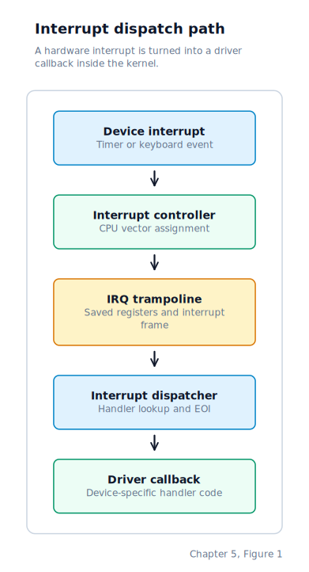
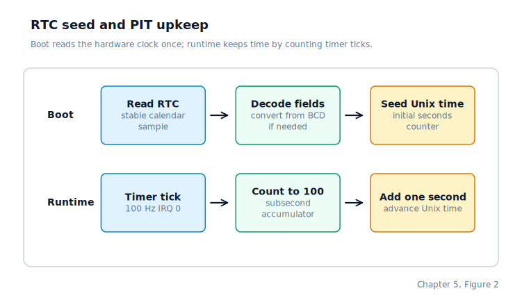

\newpage

## Chapter 5 — The IRQ Dispatch Registry

### The Kernel's Heartbeat

Chapter 4 ended with the CPU able to handle interrupts and exceptions: on x86 the IDT is live and the PIC has been remapped; on AArch64 the exception vector table is installed at `VBAR_EL1`. What neither path has yet is a clean software layer on top of those raw interrupt paths.

The deeper requirement is a **periodic interrupt** — a hardware event that fires at a known rate, gives the kernel a pulse, and drives everything that needs to happen on a schedule. Scheduling, time-keeping, and any later preemption all depend on that heartbeat. Without it the kernel runs straight-line code with no way to measure elapsed time or decide when a process has had long enough.

Above the per-arch wiring, the kernel needs two things. First, a way for drivers to register handler functions for individual IRQ sources without each driver knowing how the underlying table is laid out — the keyboard driver should not need to know the PIT's vector number, and the timer driver should not need to know the keyboard's. Second, a guaranteed periodic tick that increments a counter visible to the rest of the kernel.

The two starting points are:

- **x86 PC**: The **PIT** (Programmable Interval Timer, the Intel 8253/8254 chip) generates periodic interrupts through the **PIC** (Programmable Interrupt Controller, specifically the cascaded 8259A pair). The PIT fires on IRQ 0 at a rate determined by a divisor written to its channel registers.

- **AArch64 (Raspberry Pi 3, QEMU `raspi3b`)**: The **ARM Generic Timer** (the per-CPU timer block that AArch64 cores expose as system registers) counts at a fixed hardware frequency and fires the non-secure EL1 physical timer interrupt at a rate we control. The **BCM2836 core-local interrupt block** (a Pi 3-specific peripheral that routes per-core interrupts to each core) connects that timer interrupt to core 0.

Both paths end in the same place: a periodic interrupt fires, the registered handler runs, a tick counter advances, and the kernel has a usable notion of elapsed time.

### The Full IRQ Path

The path from a hardware event to a registered C handler looks like this:



### The Registry Structure

The dispatch table is a static array of 16 `irq_handler_fn` function pointers, all initialised to NULL during early startup. The type is:

```c
typedef void (*irq_handler_fn)(void);
```

Each entry corresponds to one logical IRQ line number. The table uses zero-based line indices because those are stable across different hardware interrupt routing configurations — the keyboard is always IRQ 1 regardless of which vector the underlying hardware maps it to. Drivers claim their line during startup and the common dispatch path does the translation from raw hardware input to table index.

### Registering a Handler

A driver registers its handler during init, before interrupts are enabled. The registration stores one function pointer in the slot for that IRQ line. If a second driver claims the same line, the new handler replaces the old one — there is no chain.

| Slot | Handler | Purpose |
|------|---------|---------|
| `0` | Timer handler | Handles timer ticks |
| `1` | Keyboard handler | Handles keyboard input |
| `2..14` | None | No handler registered yet |
| `15` | None | No handler registered yet |

The registration call belongs to the driver, but the table itself is arch-neutral. What changes per architecture is only how a raw hardware signal gets translated into the IRQ line number that indexes this table.

### The Dispatch Function

The common IRQ dispatch step receives a zero-based IRQ line number (the per-arch layer performs the translation from the raw hardware identifier before calling here). It then:

1. If `irq_num < 16` and `irq_table[irq_num]` is non-NULL, calls the registered function.
2. Sends an **EOI** (End of Interrupt) acknowledgement to the hardware interrupt controller so the controller knows the interrupt has been handled. The precise EOI mechanism is per-arch: on x86 it is a port write to the PIC; on AArch64 it is implicit in the interrupt controller's protocol.

The EOI step is centralised here so individual handlers do not need to perform it. A driver that forgets to send EOI would leave the interrupt controller stuck and prevent all future interrupts of the same priority. By placing it in the dispatch layer, we guarantee EOI always goes out, regardless of what the handler does.

### On x86: 8259 PIC plus 8253/4 PIT

On x86, the hardware that produces the periodic heartbeat is a pair of chips that were already present in the original IBM PC and have shipped in every compatible machine since.

#### The PIC remap and EOI handshake

Chapter 4 established that the 8259A PIC pair must be remapped so hardware IRQ lines land on vectors 32–47 rather than on the CPU's reserved exception vectors 8–15. Once remapped, IRQ 0 arrives on vector 32. The dispatch function subtracts 32 from the raw vector number to recover the zero-based IRQ line index used as the table key.

After the registered handler returns, the dispatch function sends the EOI. For IRQ lines 0–7 the EOI goes to the master PIC by writing `0x20` to port `0x20`. For lines 8–15 the same write must go to the slave PIC at `0xA0` first, then to the master. Centralising this in the dispatch layer means no driver ever needs to know which PIC owns its line.

The kernel also programs the PIC's **interrupt mask** (**OCW1**, the Operational Command Word that enables or disables individual IRQ lines) so that only IRQ 0 and IRQ 1 are active at this stage. Every other line is masked off because no handler exists for it yet, and an unmasked line with no handler would silently prevent all lower-priority interrupts from arriving.

#### Programming the PIT

The PIT's internal oscillator runs at 1,193,182 Hz. Writing a **divisor** to the chip's channel-0 reload register configures how many oscillator pulses pass between interrupts. The command byte `0x36` sent to port `0x43` selects channel 0, access mode lobyte/hibyte, and mode 2 (rate generator). The divisor's low byte then goes to port `0x40`, followed by the high byte.

Writing a divisor of 11,932 produces approximately 100 interrupts per second — one IRQ 0 every 10 milliseconds, which becomes the scheduler's timeslice granularity.

#### The timer handler

During kernel startup the timer driver registers its handler for IRQ 0. That handler does two things in sequence: it advances the wall clock by one tick, then notifies the scheduler so it can decide whether to preempt the running process. Because the handler is registered before interrupts are enabled, the table is fully consistent before any IRQ can arrive.

IRQ 0 is the periodic tick source on x86. Everything that needs to know elapsed time — the scheduler, the wall clock, `SYS_CLOCK_GETTIME` — is ultimately counting these ticks.

### On AArch64: ARM Generic Timer plus BCM2836 core-local interrupt block

On AArch64 the periodic interrupt comes from two components that work together: one that counts time and one that routes the resulting interrupt to the right core.

The **ARM Generic Timer** is the per-CPU timer block that AArch64 cores expose as a small set of system registers. Unlike the PIT, it needs no port writes — it lives entirely in the system-register space and is programmed with `msr` and `mrs` instructions. It is also intrinsically per-CPU: each core has its own instance, so there is no shared chip to arbitrate access to.

The **BCM2836 core-local interrupt block** is a Pi 3-specific peripheral that routes per-core interrupts to each core. It acts as the bridge between the ARM Generic Timer's output and the AArch64 interrupt controller. Without configuring it, the timer would fire but the interrupt would never reach core 0's IRQ slot in the exception vector table.

#### Reading the timer frequency

The first step is to find out how fast the timer counts. `CNTFRQ_EL0` (Counter-Timer Frequency register, which holds the timer's tick rate in Hz) is a read-only system register that the firmware or bootloader populates before the kernel starts. On the `raspi3b` model this value is 62,500,000 — the timer counts 62.5 million times per second.

Reading `CNTFRQ_EL0` removes any need to hard-code a frequency or guess the underlying oscillator rate. We read it, compute the divisor for whatever tick rate we want, and write that divisor as the countdown value. For one interrupt per second the divisor is `62500000 / 1 = 62500000`. For 100 interrupts per second it would be `62500000 / 100 = 625000`. The bring-up milestone uses one tick per second — slow enough to see distinct ticks on the console, fast enough to prove the interrupt path works reliably.

#### Writing the countdown and enabling the timer

`CNTP_TVAL_EL0` (Counter-Timer Physical Timer Value register, which holds the ticks-until-next-fire countdown) sets how many timer counts must elapse before the next interrupt fires. Writing the divisor to this register arms the timer for one shot. The timer does not automatically reload — it is the interrupt handler's responsibility to write `CNTP_TVAL_EL0` again on every tick to schedule the next one. That reload happens inside the timer's IRQ handler, which runs every time core 0's IRQ slot fires.

`CNTP_CTL_EL0` (Counter-Timer Physical Timer Control register, which holds the enable, mask, and status bits) controls whether the timer is active. Writing `1` to bit 0 (the enable bit) with bit 1 (the interrupt-mask bit) clear starts the timer and permits it to signal an interrupt when the countdown reaches zero.

In practice the sequence is: read `CNTFRQ_EL0`, compute the divisor, write it to `CNTP_TVAL_EL0`, write `0x1` to `CNTP_CTL_EL0`. Three register operations and the timer is armed.

#### Routing the interrupt through the BCM2836 core-local block

The ARM Generic Timer's signal does not automatically reach the CPU's IRQ input. On the Raspberry Pi 3, each core has a set of registers in the BCM2836 core-local interrupt block that control which interrupt sources that core will see. Writing the appropriate enable bit for the non-secure EL1 physical timer interrupt into core 0's timer interrupt control register connects the timer's output to core 0's IRQ line. Once that bit is set, the next timer expiry causes the IRQ slot in the exception vector table to fire.

The IRQ handler in that slot does three things: it reads `CNTP_CTL_EL0` to confirm the timer interrupt is pending (the status bit is set when the countdown has expired), reloads `CNTP_TVAL_EL0` with the same divisor so the next interrupt is already scheduled before the handler returns, and increments the tick counter. The reload-then-increment order matters: if the handler increments first and then the system is delayed for any reason, the next tick still arrives at the right time rather than drifting.

#### Where the AArch64 timer plugs into the registry

The same IRQ dispatch table that x86 uses is also present on AArch64. On AArch64 the timer interrupt has no IRQ "line number" in the PIC sense — it arrives through the exception vector table slot rather than through a shared interrupt controller. The AArch64 IRQ handler reads the BCM2836 interrupt source register to identify which source fired, maps that to a logical IRQ index (IRQ 0 for the timer), and calls into the same dispatch table used on x86. That way the timer handler that increments the tick counter and nudges the scheduler is identical code on both architectures.

### The Wall Clock

Every real Unix system needs a notion of what time it is right now — a value that survives power cycles and can be read cheaply at any point during execution.

On x86 the answer is the **CMOS RTC** (Complementary Metal-Oxide Semiconductor Real-Time Clock), a battery-backed chip that keeps ticking even when the machine is off. We read it exactly once at boot and then maintain a software counter from that seed.

#### Reading the CMOS RTC

The RTC is exposed through two I/O ports: address port `0x70` and data port `0x71`. Writing a register number to `0x70` selects the register; reading `0x71` returns its value. The relevant registers are:

| Register | Address | Contents |
|---|---|---|
| Seconds | `0x00` | current second (0–59) |
| Minutes | `0x02` | current minute (0–59) |
| Hours | `0x04` | current hour (0–23 or 12-hour + PM bit) |
| Day of month | `0x07` | day (1–31) |
| Month | `0x08` | month (1–12) |
| Year | `0x09` | year modulo 100 |
| Status A | `0x0A` | bit 7 = update-in-progress flag |
| Status B | `0x0B` | bit 2 = binary mode; bit 1 = 24-hour mode |

The RTC updates its registers approximately once per second, and during the update window any individual register read may return a partially incremented value. We avoid this by reading the entire set twice and comparing. If both reads agree, the values are stable. If they disagree, or if the status A update-in-progress flag is set at either sample, the loop retries. After up to 100,000 tries the read is abandoned and the clock is left at zero, which means the system has no wall time — a degraded but safe state.

After a stable sample is in hand, the kernel converts the raw register values to binary. By default the CMOS stores values in **BCD** (Binary-Coded Decimal), where each decimal digit occupies one nibble of the byte — for example, the decimal value 42 is stored as `0x42`. Unless Status B bit 2 is set (indicating binary mode), each field is decoded from BCD into an ordinary integer. The 12/24-hour format is also normalised: if Status B bit 1 is clear, the RTC is in 12-hour mode and the PM indicator is encoded in the top bit of the hours byte.

Once all six fields are in calendar form, they are converted to a **Unix timestamp** — the number of seconds elapsed since 1970-01-01 00:00:00 UTC. The conversion counts the number of days from 1970 to the current year (accounting for leap years with the Gregorian rule: divisible by 4 but not 100, or divisible by 400), adds the days elapsed in the current year up to the current month and day, and then multiplies total days by 86,400 before adding the hours, minutes, and seconds. The result is stored in a static `g_unix_time` variable.

#### Advancing the Clock on Timer Ticks

Reading the RTC every second would be possible but wasteful. Instead, the periodic timer fires at 100 Hz on x86 (and at whatever rate we choose on AArch64) and the timer path increments a sub-second tick counter on every interrupt. When that counter reaches the ticks-per-second rate, it resets to zero and increments the Unix-time counter by one. This way the wall clock advances at exactly one second per N timer ticks — the same rate as the scheduler.

We expose the current Unix-time counter to user space through `SYS_CLOCK_GETTIME`. Because the CMOS is only read once on x86 (and the AArch64 bring-up milestone uses the tick counter directly rather than a battery-backed RTC), the clock drifts over long runtimes; for a system with no **NTP** (Network Time Protocol — the internet standard for synchronising clocks across machines) and a battery-backed RTC that is set accurately at boot, the drift is small enough to be irrelevant.



### The New Boot Sequence Excerpt

After this chapter, the interrupt-related portion of kernel startup proceeds in this order:

1. The IRQ dispatch table is cleared so no slot contains stale garbage that could be accidentally invoked.
2. The timer driver registers its handler for IRQ 0.
3. The ATA disk driver probes the drive.
4. The keyboard driver registers its handler for IRQ 1.
5. On x86: the IDT is filled, the PIC is remapped, the PIT is programmed to 100 Hz, and interrupts are finally enabled. On AArch64: the exception vector table is already installed, the BCM2836 core-local interrupt block is configured, the ARM Generic Timer is armed, and the IRQ mask in `DAIF` is cleared.

Every registration completes before interrupts are turned on, which ensures the table is fully consistent before any IRQ can arrive.

### Where the Machine Is by the End of Chapter 5

We now have a proper interrupt dispatch mechanism on both architectures. Any driver can register for any IRQ line without knowing what other drivers have registered or what the underlying interrupt routing looks like. The timer and keyboard handlers are installed through the same registry as any future driver, and the centralised EOI means no driver can accidentally leave the interrupt controller in a locked state by forgetting the End of Interrupt acknowledgement.

On x86, the PIT fires at 100 Hz, delivers IRQ 0 through the remapped PIC, and the dispatch function calls the registered timer handler on every tick. On AArch64, the ARM Generic Timer counts down from `CNTFRQ_EL0 / target_hz`, fires the non-secure EL1 physical timer interrupt routed through the BCM2836 core-local interrupt block, and the IRQ handler reloads the countdown and increments the tick counter before returning. Both paths produce a periodic interrupt that increments a tick counter visible to the rest of the kernel.

The system also has a wall clock seeded at boot and maintained by the timer interrupt. User programs can read the current Unix time through `SYS_CLOCK_GETTIME` without ever touching a hardware port directly.
