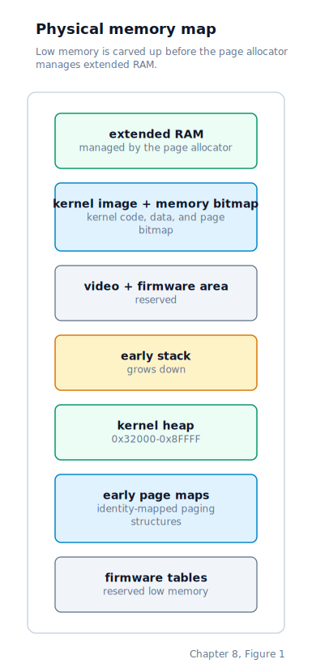
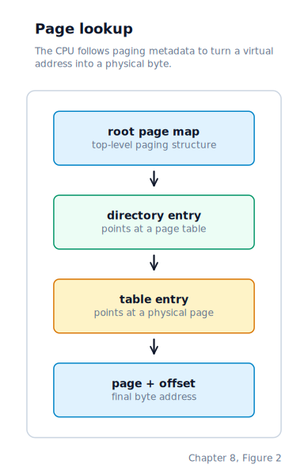
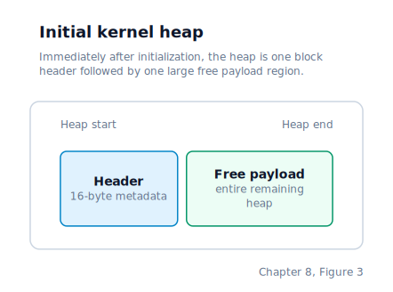
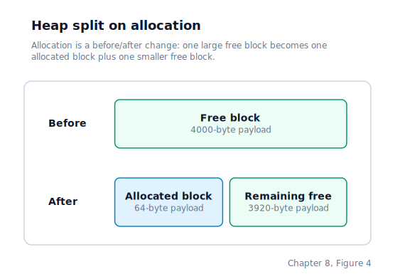
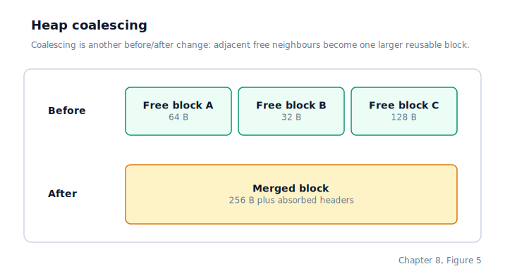
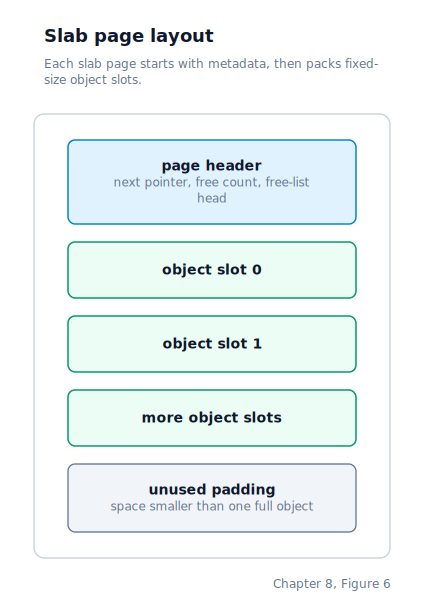
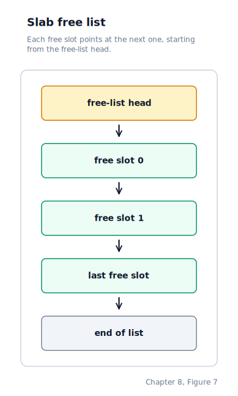

\newpage

## Chapter 8 — Memory Management

### Three Layers on Top of Raw RAM

Chapter 7 left us with a reliable map of which 4 KB chunks of physical memory are real RAM and which are holes or hardware-mapped regions. Knowing is not enough — we need to *do* something with that information. Three separate problems remain, and this chapter builds three layered solutions, each on top of the one beneath it.

The first problem is **tracking which physical pages are free and which are in use**. The solution is the **Physical Memory Manager** (PMM), which maintains a bitmap with one bit per page.

The second problem is **controlling how virtual addresses map to physical addresses**. The solution is **paging** — a hardware feature that translates every memory access through a two-level lookup table before it reaches the bus.

The third problem is **allocating arbitrary-sized chunks of memory for the kernel's own short-lived data structures**. The solution is the **kernel heap**, a simple allocator that provides `kmalloc` and `kfree` out of a reserved block of identity-mapped memory.

Each of these three subsystems is covered below. All three must be initialised in a specific order — any other order fails because each layer depends on state the previous layer established.

### The Physical Memory Layout

Before we could write the allocators, we had to decide where each piece of early-boot data lives in physical memory. These addresses must be chosen before paging is enabled, because once paging is on, every write goes through the page tables, and the page tables themselves have to already be in place.

The physical address space the kernel inherits from the BIOS looks like a stack of regions, growing upward from address zero:



The same layout in tabular form, which is easier to scan when you need an exact address:

| Start | End | Size | Region | Notes |
|-------|-----|------|--------|-------|
| `0x00000000` | `0x000004FF` | 1.25 KB | BIOS IVT + BDA | Interrupt vector table & BIOS data area — reserved |
| `0x00000500` | `0x00010FFF` | ~66 KB | Unused low RAM | Free, but not used by the kernel |
| `0x00011000` | `0x00011FFF` | 4 KB | Page directory | The 1 024-entry PD loaded into CR3 |
| `0x00012000` | `0x00031FFF` | 128 KB | Page tables | 32 page tables, identity-mapping 0–128 MB |
| `0x00032000` | `0x0008FFFF` | ~376 KB | Kernel heap | `kmalloc` / `kfree` range |
| `0x00090000` | — | — | Early stack top | Grows downward from here |
| `0x000A0000` | `0x000BFFFF` | 128 KB | VGA / ROM hole | `0xB8000` is the VGA text buffer |
| `0x000C0000` | `0x000FFFFF` | 256 KB | BIOS ROM shadow | Reserved |
| `0x00100000` | kernel end | varies | Kernel image + BSS | Code, data, and the PMM bitmap (in `.bss`) |
| kernel end | `0x07FFFFFF` | rest | Extended RAM pool | Handed out page by page by the PMM |

Everything below 1 MB is reserved or hardware-mapped. The kernel image itself starts at 1 MB, and the PMM bitmap lives inside the kernel's **BSS** (the section of an executable holding uninitialised data — it occupies no space in the file but is allocated and zeroed when the program is loaded), so it ends up just above the kernel's code and data.

### Layer 1: The Physical Memory Manager

The **PMM** tracks which physical 4 KB pages are free. It uses a **bitmap**: a flat array where each bit represents one page. A `1` means "in use", a `0` means "free".

For 128 MB of RAM with 4 KB pages, the arithmetic is tidy:

- 128 MB ÷ 4 KB = 32 768 pages.
- 32 768 bits = 4 096 bytes = exactly 4 KB of bitmap.

Visually, the bitmap is a flat array where each bit owns a single page of physical RAM. Byte 0, bit 0 describes the page at physical address `0x00000000`; byte 0, bit 1 describes the page at `0x00001000`; and so on:

| Bitmap bit | Page address | Meaning |
|------------|--------------|---------|
| `byte0 bit0` | `0x0000` | Page already reserved |
| `byte0 bit1` | `0x1000` | Page can be allocated |
| `byte0 bit2` | `0x2000` | Page already reserved |
| `byte1 bit0` | `0x8000` | Page can be allocated |

A `1` means "in use", a `0` means "free". Finding a free page is the same as finding the first byte that is not `0xFF`, then the first zero bit inside that byte — the physical address follows from `(byte_index × 8 + bit_index) × 4096`.

The bitmap is a static 4 096-byte array, which places it in the kernel's BSS section and therefore at `0x100000+` alongside the rest of the kernel image. A second static array now sits beside it: one byte of reference count per physical page. The bitmap still answers "is this page allocatable right now?", but the refcount answers "how many live mappings still point at it?" — important once processes can share physical frames. This is the same broad placement strategy Linux uses with `mem_map` — page-tracking metadata sits just above the kernel image, safely above the low-memory region where the bootloader leaves its own data.

#### Initialisation Order

The physical memory manager initializes with a conservative strategy: first mark every page as reserved, then walk the firmware memory map and open up every region the hardware reports as usable, then re-protect the regions the kernel itself occupies — the kernel image, the bitmap, the page tables, the heap, the stack, and the VGA/ROM hole.

The "start safe, then free, then re-reserve" sequence is deliberate. If the memory map is missing, everything stays marked as used and the allocator refuses to hand out anything until the fallback region (1 MB–128 MB) is explicitly freed. This prevents the kernel from ever accidentally handing out a page that is already occupied by hardware, firmware, or itself.

#### Allocation

Physical-page allocation therefore follows a simple search. The kernel scans the bitmap byte by byte for the first byte that is not `0xFF`, then bit by bit inside that byte for the first zero. It marks that page in use, sets the page's reference count to 1, and returns the corresponding physical address. If the entire bitmap is full, allocation returns zero to signal out-of-memory.

Releasing a page does not always make it free immediately. The kernel drops one reference to the frame and only clears the bitmap bit when the count reaches zero. Reserved pages such as the kernel image and the identity-mapped paging structures are pinned at refcount 255 during initialisation, which keeps normal teardown from ever recycling them accidentally.

### Layer 2: Paging

#### Why Paging Exists

With just a physical memory manager, we can allocate pages, but the CPU still has unrestricted access to every physical address. Paging adds a hardware-enforced translation layer between virtual and physical addresses. Every memory access the CPU makes — every instruction fetch, every data load, every stack push — passes through a lookup table that translates the virtual address the program used into the physical address that the RAM chips actually see.

This enables three critical capabilities:

- **Memory isolation between processes.** Each process has its own lookup table (its own page directory), so process A's pointer to `0x400000` resolves to a different physical page than process B's pointer to `0x400000`. Neither process can reach the other's memory.
- **Read-only regions.** The lookup-table entries include permission bits. The kernel's code can be mapped read-only so that a stray write cannot modify it.
- **On-demand mapping.** A page can be marked "not present", and the CPU will fault when it is touched. The fault handler can allocate a physical page, update the table, and retry the instruction.

#### The x86 Paging Structure

On 32-bit x86, the paging lookup is a two-level table walk. A 32-bit virtual address is sliced into three fields, each of which indexes a different level of the walk:

| Bits | Field | Meaning |
|------|-------|---------|
| 0-11 | Offset | Byte offset within the final 4 KB page |
| 12-21 | Table index | Selects one entry inside the page table |
| 22-31 | Directory index | Selects one entry inside the page directory |

Following those indices through memory is the **page walk**: CR3 points at the page directory, the top ten bits pick a page directory entry (PDE), that PDE points at a page table, the middle ten bits pick a page table entry (PTE), that PTE points at a 4 KB frame, and the bottom twelve bits pick the byte inside the frame:



The page directory has 1 024 entries (called **PDEs**, Page Directory Entries). Each PDE that is marked "present" points at a page table. Each page table has 1 024 entries (**PTEs**, Page Table Entries). Each PTE maps one 4 KB page. One page directory therefore covers the full 4 GB address space: 1 024 × 1 024 × 4 096 = 4 GB.

Every PDE and PTE is a 32-bit word with the same general shape — the top twenty bits are the physical frame address (because frames are 4 KB-aligned, the low twelve bits are always zero and are reused as flags), and the low twelve bits are permission and status flags:

| Bits | Field | Meaning |
|------|-------|---------|
| 0 | P | 1 = present; if 0 the CPU raises a page fault |
| 1 | R/W | 1 = writable, 0 = read-only |
| 2 | U/S | 1 = user accessible, 0 = supervisor only |
| 3 | PWT | Write-through |
| 4 | PCD | Cache disable |
| 5 | Accessed | Set by CPU on any access |
| 6 | Dirty | PTE only: set by CPU on write |
| 7 | PS / PAT | PDE: PS (Page Size) enables 4 MB pages. PTE: **PAT** (Page Attribute Table) index bit |
| 8 | Global | PTE only: TLB entry survives CR3 reloads |
| 12-31 | Frame address | Top 20 bits of the physical address of the next table (PDE) or final page (PTE) |

The CPU is told where the currently active page directory lives by writing its physical address into **CR3**, a control register that holds the current root of the paging tree. Paging itself is enabled by setting bit 31 of **CR0**.

#### Identity Mapping the First 128 MB

The initial page tables set up in `paging_init` use **identity mapping**: virtual address `X` maps to physical address `X` for every address from zero through 128 MB. This is important because it means the kernel can keep running at the same addresses after paging is enabled — every pointer in every variable continues to refer to the same physical page it did before the switch.

The function fills in the page directory one entry at a time. For the first thirty-two PDEs (covering `0x00000000` through `0x08000000`, a 128 MB region), it allocates a page table, fills every one of that table's 1 024 PTEs with `virtual == physical` mappings, and points the PDE at the table. All remaining PDEs are left as zero — any access to a virtual address above 128 MB will page-fault.

After every page table is filled in, the kernel loads the page directory's physical address into `CR3` and sets bit 31 of `CR0`. On the next instruction, the CPU is translating every memory access. Because everything is identity-mapped, nothing visibly changes.

#### Private Page Tables for User Processes

When a user program is loaded at virtual address `0x400000` (which falls in PDE index 1), it lands inside a region that every new process initially inherits from the kernel. The page tables covering the 0–128 MB identity mapping are **shared** among all processes: every process's page directory points to the same physical page tables for PDEs 0–31.

If the kernel simply wrote a new user PTE into one of those shared page tables, every later process would overwrite the previous process's mappings. When the earlier process resumed and `CR3` was reloaded (flushing the **TLB**, the CPU's cache of recent translations), it would execute the new process's physical pages instead of its own — a guaranteed crash.

The fix is to detect when a user mapping lands in a 4 MB region still backed by a shared kernel page table. In that case, the kernel allocates a brand-new page table, copies the existing kernel entries into it so ring-0 code in this address space can still reach what it needs, installs that private table in the page directory, and only then writes the user PTE. After that, the process has its own page table for the region containing its user segments, and the shared kernel mapping is untouched.

#### Cloning a Page Directory

Creating a fresh address space for a new process is straightforward: allocate a blank page directory, copy the kernel PDEs, and leave the user PDEs empty. Cloning an existing address space for a fork operation is harder, because the child needs independent page tables but we want to avoid copying user frames eagerly.

The clone therefore duplicates the paging structures in two layers. For every present PDE that contains user mappings, it allocates a fresh child page table and copies the parent's entries into it. For each present user PTE inside that table, rather than allocating a new frame immediately, it marks the page as copy-on-write: the write bit is cleared, a software-defined COW flag is set, and the physical frame's reference count is incremented so the same physical memory is shared between parent and child. A write fault later forces the real per-process copy. The important structural point here is that paging is no longer only a static map built at process-creation time — the same page-table entries are part of a live fault-and-retry protocol.

### Layer 3: The Kernel Heap

#### Why a Heap is Needed

The PMM can hand out whole pages, which is fine for page directories, page tables, and large buffers. But many kernel data structures are smaller than a page — a keyboard ring buffer slot, an eight-byte scheduler list node, a fifty-byte path string. Allocating a full 4 KB page for each would waste almost all of the memory. We therefore have our own **heap**: a reserved block of identity-mapped memory inside which `kmalloc` hands out arbitrary byte-sized ranges.

The heap occupies the physical range `0x32000`–`0x8FFFF`, about 376 KB, inside the first megabyte of RAM. It is fully identity-mapped by paging, so we can reach any byte in it with a normal C pointer.

Inside that region, the heap is structured as a linked list of variable-sized blocks. Immediately after `kheap_init`, there is exactly one block covering the whole heap:



#### The Block Header

Every allocation inside the heap is preceded by a 16-byte **header** that stores metadata immediately next to the user's data:

```c
typedef struct heap_block {
    uint32_t            magic;   // 0xDEADBEEF — integrity canary
    uint32_t            size;    // bytes of user-accessible payload
    uint32_t            free;    // 1 = free, 0 = allocated
    struct heap_block  *next;    // pointer to next block in list
} heap_block_t;
```

The heap is managed as an **embedded free list**: every block in the heap, whether free or allocated, is a 16-byte header followed by payload bytes, and the `next` field chains every block together in order. At initialisation time the kernel installs a single free block that spans the entire heap region.

#### Allocation: First-Fit With Splitting

`kmalloc` uses a first-fit policy. It walks the block list from the beginning, looking for the first block that is both marked free and at least as large as the requested size. When it finds one, it checks whether the block is significantly larger than needed — larger by at least the minimum split threshold. If so, it **splits** the block: it carves a new free block out of the extra space and reduces the original block's size to exactly what was asked for. Then it marks the original block as allocated and returns a pointer to the byte just past the header.

Splitting avoids waste: if the caller wants 64 bytes and the first free block is 4 000 bytes, the allocator carves off a 64-byte allocated block and leaves a 3 920-byte free block behind rather than consuming all 4 000 bytes. Visually:



#### Freeing: Mark and Coalesce

`kfree` takes a user pointer, backs up 16 bytes to find the header, verifies the magic value, and marks the block free. Then it makes a single forward pass over the list merging any pair of adjacent free blocks into one — a process called **coalescing**. Each merge combines two free blocks into a single larger free block, extending the first and unlinking the second.

Coalescing is what prevents **heap fragmentation**. Without it, repeated allocate/free cycles would leave the heap full of tiny unusable gaps even when there is plenty of total free space. With it, neighbours merge back together and future allocations can reuse the combined space. Concretely, if three neighbouring blocks are freed back-to-back, the coalesce pass fuses them in place:



The two intermediate headers are absorbed into A's payload, and A's `next` pointer jumps straight to D.

#### The Magic Canary

Every block header carries the constant `0xDEADBEEF` in its `magic` field. When `kfree` is called, it checks whether the header's magic is still correct. If a buffer overrun has trampled the header of an adjacent block, or if `kfree` was called with a bogus pointer, the magic value will no longer be `0xDEADBEEF`, and the function returns without doing any damage. It does not prevent the corruption — it is a smoke detector, not a sprinkler — but it stops the allocator from operating on already-corrupted metadata and making things worse.

### The Slab Allocator

`kmalloc` is a general-purpose allocator — it handles any size, but every allocation pays the cost of a header scan and coalescing logic. When the kernel needs to allocate and free the same kind of object thousands of times (process descriptors, pipe buffers, open-file entries), there is a better option: a **slab allocator**.

The idea, introduced by Jeff Bonwick at Sun Microsystems in 1994 and adopted by Linux as SLAB (and later SLUB), is to dedicate a pool of memory to a single object type. Because every slot in the pool has the same size, there is no fragmentation and no header scan — allocation is a single pointer pop.

#### Structure

The slab allocator introduces two types:

```c
typedef struct slab_hdr {
    struct slab_hdr *next;      /* intrusive list link */
    uint32_t         n_free;    /* free objects in this slab */
    void            *free_head; /* head of the embedded free list */
} slab_hdr_t;

typedef struct kmem_cache {
    const char  *name;
    uint32_t     obj_size;
    uint32_t     objs_per_slab;
    slab_hdr_t  *partial;       /* slabs with at least one free slot */
    slab_hdr_t  *full;          /* slabs with no free slots */
} kmem_cache_t;
```

A **slab** is exactly one 4 KB PMM page. The `slab_hdr_t` (12 bytes) sits at the very start; the remaining 4,084 bytes are divided into equal-sized object slots. A **cache** (`kmem_cache_t`) owns a list of these slabs for one specific object size and is itself allocated from the kernel heap.

#### Layout Within a Slab Page



#### The Embedded Free List

When a slot is free, its first four bytes hold a pointer to the next free slot. No separate array of free-slot indices is needed. After `kmem_cache_create`, the free list threads through all N slots in address order:



Allocation pops `free_head`; deallocation pushes back. Both are O(1).

#### Finding the Owning Slab at Free Time

When `kmem_cache_free` is called, it needs to update the slab that contains the object — but the caller passes only the object pointer, not the slab. Because every slab is exactly one page and the `slab_hdr_t` is at the page base, the slab address is simply the object address with its low 12 bits cleared:

```c
slab = (slab_hdr_t *)((uint32_t)obj & ~0xFFF);
```

This works as long as the object lies within the same page as its slab header, which `kmem_cache_create` guarantees by refusing object sizes that would not fit (`objs_per_slab == 0`).

#### Partial and Full Lists

The cache tracks two lists:

- **partial**: slabs with at least one free slot — the first place `kmem_cache_alloc` looks.
- **full**: slabs that are completely consumed — bypassed on allocation, moved back to partial when any object is freed into them.

When the partial list is empty and an allocation is needed, the cache claims a fresh PMM page, formats it as a new slab, and prepends it to partial. When freeing an object causes a slab to become completely empty, the slab is removed from partial and its page is returned to the PMM. This keeps the memory footprint tight: idle caches consume no physical pages.

#### Limits

The maximum object size the slab handles is `PAGE_SIZE - sizeof(slab_hdr_t)` = 4,084 bytes — enough for one object to fit per page. Objects larger than this must use `kmalloc` or `pmm_alloc_page` directly.

### The Initialisation Order

The four memory subsystems must be initialised in a specific order:

1. **Physical page tracking** walks the firmware memory map and builds the allocation bitmap. This runs before paging is on, so it writes directly into kernel BSS.
2. **Paging** fills in the page directory and page tables and switches the CPU into virtual-address mode. From the next instruction onward, every memory access goes through the translation hardware.
3. **The heap allocator** installs its initial free list over the heap region. Paging is already on at this point, but because the heap is identity-mapped the addresses still resolve correctly.
4. **Object caches** (created on demand after the heap is up) each allocate a small descriptor from the heap and grow lazily — the first physical page for a cache is claimed only when the first object is actually allocated from it.

Trying to do any of these steps out of order is impossible. The heap depends on paging being on. Paging depends on the PMM. The PMM depends on the Multiboot memory map. The slab depends on both the heap (for the descriptor) and the PMM (for slab pages).

### Where the Machine Is by the End of Chapter 8

By the end of this chapter we have four memory capabilities:

| Capability | Provided by | How the kernel calls it |
|------------|-------------|-------------------------|
| Track free physical pages | PMM | `pmm_alloc_page` / `pmm_free_page` |
| Translate virtual to physical addresses | Paging | Transparent — the CPU does it |
| Allocate and free arbitrary byte ranges | Heap | `kmalloc` / `kfree` |
| Allocate and free fixed-size objects efficiently | Slab | `kmem_cache_create` / `kmem_cache_alloc` / `kmem_cache_free` |

Together, these four layers are the foundation for every feature in the chapters that follow. Loading programs, creating processes, managing files, buffering keystrokes — every one of those requires dynamic memory. The heap handles one-off and variably-sized allocations; the slab handles the high-frequency, fixed-size objects that dominate kernel hot paths.
