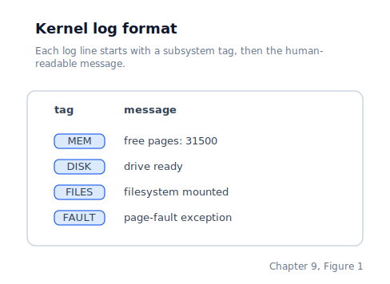
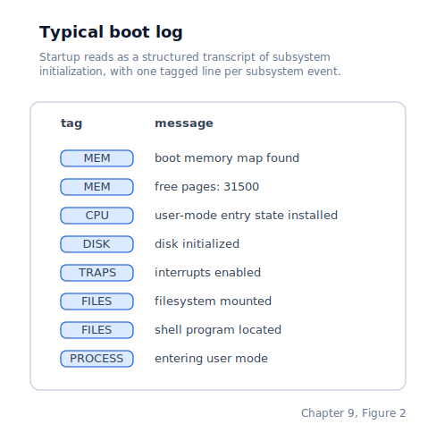

\newpage

## Chapter 9 — Kernel Boot Log

### A Shared Voice for Every Subsystem

Without a shared log, each subsystem invents its own messaging, the output becomes noisy, and once the screen scrolls the boot history is gone.

With the memory subsystem live and the heap available, the kernel can initialise subsystems that need dynamic allocation. As those subsystems come up they all need to report their status, and without a shared logging layer each one invents its own approach. One subsystem calls `print_string` directly with a literal string, another builds a message buffer inline, a third adds and removes diagnostic lines repeatedly during development. The screen becomes cluttered with inconsistent output that is hard to read and impossible to review after it scrolls away.

This chapter introduces a small logging layer called **klog**. It is not a debugging aid to be removed before shipping — it is the permanent voice the kernel uses to describe itself as it boots. Every subsystem from this chapter onward uses klog instead of calling `print_string` directly.

### The Three Functions klog Provides

klog exposes three convenience functions, and between them they cover the common messages the kernel needs to produce. All three take a short **tag** — typically a three or four-character subsystem identifier — and a message string. `klog` prints the tag and message alone at `INFO` level. `klog_uint` appends a colon, a space, and a decimal number. `klog_hex` does the same but formats the number in hexadecimal. No caller has to format numbers by hand — that logic is entirely inside the logging layer.

Underneath those wrappers sits the more general `klog_log(level, tag, msg)` entry point. That is what gives the log stream explicit severity levels such as `DEBUG`, `INFO`, `WARN`, and `ERROR` while still keeping the older helper calls small and readable.

Every call produces a single line on the boot console and on QEMU's debugcon when that output is enabled. Early in boot that visible console is the VGA text buffer; after the desktop starts, user-facing shell output is routed through the desktop while kernel diagnostics remain available through debugcon and `/proc/kmsg`. The rendered format now includes a boot-relative timestamp, a severity, a subsystem tag, and the message text:

### How It Is Implemented

klog still depends on `print_string`, the legacy text output function from Chapter 3, and still mirrors output to the optional debug console. But the log is no longer write-only. Each rendered message is also copied into a fixed-size in-memory ring buffer so the most recent history survives after the visible screen has scrolled away or the desktop has taken over the display. The ring buffer is like a revolving door with a fixed number of slots — new messages push out old ones as the head pointer wraps, but the consumer reads at its own pace from the tail.

The retained record is intentionally compact: it stores the uptime tick count, the chosen log level, a short tag, and a bounded message string. The timestamp comes from the same PIT-driven timebase that we advance every timer interrupt, so the log lines can be rendered later as `seconds.milliseconds since boot` without consulting the RTC again.

The numeric formatting helpers are still self-contained inside klog. `klog_uint` and `klog_hex` build a short formatted suffix and then hand the finished message to the shared logging path, so every public API ends up going through the same formatter, ring-buffer insertion, and console-mirroring code.

### What a Boot Log Looks Like

With klog in use everywhere, the kernel's startup path reads as a structured transcript rather than scattered, inconsistent messages. A typical boot produces:

Each line is produced by a `klog` call somewhere in `start_kernel` or one of the subsystem initialisers. The PMM lines are intentionally permanent — knowing the number of free pages at boot is operationally useful and catches memory-map parsing bugs the moment they appear.

Because the recent history is retained in memory, the boot log is no longer limited to what still fits on the visible screen. `procfs` exposes that retained transcript as `/proc/kmsg`, and the user-space `dmesg` utility simply opens and prints that file through the normal `SYS_OPEN` and `SYS_READ` path. We therefore have both immediate human-visible console output and a later-readable diagnostic history.

### When to Add a klog Call

The rule is simple: any subsystem that completes initialisation, encounters a recoverable error, reports a numeric measurement that varies between boots, or catches a CPU exception should emit a klog line. A completed initialisation usually calls `klog`; a numeric result calls `klog_uint` or `klog_hex`; a path that needs stronger severity can call `klog_log` directly. There is still no runtime log filtering — this kernel is small enough that every message is worth keeping — but severity tags make the transcript easier to scan once it is viewed later through `/proc/kmsg` or `dmesg`.

### Where the Machine Is by the End of Chapter 9

By the end of this chapter, every kernel subsystem reports its status through one shared logging interface, and the boot console reads as a consistent structured log. Because every rendered line is also retained in the in-memory ring buffer, nothing is lost when the visible screen scrolls or the desktop takes over the display. Later chapters build on that by exposing the retained log through `procfs` as `/proc/kmsg`, which is exactly how the user-space `dmesg` utility reads the boot history back out — the same pattern real Unix systems use to let operators review what happened on the way up.
