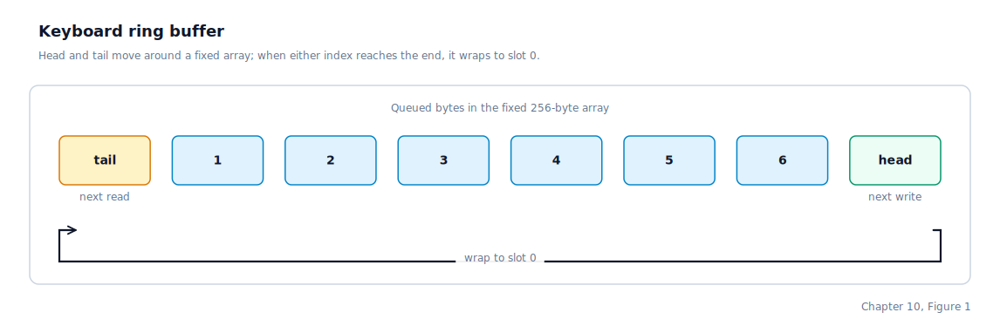

\newpage

## Chapter 10 — Keyboard Input

### From a Physical Key to a Character in a Buffer

This chapter follows the life of a single keystroke from the moment a key closes a contact on the keyboard matrix to the moment the kernel has a character ready for a user program to read. Six distinct things happen along the way:

1. The user presses a key. The keyboard controller (a small microcontroller inside the keyboard housing) detects the press and emits an electrical signal on the **IRQ** (Interrupt Request) line 1 — **IRQ1** — to the PIC (Programmable Interrupt Controller).
2. The PIC forwards the signal to the CPU as interrupt vector 33 — the vector IRQ1 was remapped to in Chapter 4.
3. The CPU saves its current state, looks up vector 33 in the IDT, and enters the common IRQ entry path.
4. The common IRQ path saves the remaining registers, converts vector 33 to IRQ line 1, and dispatches to whichever handler claimed that line.
5. The registered handler is the keyboard handler, which is the code this chapter describes.
6. The keyboard handler reads the **scancode** — the raw byte the keyboard sent — from an I/O port, converts it to an ASCII character, and appends it to a circular buffer where a later read call will find it.

Between steps 1 and 6 the rest of the system is completely passive. The keyboard driver is one of the few places in the OS where execution flows from hardware to software rather than the other way around.

### Scancodes, Not ASCII

A PC keyboard does not send ASCII. It sends **scancodes** — small numeric codes that identify which physical key was pressed or released. The **PS/2** keyboard protocol (named after IBM's 1987 Personal System/2 computer line, which standardised the connector and signalling still used by modern keyboards today) defines several sets of scancodes, and by default the keyboard uses **scancode set 1**, in which each key has a **make code** sent when the key is pressed and a **break code** sent when it is released. The break code for any key is the make code with bit 7 set — that is, the make code plus `0x80`.

Our driver is deliberately simple: it ignores key releases entirely. When the handler reads a byte with bit 7 set, it returns without doing anything. Modifier keys like Shift and Ctrl are also ignored — they exist in the driver's scancode table but map to zero, meaning "no character". Because of this, typing `A` and `a` both produce the same lowercase letter. Adding proper modifier tracking (watching for shift down and shift up to toggle a flag) is a straightforward extension.

The scancode is read from **I/O port `0x60`**, the keyboard controller's data port. Reading that port both returns the most recent scancode and clears the keyboard's output buffer, making room for the next press.

### The Scancode-to-ASCII Table

We map scancodes to characters with a static lookup table indexed by scancode. Scancode `0x02` through `0x0D` are the top-row number keys and their variants (`1`, `2`, `3`, ..., `0`, `-`, `=`). Scancode `0x0E` is Backspace; the table returns `\b`. Scancode `0x0F` is Tab; the table returns `\t`. The next row (`0x10` through `0x1B`) is `q` through `]`. The row after that is `a` through `` ` ``. Then the bottom row, `\` through `/`. Scancode `0x1C` is Enter, mapped to `\n`. Scancode `0x39` is the spacebar, mapped to `' '`.

Any scancode that falls outside the table, or that maps to zero, produces no character at all. This is how Shift, Ctrl, Alt, Caps Lock, and the function keys are effectively disabled.

### The Ring Buffer

Our handler runs inside an interrupt context. Interrupt context has two hard rules: it must finish quickly (other interrupts may be pending), and it must not block waiting for anything. At the same time, the program that wants to read a keystroke is running at a completely different rate and may not be ready to consume a character at the exact moment one arrives.

The classic solution is a **ring buffer**, also called a circular buffer. A ring buffer is a fixed-size array with two indices: a head index that points to the next slot to write, and a tail index that points to the next slot to read. The interrupt handler writes at the head and advances the head index. The consumer reads at the tail and advances the tail index. When either index walks off the end of the array, it wraps around to zero.

We declare a 256-byte buffer and the two indices:

```c
#define KB_BUFFER_SIZE 256
static char kb_buffer[KB_BUFFER_SIZE];
static int  kb_head = 0;
static int  kb_tail = 0;
```

When the head catches up to the tail, the buffer is full and the next keystroke is dropped. When they're equal, the buffer is empty.

Visually, the buffer is a fixed array with the two indices chasing each other around its edge. After the user types `hi`, the state looks like this:



When the consumer reads one character, `kb_tail` advances; when the interrupt pushes one, `kb_head` advances. Whichever index reaches the end of the array next wraps to zero and keeps going.

The producer path writes at the head, checks the full condition, and advances. The consumer path reads at the tail (if the buffer is not empty), advances the tail, and returns the character. Neither side allocates memory, neither blocks, and neither requires locking because there is only one producer (the interrupt) and one consumer (the main kernel code) and the indices are updated in a safe order.

### Modifier Keys and Ctrl+C

Our driver now tracks modifier key state beyond just Shift. Two modifier flags — `shift_held` and `ctrl_held` — are updated on every make code and cleared on the corresponding break code.

Shift (scancodes `0x2A` and `0x36`) has been tracked since the original implementation. We maintain separate shifted and unshifted scancode tables and select between them based on `shift_held`. Ctrl (scancode `0x1D`) follows the same pattern: the make code sets `ctrl_held = 1`; the break code (`0x9D = 0x1D | 0x80`) clears it.

When `ctrl_held` is set and scancode `0x2E` (the letter `c`) arrives, we do not push a character to the ring buffer. Instead the keyboard path hands the event to the foreground-signal logic, which decides where to send the interrupt signal based on what is currently running:

- If a foreground job is running, the kernel sends SIGINT — an interrupt signal that terminates the target process by default — to the currently running process and to the process that the waiting program is blocked on. This covers jobs with multiple processes: a pipe such as `writer | reader` forks two children and the waiting program is blocked on the writer, so both the currently scheduled reader and the writer get SIGINT. Visual feedback (`^C\n`) is printed before delivering the signals.
- If no child is running (the interactive program is at the prompt), the kernel pushes the byte `0x03` — the **ETX** (End of Text) ASCII control character — into the ring buffer. The prompt loop detects ETX, prints `^C`, discards the current input line, and re-prompts.

This design means our keyboard driver never makes policy decisions about process termination. It only detects the keystroke and reports it to the signal subsystem. Whether the signal kills a process, is caught by a user handler, or is silently ignored is determined by each process's signal disposition.

Ctrl+Z follows the same pattern: when `ctrl_held` is set and scancode `0x2C` (the letter `z`) arrives, the TTY layer prints `^Z\n` and sends a terminal-stop signal to the foreground process group. The stopped process enters a suspended state and is invisible to the scheduler until a continue signal arrives.

### Sending the End-of-Interrupt Signal

After the handler has processed the keystroke, it must tell the PIC that the interrupt is complete. The PIC does not know when a handler finishes — it only knows that one is in progress. If we return from the handler without notifying the PIC, it will refuse to deliver any future interrupt of the same priority, which on IRQ1 means the keyboard stops working entirely.

The notification is a single byte written to the master PIC's command port. That byte is `0x20`, and it goes to port `0x20`. For interrupts that come from the slave PIC (IRQs 8–15), we have to send the EOI to both the slave (port `0xA0`) and the master (port `0x20`), because the slave's signal reaches the CPU by way of the master. IRQ1 is on the master, so only one write is needed.

The EOI is sent by the shared IRQ dispatch layer after the registered handler returns, not by the keyboard handler itself. Every IRQ handler benefits from this — the EOI is centralised so individual drivers cannot forget to send it.

### Registering With the Kernel

Our keyboard driver does not expose a bespoke read function through a header that other subsystems include. Instead, startup registers the keyboard with two kernel-wide registries before interrupts are enabled.

First, the driver claims IRQ1 in the IRQ dispatch table. From that point on, every keyboard interrupt reaches the driver without any code outside the driver needing to know the handler's name or address.

Second, it publishes the same character-device interface under both `"stdin"` and `"tty0"`. The syscall layer reads file descriptor 0 by looking up whichever device currently owns `"stdin"` and calling through its ops-table. This means the syscall code has no compile-time dependency on the keyboard driver. A future driver could register a different device under `"stdin"` without touching the syscall code at all. Chapter 12 describes the character device registry in detail.

### Extended Scancodes and Page Up / Page Down

Extended scancodes are two-byte sequences: a `0xE0` prefix followed by a key-identifying byte. The PS/2 keyboard uses them for many keys that do not appear in the original 83-key AT layout — arrow keys, Home, End, Insert, Delete, Page Up, and Page Down among them. These keys send a prefix byte of `0xE0` followed by a second make code, instead of the single-byte make codes used by letters and digits.

We handle this with a one-bit flag, `e0_prefix`. When the interrupt fires and the byte read from port `0x60` is `0xE0`, the handler sets the flag and returns immediately — there is nothing to push into the ring buffer yet. When the very next interrupt arrives, the flag is set, so the handler treats the new scancode as the second half of an extended pair:

| First byte | Second byte | Key |
|---|---|---|
| `0xE0` | `0x49` | Page Up |
| `0xE0` | `0x51` | Page Down |

Rather than invent a new encoding, we map these two keys to the ASCII control codes **SOH** (Start of Header, `0x01`) and **STX** (Start of Text, `0x02`). These byte values are never produced by printable keys and are not used by any other part of the input loop, so they act as private signals that the consuming code can detect without ambiguity. Any unrecognised extended scancode is silently dropped. Key-release events (scancodes with the high bit set) clear the `e0_prefix` flag and return, the same as before.

### Polling Versus Blocking

The `SYS_READ` implementation at this stage still **spins** on the keyboard character source — it polls in a tight loop until a non-zero byte appears. This is wasteful of CPU cycles (a busy-waiting loop does no useful work) but simple to implement. A more sophisticated approach would put the process to sleep and use the `HLT` instruction (which halts the CPU until the next interrupt arrives) to avoid burning cycles. That refinement is straightforward once a proper sleep/wake mechanism is in place.

### Where the Machine Is by the End of Chapter 10

Every key the user presses now produces a character in the kernel's ring buffer, and a user program can call `SYS_READ` on file descriptor 0 to pull those characters out one at a time. Pressing Ctrl+C while a foreground job is running sends an interrupt signal to every runnable process in that job (including all stages of a pipeline); pressing Ctrl+C at the prompt cancels the current input line. Pressing Ctrl+Z sends a terminal-stop signal to the foreground process group, suspending the running program and returning control to the waiting program.

The architecture introduced in this chapter — interrupt fires, handler pushes to a ring buffer (or sends a signal), consumer pulls from the ring buffer — is the same pattern real operating systems use. The hardware-specific pieces (scancode decoding, I/O port numbers, EOI sequences) vary by device and by PIC, but the separation between the interrupt producer and the sleeping consumer is universal.
