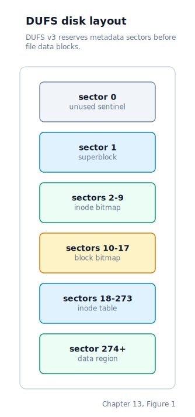
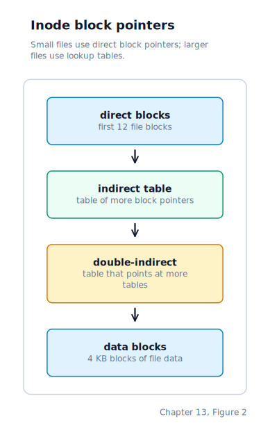
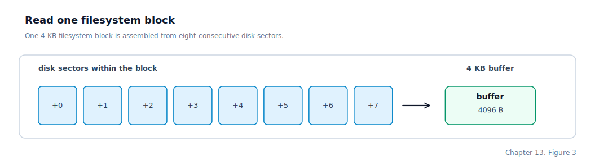
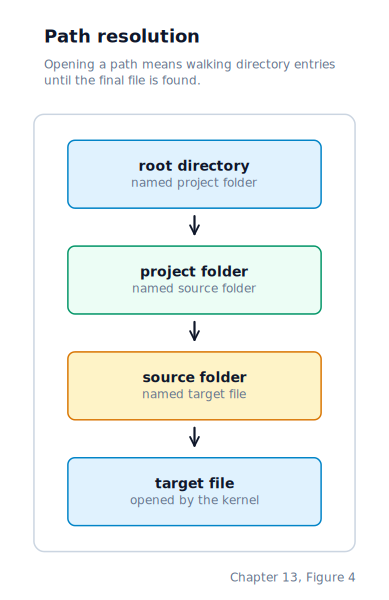
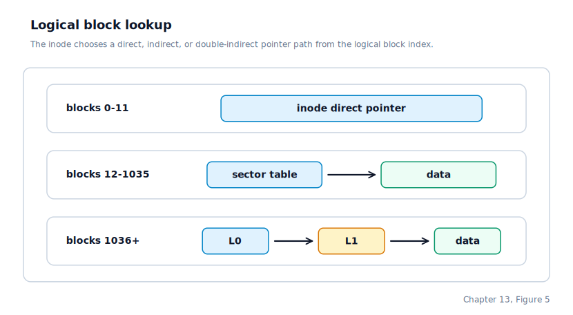
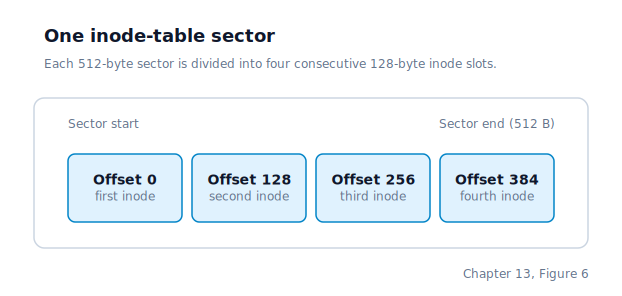
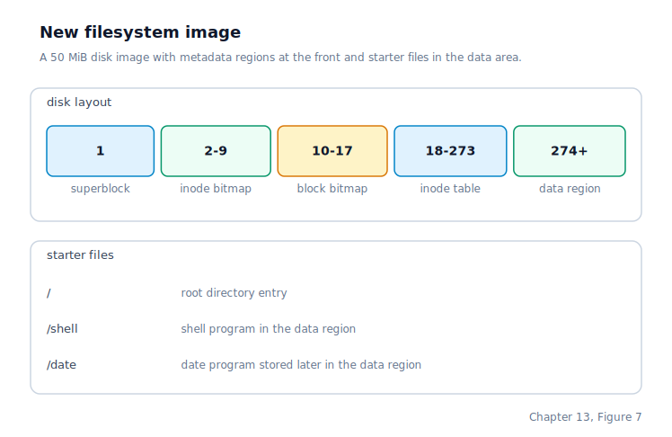

\newpage

## Chapter 13 — An Inode-Based Filesystem (DUFS v3)

### Why a Filesystem Is Necessary

Chapter 12 left us with a block device registry that routes all disk I/O through named ops-tables. Up to this point we loaded `shell` from a hard-coded sector offset on the disk. That worked because the Makefile placed the file at a known location and the loader knew exactly where to look. It stops working the moment a second program is added, because we have no way to distinguish one binary from another — every sector is just a sequence of bytes.

A **filesystem** is the layer of software that turns a numbered sector into a named file and back again. This chapter builds DUFS v3 — "OS File System, version 3" — a compact inode-based filesystem modelled after the classical UNIX design with Linux-compatible limits. Understanding it requires following the path a single `open("shell")` call takes from the kernel's VFS layer down to a raw ATA sector read.

### Why Inodes?

The very first DUFS stored each file's name, size, and starting sector together in a single flat directory entry. That worked for a tiny proof-of-concept but has four fundamental problems:

**Renaming is expensive.** Moving a file between directories means rewriting the entry's parent field, which in the v1 design is an index into the same directory table, making renames entangled with directory state.

**Hard links are impossible.** A hard link is two names pointing at the same file content. With metadata embedded in the directory entry, giving one file two names would require duplicating all the metadata and keeping both copies in sync — it cannot be done reliably.

**Contiguous allocation is a dead end.** V1 stores only a `start_lba`, so every file must live in one contiguous run of sectors. A file cannot grow past an adjacent occupied sector without being relocated. With block pointers in the inode, a file can be assembled from non-contiguous blocks anywhere on the disk.

**Directory entries bloat with metadata.** When a directory entry holds all the metadata, scanning it for a name lookup also reads timestamps, sizes, and permissions — data that the name lookup does not need.

UNIX (Bell Labs, 1969) separated name from metadata by introducing the **inode** (index node): a small fixed-size record on disk that holds the file's type, size, link count, and an array of block pointers. Directory entries become `(name, inode_number)` pairs only. Two names can point at the same inode number — that is a hard link. Renaming a file within the same directory only rewrites the directory entry, not the inode. The inode is the ground truth; the directory is just the index.

Linux's `ext2` filesystem, the direct descendant of the original UNIX design, works exactly this way. DUFS v3 follows the same principles and matches Linux's key limits: `NAME_MAX = 255`, `PATH_MAX = 4096`, and 4096-byte data blocks.

### The On-Disk Layout

DUFS v3 divides the disk into six regions. The ATA driver works in 512-byte **sectors** (LBAs). DUFS groups eight consecutive sectors into one 4096-byte **block** — the unit at which file data and directory content are allocated and read. **LBA** (Logical Block Addressing) numbers sectors from zero.



The first 274 LBAs are entirely overhead — superblock, bitmaps, and the inode table. File data and directory content begin at LBA 274. The block bitmap can track up to 32,768 data blocks (128 MB); the inode table holds up to 1,024 inodes. The disk image is 50 MB (102,400 sectors).

### On-Disk Structures

The superblock, inode, and directory entry are defined as packed C structs so the kernel can read a raw sector buffer and cast it directly to the right type.

**Superblock** — exactly one sector at LBA 1. It identifies the filesystem and records the locations of all other regions:

```c
typedef struct {
    uint32_t magic;             /* 0x44554603 — "DUF\x03" (DUFS v3)         */
    uint32_t total_sectors;     /* total sectors in the disk image           */
    uint32_t inode_count;       /* number of inode slots (1024)              */
    uint32_t inode_bitmap_lba;  /* start LBA of the inode bitmap block (2)  */
    uint32_t block_bitmap_lba;  /* start LBA of the block bitmap block (10) */
    uint32_t inode_table_lba;   /* start LBA of the inode table (18)        */
    uint32_t data_lba;          /* start LBA of the first data block (274)  */
    uint8_t  pad[484];          /* zeroed padding to fill the sector         */
} __attribute__((packed)) dufs_super_t;
```

The **magic** field is the filesystem's fingerprint. When `fs_init` reads the superblock it compares the magic against the expected constant. A mismatch means the disk image was built by a different version — we refuse to mount rather than interpret random bytes as a filesystem.

**Inode** — 128 bytes, four per sector. An inode never stores the file's name; it stores everything else about the file:

```c
typedef struct {
    uint16_t type;            /* DUFS_TYPE_FILE = 1, DUFS_TYPE_DIR = 2      */
    uint16_t link_count;      /* directory entries naming this file          */
    uint32_t size;            /* file size in bytes (0 for directories)      */
    uint32_t block_count;     /* data blocks currently allocated             */
    uint32_t mtime;           /* last-modified Unix timestamp, UTC seconds   */
    uint32_t atime;           /* last-accessed Unix timestamp, UTC seconds   */
    uint32_t direct[12];      /* direct block LBAs (0 = unallocated)         */
    uint32_t indirect;        /* single-indirect block LBA (0 = none)        */
    uint32_t double_indirect; /* double-indirect block LBA (0 = none)        */
    uint8_t  pad[52];         /* zeroed padding to reach 128 bytes           */
} __attribute__((packed)) dufs_inode_t;
```

The block pointers are the heart of the inode. Each block is 4096 bytes. Twelve `direct` entries cover up to 48 KB directly. When a file exceeds that, `indirect` holds the LBA of a 4096-byte **indirect block** containing 1024 LBA values — adding up to 4 MB more. For files larger still, `double_indirect` holds a 4096-byte block whose 1024 entries each point to their own indirect block, covering up to 4 GB. On a 50 MB disk, the practical ceiling is the disk itself.



The capacity at each tier is: 12 direct blocks × 4096 bytes = **48 KB**; one indirect block × 1024 entries × 4096 bytes = **4 MB**; one double-indirect block × 1024 × 1024 × 4096 bytes ≈ **4 GB**. On a 50 MB disk image the practical ceiling is the disk itself.

A block pointer value of 0 means "not allocated". LBA 0 is always unused on DUFS disks, so 0 is a safe sentinel that costs nothing to detect.

**Directory entry** — 260 bytes, fifteen per 4096-byte block. Every directory is a flat array of these:

```c
typedef struct {
    char     name[256];  /* null-terminated filename (max 255 characters)    */
    uint32_t inode;      /* inode number (0 = empty / deleted slot)          */
} __attribute__((packed)) dufs_dirent_t;
```

The 256-byte name field matches Linux's `NAME_MAX = 255`: 255 characters plus a NUL terminator. Fifteen entries pack into one 4096-byte block (15 × 260 = 3900 bytes; 196 bytes unused per block). The inode number links the name to all the file's metadata.

### Inode 0 and Inode 1

Inode 0 is permanently reserved and never allocated to any file or directory. Its bitmap bit is set at image-build time and the allocation scan starts at inode 2, so inode 0 is invisible to the rest of the code. Using 0 as the "no inode" sentinel in directory entries is safe precisely because inode 0 is never valid.

Inode 1 is always the **root directory** — the directory that every path without a leading slash is resolved against. This convention matches the classical UNIX design: Linux's `ext2`, `ext3`, and `ext4` all fix inode 2 as the root (inode 1 is reserved for a different purpose in those filesystems; DUFS uses 1 directly). The root directory's inode is written by the image-building tool at build time; we read it on mount to locate the root's data blocks.

### Initialisation

When the filesystem is mounted at boot, the driver opens the disk, reads the superblock, and validates a magic number embedded in it. A mismatch means the disk either has no DUFS filesystem or is corrupted, and the mount fails immediately.

If the magic is correct, the inode bitmap and the block bitmap are both read into kernel memory, where they remain for the rest of the kernel's lifetime. Keeping them in RAM means every allocation or lookup can check or update a bitmap with a simple in-memory bit operation rather than a disk read.

We keep no in-memory cache of inodes or directory contents. Every directory lookup, every read, and every write goes through the block device for its I/O.

### Block I/O

All data I/O in DUFS v3 operates on 4096-byte blocks. Because the ATA driver transfers exactly one 512-byte sector at a time, every block-level read or write internally calls `read_sector` or `write_sector` eight times in sequence:



Inode table I/O is the exception: inodes are 128 bytes with four per sector, so inode reads and writes still use single-sector calls. This keeps inode I/O efficient — updating one inode costs one sector read and one sector write, not eight of each.

### Path Resolution

DUFS supports paths of arbitrary depth. A bare name like `"shell"` names a root-level file. A slash-separated path like `"projects/src/main.c"` names a file nested three levels deep. A leading `/` is ignored — `"/a/b"` and `"a/b"` are equivalent.

DUFS resolves a path with an iterative component walk modelled after Linux's path-walk logic. The important split is the same in both systems: one layer walks components from left to right, and the filesystem-specific lookup step only has to answer "inside this directory, which inode goes with this name?"

The walk begins at inode 1 (root) and processes each `/`-separated component left to right. For each intermediate component, the filesystem looks that name up in the current directory, reads the resulting inode to confirm it is itself a directory, and then advances into it. When there are no more slashes, the remaining string becomes the **leaf name** and the last directory reached becomes the **containing directory inode**. The leaf itself is not looked up yet, because the caller may be creating it rather than opening it.

The walk for a path like `projects/src/main.c` looks like this:



### Reading File Data

Reading from a file maps a byte range within that file to a sequence of block reads. The filesystem reads the inode first to get the file size; if `offset >= size`, the read returns 0 — **EOF** (End of File, the condition that no further data exists beyond this point). Otherwise the requested range is capped at `size - offset` bytes.

The byte range is then walked block by block. For each block, the filesystem computes a **logical block index**: `block_idx = cur_offset / 4096`. It translates that logical index to a physical LBA by examining the direct, indirect, and double-indirect pointers in the inode, reads the 4096-byte block from disk, copies the relevant bytes into `buf`, and advances the cursor.



### Writing File Data

Writing extends a file, allocating new data blocks on demand. For each block in the affected range, the filesystem first ensures that a real block exists. If the relevant direct or indirect pointer is still zero, it finds a free block in the block bitmap, marks it allocated, zeroes it on disk, and stores the new LBA in the inode. For writes that land in the indirect or double-indirect range, the intermediate table blocks are allocated first.

The block bitmap is held in memory during the write. The allocation bits are updated immediately there, but the bitmap itself is flushed to disk only once at the end of the whole write, along with the updated inode. That keeps a large multi-block write from re-writing the bitmap on every single block allocation.

### Creating and Deleting Files

Creating a file starts by walking the path to its parent directory. If an entry with the same name already exists and is a file, the existing inode's data blocks are freed, its `mtime` is refreshed from the kernel wall clock, and the same inode number is returned — a truncation. If no entry exists, the filesystem allocates a fresh inode, stamps it with the current Unix timestamp, and inserts a new `(leaf_name, inode_number)` record into the parent directory.

Adding an entry to a directory scans the parent's existing data blocks for an empty slot. If one is found, it is filled and the parent's modification timestamp is updated. If every existing block is full, a new block is allocated for the directory and the entry goes there.

Removing a file resolves the path, reads the file's inode, and decrements `link_count`. When that count reaches zero, the filesystem frees every data block the inode owns. For double-indirect files this means walking the whole pointer tree: the data blocks themselves, the L1 blocks that point at them, and finally the top-level L0 block.

Creating and removing directories follows the same path-walk logic. A new directory gets a fresh inode marked as a directory and is inserted into its parent, but it owns no data blocks until the first directory entry is added to it. Removing a directory is allowed only when it is empty.

### Block and Inode Bitmaps

Both bitmaps live in memory as 4096-byte arrays. Bit `i` of the inode bitmap corresponds to inode `i`. Bit `i` of the block bitmap corresponds to the data block starting at `LBA = data_lba + i × 8`.

Block allocation scans from bit 0 and returns the first free 4096-byte data block. Block freeing performs the inverse mapping from LBA back to bitmap bit and clears that bit.

Flushing a bitmap to disk writes all eight sectors of the bitmap block in sequence.

### The Inode Table on Disk

The inode table spans LBAs 18 through 273 (256 sectors = 1024 inodes × 128 bytes). Each sector holds four 128-byte inodes at offsets 0, 128, 256, and 384.

Reading inode `n` requires computing the sector: `inode_table_lba + n / 4`, and the slot within that sector: `n % 4`. `inode_read(n, out)` performs one sector read and copies the appropriate 128-byte slice. `inode_write(n, in)` performs a read-modify-write: it reads the sector, replaces the target slot, and writes the sector back.



### Building the Disk Image

The image-building tool constructs a valid DUFS v3 image from a list of source files and their destination paths. It runs at build time.

Destination paths may contain `/` at any depth: `"usr/bin/hello"` causes the script to create both `usr/` and `usr/bin/` automatically. The directory tree is built by splitting each destination path on `/`, creating every intermediate component. Inode numbers are assigned in breadth-first order — parents always receive lower inode numbers than their children.

Initial image timestamps are populated at build time. File inodes receive the host file's modification time, while directory inodes receive the image build time. Runtime changes use the kernel wall clock instead.



### The VFS Interface

DUFS v3 registers itself with the **VFS** (Virtual File System, the abstraction layer that lets multiple filesystem implementations coexist behind one interface) through an ops-table:

| Operation | DUFS v3 function | Meaning |
|-----------|------------------|---------|
| `init` | `fs_init` | Mount the filesystem and load its on-disk metadata |
| `open` | `fs_open` | Resolve a path to an inode number and file size |
| `getdents` | `fs_list` | Enumerate the entries in a directory |
| `create` | `fs_create` | Create or truncate a file and return its inode number |
| `unlink` | `fs_unlink` | Remove a file name and free the inode when its link count reaches zero |
| `mkdir` | `fs_mkdir` | Create a new directory inode and attach it to its parent |
| `rmdir` | `fs_rmdir` | Remove an empty directory |
| `rename` | `fs_rename` | Move or rename a directory entry |
| `stat` | `fs_stat` | Return file metadata such as type, size, link count, and timestamps |

All layers above the VFS identify files by inode number rather than by LBA. `file_handle_t` in the process descriptor stores `inode_num`; the read and write syscalls pass that number directly to `fs_read` and `fs_write`.

`fs_flush_inode(inode_num)` is a no-op in DUFS v3. The inode is always written back at the end of every `fs_write` call, so `sys_close` has nothing extra to flush.

### Where the Machine Is by the End of Chapter 13

The DUFS v3 image is now mounted and the filesystem layer is fully operational. We have read the superblock from LBA 1, verified the magic number, and loaded both 4096-byte bitmaps into memory. The root directory inode (inode 1) is our anchor for every subsequent path resolution.

From here, any filename — whether a bare name in the root or a slash-separated path of arbitrary depth — resolves to an inode number through the filesystem's path walk. That inode number is our stable handle for the file: it outlives renames (the inode number never changes when a directory entry is rewritten), and two names pointing at the same inode number coexist correctly because the inode tracks a `link_count` rather than a single owning entry.

File data is stored in 4096-byte blocks, addressed by up to twelve direct pointers plus single-indirect and double-indirect chains. A small file lives entirely in direct blocks; a large file extends transparently through indirect addressing without any change to the callers above.

The inode number has replaced the raw LBA as our handle for an open file. Every layer from the ELF loader through the process open-file table and the read/write syscalls now speaks in inode numbers, with DUFS v3 handling the translation to physical disk sectors internally.
