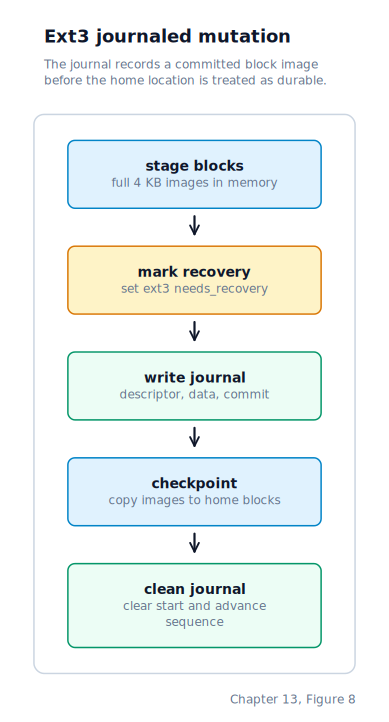

\newpage

## Chapter 13 — Inode Filesystems: DUFS v3 and ext3

### Why a Filesystem Is Necessary

Chapter 12 left us with a block device registry that routes all disk I/O through named ops-tables. Up to this point we loaded `shell` from a hard-coded sector offset on the disk. That worked because the Makefile placed the file at a known location and the loader knew exactly where to look. It stops working the moment a second program is added, because we have no way to distinguish one binary from another — every sector is just a sequence of bytes.

A **filesystem** is the layer of software that turns a numbered sector into a named file and back again. This chapter starts with DUFS v3 — "OS File System, version 3" — a compact inode-based filesystem modelled after the classical UNIX design with Linux-compatible limits. It then connects those same ideas to Drunix's default root filesystem: a small, deterministic ext3 image that host Linux tools can inspect and that the kernel can update through an internal journal. Understanding both requires following the path a single `open("shell")` call takes from the kernel's VFS layer down to a raw ATA sector read.

### Why Inodes?

The very first DUFS stored each file's name, size, and starting sector together in a single flat directory entry. That worked for a tiny proof-of-concept but has four fundamental problems:

**Renaming is expensive.** Moving a file between directories means rewriting the entry's parent field, which in the v1 design is an index into the same directory table, making renames entangled with directory state.

**Hard links are impossible.** A hard link is two names pointing at the same file content. With metadata embedded in the directory entry, giving one file two names would require duplicating all the metadata and keeping both copies in sync — it cannot be done reliably.

**Contiguous allocation is a dead end.** V1 stores only a `start_lba`, so every file must live in one contiguous run of sectors. A file cannot grow past an adjacent occupied sector without being relocated. With block pointers in the inode, a file can be assembled from non-contiguous blocks anywhere on the disk.

**Directory entries bloat with metadata.** When a directory entry holds all the metadata, scanning it for a name lookup also reads timestamps, sizes, and permissions — data that the name lookup does not need.

UNIX (Bell Labs, 1969) separated name from metadata by introducing the **inode** (index node): a small fixed-size record on disk that holds the file's type, size, link count, and an array of block pointers. Directory entries become `(name, inode_number)` pairs only. Two names can point at the same inode number — that is a hard link. Renaming a file within the same directory only rewrites the directory entry, not the inode. The inode is the ground truth; the directory is just the index.

Linux's `ext2` filesystem, the direct descendant of the original UNIX design, works exactly this way. DUFS v3 follows the same principles and matches Linux's key limits: `NAME_MAX = 255`, `PATH_MAX = 4096`, and 4096-byte data blocks.

### The On-Disk Layout

DUFS v3 divides the disk into six regions. The ATA driver works in 512-byte **sectors** (LBAs). DUFS groups eight consecutive sectors into one 4096-byte **block** — the unit at which file data and directory content are allocated and read. **LBA** (Logical Block Addressing) numbers sectors from zero.


The first 274 LBAs are entirely overhead — superblock, bitmaps, and the inode table. File data and directory content begin at LBA 274. The block bitmap can track up to 32,768 data blocks (128 MB); the inode table holds up to 1,024 inodes. The disk image is 50 MB (102,400 sectors).

### On-Disk Structures

The superblock, inode, and directory entry are defined as packed C structs so the kernel can read a raw sector buffer and cast it directly to the right type.

**Superblock** — exactly one sector at LBA 1. It identifies the filesystem and records the locations of all other regions:

```c
typedef struct {
    uint32_t magic;             /* 0x44554603 — "DUF\x03" (DUFS v3)         */
    uint32_t total_sectors;     /* total sectors in the disk image           */
    uint32_t inode_count;       /* number of inode slots (1024)              */
    uint32_t inode_bitmap_lba;  /* start LBA of the inode bitmap block (2)  */
    uint32_t block_bitmap_lba;  /* start LBA of the block bitmap block (10) */
    uint32_t inode_table_lba;   /* start LBA of the inode table (18)        */
    uint32_t data_lba;          /* start LBA of the first data block (274)  */
    uint8_t  pad[484];          /* zeroed padding to fill the sector         */
} __attribute__((packed)) dufs_super_t;
```

The **magic** field is the filesystem's fingerprint. When `fs_init` reads the superblock it compares the magic against the expected constant. A mismatch means the disk image was built by a different version — we refuse to mount rather than interpret random bytes as a filesystem.

**Inode** — 128 bytes, four per sector. An inode never stores the file's name; it stores everything else about the file:

```c
typedef struct {
    uint16_t type;            /* DUFS_TYPE_FILE = 1, DUFS_TYPE_DIR = 2      */
    uint16_t link_count;      /* directory entries naming this file          */
    uint32_t size;            /* file size in bytes (0 for directories)      */
    uint32_t block_count;     /* data blocks currently allocated             */
    uint32_t mtime;           /* last-modified Unix timestamp, UTC seconds   */
    uint32_t atime;           /* last-accessed Unix timestamp, UTC seconds   */
    uint32_t direct[12];      /* direct block LBAs (0 = unallocated)         */
    uint32_t indirect;        /* single-indirect block LBA (0 = none)        */
    uint32_t double_indirect; /* double-indirect block LBA (0 = none)        */
    uint8_t  pad[52];         /* zeroed padding to reach 128 bytes           */
} __attribute__((packed)) dufs_inode_t;
```

The block pointers are the heart of the inode. Each block is 4096 bytes. Twelve `direct` entries cover up to 48 KB directly. When a file exceeds that, `indirect` holds the LBA of a 4096-byte **indirect block** containing 1024 LBA values — adding up to 4 MB more. For files larger still, `double_indirect` holds a 4096-byte block whose 1024 entries each point to their own indirect block, covering up to 4 GB. On a 50 MB disk, the practical ceiling is the disk itself.


The capacity at each tier is: 12 direct blocks × 4096 bytes = **48 KB**; one indirect block × 1024 entries × 4096 bytes = **4 MB**; one double-indirect block × 1024 × 1024 × 4096 bytes ≈ **4 GB**. On a 50 MB disk image the practical ceiling is the disk itself.

A block pointer value of 0 means "not allocated". LBA 0 is always unused on DUFS disks, so 0 is a safe sentinel that costs nothing to detect.

**Directory entry** — 260 bytes, fifteen per 4096-byte block. Every directory is a flat array of these:

```c
typedef struct {
    char     name[256];  /* null-terminated filename (max 255 characters)    */
    uint32_t inode;      /* inode number (0 = empty / deleted slot)          */
} __attribute__((packed)) dufs_dirent_t;
```

The 256-byte name field matches Linux's `NAME_MAX = 255`: 255 characters plus a NUL terminator. Fifteen entries pack into one 4096-byte block (15 × 260 = 3900 bytes; 196 bytes unused per block). The inode number links the name to all the file's metadata.

### Inode 0 and Inode 1

Inode 0 is permanently reserved and never allocated to any file or directory. Its bitmap bit is set at image-build time and the allocation scan starts at inode 2, so inode 0 is invisible to the rest of the code. Using 0 as the "no inode" sentinel in directory entries is safe precisely because inode 0 is never valid.

Inode 1 is always the **root directory** — the directory that every path without a leading slash is resolved against. This convention matches the classical UNIX design: Linux's `ext2`, `ext3`, and `ext4` all fix inode 2 as the root (inode 1 is reserved for a different purpose in those filesystems; DUFS uses 1 directly). The root directory's inode is written by the image-building tool at build time; we read it on mount to locate the root's data blocks.

### Initialisation

When the filesystem is mounted at boot, the driver opens the disk, reads the superblock, and validates a magic number embedded in it. A mismatch means the disk either has no DUFS filesystem or is corrupted, and the mount fails immediately.

If the magic is correct, the inode bitmap and the block bitmap are both read into kernel memory, where they remain for the rest of the kernel's lifetime. Keeping them in RAM means every allocation or lookup can check or update a bitmap with a simple in-memory bit operation rather than a disk read.

We keep no in-memory cache of inodes or directory contents. Every directory lookup, every read, and every write goes through the block device for its I/O.

### Block I/O

All data I/O in DUFS v3 operates on 4096-byte blocks. Because the ATA driver transfers exactly one 512-byte sector at a time, every block-level read or write internally calls `read_sector` or `write_sector` eight times in sequence:


Inode table I/O is the exception: inodes are 128 bytes with four per sector, so inode reads and writes still use single-sector calls. This keeps inode I/O efficient — updating one inode costs one sector read and one sector write, not eight of each.

### Path Resolution

DUFS supports paths of arbitrary depth. A bare name like `"shell"` names a root-level file. A slash-separated path like `"projects/src/main.c"` names a file nested three levels deep. A leading `/` is ignored — `"/a/b"` and `"a/b"` are equivalent.

DUFS resolves a path with an iterative component walk modelled after Linux's path-walk logic. The important split is the same in both systems: one layer walks components from left to right, and the filesystem-specific lookup step only has to answer "inside this directory, which inode goes with this name?"

The walk begins at inode 1 (root) and processes each `/`-separated component left to right. For each intermediate component, the filesystem looks that name up in the current directory, reads the resulting inode to confirm it is itself a directory, and then advances into it. When there are no more slashes, the remaining string becomes the **leaf name** and the last directory reached becomes the **containing directory inode**. The leaf itself is not looked up yet, because the caller may be creating it rather than opening it.

The walk for a path like `projects/src/main.c` looks like this:


### Reading File Data

Reading from a file maps a byte range within that file to a sequence of block reads. The filesystem reads the inode first to get the file size; if `offset >= size`, the read returns 0 — **EOF** (End of File, the condition that no further data exists beyond this point). Otherwise the requested range is capped at `size - offset` bytes.

The byte range is then walked block by block. For each block, the filesystem computes a **logical block index**: `block_idx = cur_offset / 4096`. It translates that logical index to a physical LBA by examining the direct, indirect, and double-indirect pointers in the inode, reads the 4096-byte block from disk, copies the relevant bytes into `buf`, and advances the cursor.


### Writing File Data

Writing extends a file, allocating new data blocks on demand. For each block in the affected range, the filesystem first ensures that a real block exists. If the relevant direct or indirect pointer is still zero, it finds a free block in the block bitmap, marks it allocated, zeroes it on disk, and stores the new LBA in the inode. For writes that land in the indirect or double-indirect range, the intermediate table blocks are allocated first.

The block bitmap is held in memory during the write. The allocation bits are updated immediately there, but the bitmap itself is flushed to disk only once at the end of the whole write, along with the updated inode. That keeps a large multi-block write from re-writing the bitmap on every single block allocation.

### Creating and Deleting Files

Creating a file starts by walking the path to its parent directory. If an entry with the same name already exists and is a file, the existing inode's data blocks are freed, its `mtime` is refreshed from the kernel wall clock, and the same inode number is returned — a truncation. If no entry exists, the filesystem allocates a fresh inode, stamps it with the current Unix timestamp, and inserts a new `(leaf_name, inode_number)` record into the parent directory.

Adding an entry to a directory scans the parent's existing data blocks for an empty slot. If one is found, it is filled and the parent's modification timestamp is updated. If every existing block is full, a new block is allocated for the directory and the entry goes there.

Removing a file resolves the path, reads the file's inode, and decrements `link_count`. When that count reaches zero, the filesystem frees every data block the inode owns. For double-indirect files this means walking the whole pointer tree: the data blocks themselves, the L1 blocks that point at them, and finally the top-level L0 block.

Creating and removing directories follows the same path-walk logic. A new directory gets a fresh inode marked as a directory and is inserted into its parent, but it owns no data blocks until the first directory entry is added to it. Removing a directory is allowed only when it is empty.

### Block and Inode Bitmaps

Both bitmaps live in memory as 4096-byte arrays. Bit `i` of the inode bitmap corresponds to inode `i`. Bit `i` of the block bitmap corresponds to the data block starting at `LBA = data_lba + i × 8`.

Block allocation scans from bit 0 and returns the first free 4096-byte data block. Block freeing performs the inverse mapping from LBA back to bitmap bit and clears that bit.

Flushing a bitmap to disk writes all eight sectors of the bitmap block in sequence.

### The Inode Table on Disk

The inode table spans LBAs 18 through 273 (256 sectors = 1024 inodes × 128 bytes). Each sector holds four 128-byte inodes at offsets 0, 128, 256, and 384.

Reading inode `n` requires computing the sector: `inode_table_lba + n / 4`, and the slot within that sector: `n % 4`. `inode_read(n, out)` performs one sector read and copies the appropriate 128-byte slice. `inode_write(n, in)` performs a read-modify-write: it reads the sector, replaces the target slot, and writes the sector back.


### Building the Disk Image

The image-building tool constructs a valid DUFS v3 image from a list of source files and their destination paths. It runs at build time.

Destination paths may contain `/` at any depth: `"usr/bin/hello"` causes the script to create both `usr/` and `usr/bin/` automatically. The directory tree is built by splitting each destination path on `/`, creating every intermediate component. Inode numbers are assigned in breadth-first order — parents always receive lower inode numbers than their children.

Initial image timestamps are populated at build time. File inodes receive the host file's modification time, while directory inodes receive the image build time. Runtime changes use the kernel wall clock instead.


### The VFS Interface

DUFS v3 registers itself with the **VFS** (Virtual File System, the abstraction layer that lets multiple filesystem implementations coexist behind one interface) through an ops-table:

| Operation | DUFS v3 function | Meaning |
|-----------|------------------|---------|
| `init` | `fs_init` | Mount the filesystem and load its on-disk metadata |
| `open` | `fs_open` | Resolve a path to an inode number and file size |
| `getdents` | `fs_list` | Enumerate the entries in a directory |
| `create` | `fs_create` | Create or truncate a file and return its inode number |
| `unlink` | `fs_unlink` | Remove a file name and free the inode when its link count reaches zero |
| `mkdir` | `fs_mkdir` | Create a new directory inode and attach it to its parent |
| `rmdir` | `fs_rmdir` | Remove an empty directory |
| `rename` | `fs_rename` | Move or rename a directory entry |
| `stat` | `fs_stat` | Return file metadata such as type, size, link count, and timestamps |

All layers above the VFS identify files by inode number rather than by LBA. `file_handle_t` in the process descriptor stores `inode_num`; the read and write syscalls pass that number directly to `fs_read` and `fs_write`.

`fs_flush_inode(inode_num)` is a no-op in DUFS v3. The inode is always written back at the end of every `fs_write` call, so `sys_close` has nothing extra to flush.

### The Linux-Compatible ext3 Root

DUFS is intentionally small, but Drunix now boots a Linux-compatible **ext3** filesystem by default. ext3 is the journaled successor to ext2: it keeps the same superblock, block-group, inode, bitmap, and directory-entry model, then adds a journal so metadata changes can be recovered after an interrupted write.

The generated root image is deliberately conservative. `tools/mkext3.py` creates one block group, 4096-byte filesystem blocks, 128-byte inodes, and classic ext2-style block maps rather than extents. The root directory is inode 2, matching ext2/ext3/ext4 convention. Inode 8 is the internal journal file. Regular user files and directories start at inode 11, after the reserved inode range.

The first blocks in the generated image are:

| Filesystem block | Contents |
|------------------|----------|
| byte 1024 inside block 0 | ext3 superblock |
| block 1 | block-group descriptor table |
| block 2 | block bitmap |
| block 3 | inode bitmap |
| block 4 onward | inode table |
| first free data blocks | internal journal, directories, and file data |

The superblock advertises only the feature bits Drunix understands for this image: `has_journal`, `filetype`, and `large_file`. The kernel also accepts `sparse_super` as a read-compatible feature, but it does not implement extents, hashed directories, external journals, metadata checksums, or JBD2. That is an important boundary: the driver is ext2/ext3-compatible for the simple images we build and for comparable host-created images, not a general ext4 implementation.

### ext3 On-Disk Objects

The ext3 inode is the same basic abstraction DUFS introduced earlier: fixed-size metadata plus an array of block pointers. The format is Linux-compatible, so fields use ext2/ext3 meanings: `mode` stores both file type and permissions, `links_count` stores the hard-link count, `size` stores the low 32 bits of the byte length, and `block[]` stores twelve direct pointers followed by indirect pointer slots. Directory contents are variable-length records containing an inode number, record length, name length, file type, and name bytes.

That variable-length directory format is different from DUFS's fixed 260-byte directory slots. It lets ext3 pack short names densely and lets deletion merge free space into neighboring records instead of leaving only fixed-size holes. The kernel's ext3 lookup code still performs the same logical operation as DUFS lookup: read a directory inode, walk its data blocks, compare each entry name, and return the target inode number.

Block and inode allocation also follows the same model as DUFS, but with Linux's block-group metadata. The block bitmap records allocated filesystem blocks. The inode bitmap records allocated inode numbers. The group descriptor points to both bitmaps and to the inode table. Because Drunix's writable ext3 support is intentionally single-group, those three pointers are enough to allocate, free, and update every object in the generated root image.

### What Journaling Adds

A journal is a write-ahead log for filesystem blocks. Before ext3 modifies the normal location of a metadata or file block, it first records the new block image in the journal and writes a commit record. If the machine stops before the commit record reaches disk, recovery ignores the partial transaction. If the commit record reaches disk but the later checkpoint to the home location does not, recovery replays the committed block images from the journal.

Drunix uses the ext3 **JBD** (Journal Block Device) format with an internal journal inode. JBD metadata is big-endian even though the ext3 filesystem structures are little-endian, so the driver has explicit `be32` and `put_be32` helpers for journal headers, tags, sequence numbers, and superblock fields.

The implementation uses synchronous full-block journaling:



1. A filesystem mutation starts a transaction and records complete 4096-byte images for every changed filesystem block.
2. The ext3 superblock is marked with the `needs_recovery` incompatibility bit so a later mount knows that journal replay may be required.
3. The JBD journal superblock's `start` field is set to the first transaction block, then the driver writes one descriptor block, one data block for each changed filesystem block, and a commit block.
4. After the commit is durable, the driver checkpoints the same block images to their normal filesystem locations.
5. The journal `start` field is cleared, the sequence number advances, and `needs_recovery` is removed from the ext3 superblock.

This is simpler than Linux's high-performance ordered metadata mode. Drunix journals full filesystem blocks and checkpoints them before the syscall returns. That costs extra I/O, but it makes the recovery rule easy to audit: a committed transaction is a list of exact block images that either need to be copied home or have already been copied home.

### Recovery on Mount

Mounting ext3 begins by reading the superblock at byte offset 1024, checking the `0xEF53` magic number, validating the block size, rejecting unsupported feature bits, and loading the group descriptor. If the image is clean, normal reads can begin immediately and writes are enabled when the block device is writable and the image uses a single block group.

If the ext3 superblock has `needs_recovery` set, the driver opens the internal journal inode and reads the JBD superblock. It then walks the journal ring from `start`, parsing descriptor blocks, optional revoke blocks, and commit blocks. Descriptor tags identify the home filesystem block for each following journal data block. A commit block makes the transaction replayable. Revoke records suppress older block images that should no longer be applied.

Replay first builds an in-memory overlay of committed block images. Reads during recovery consult that overlay before falling back to disk, so later replay logic sees a coherent filesystem view. Once replay parsing succeeds, Drunix checkpoints the overlay to the real filesystem blocks, clears the journal `start` field, removes `needs_recovery`, reloads the group descriptor, and enables writes.

If the image needs recovery but uses an external journal, an invalid journal inode, unsupported JBD features, or too many blocks for the bounded replay buffers, the mount fails or remains read-only instead of guessing. That conservative behavior is deliberate: an ext3 driver must never silently reinterpret an unknown journal format.

### Mutating ext3 Through the Driver

The ext3 VFS backend supports reading, writing, truncating, creating files, unlinking files, creating directories, removing empty directories, `stat`, `lstat`, and `readlink`. Rename, hard-link creation, and symlink creation currently return a read-only-style error because they require additional directory and link-count edge cases that are not yet implemented.

Every public mutation uses the journal path described above. Depending on the operation, one transaction may update several kinds of blocks: the block bitmap, the inode bitmap, indirect pointer blocks, directory data blocks, file data blocks, the inode table block containing the changed inode, and the group descriptor block with free-space counters. All of those blocks are staged as full images before the transaction commits.

Because the generated image is Linux-compatible, host tools are part of the contract. `make validate-ext3-linux` checks the image with `tools/check_ext3_linux_compat.py`, `e2fsck -fn`, and `dumpe2fs`, including the `has_journal` feature and journal inode 8. `make test-ext3-linux-compat` boots a writable ext3 smoke test, verifies that the JBD sequence number advanced, and runs `e2fsck -fn` on the mutated image. `make test-ext3-host-write-interop` writes a file into the image with `debugfs` and then verifies Drunix's compatibility assumptions still hold.

### Where the Machine Is by the End of Chapter 13

The filesystem layer is now fully operational in two forms. DUFS v3 provides a compact teaching filesystem: we have read its superblock from LBA 1, verified the magic number, and loaded both 4096-byte bitmaps into memory. Its root directory inode (inode 1) is the anchor for DUFS path resolution.

The default root filesystem is ext3. It uses the same inode idea but stores it in a Linux-compatible layout: root inode 2, block-group bitmaps, variable-length directory entries, and an internal JBD journal in inode 8. Drunix can replay committed journal transactions on mount, checkpoint them to their home blocks, and then perform new mutations through synchronous full-block journal transactions.

From here, any filename — whether a bare name in the root or a slash-separated path of arbitrary depth — resolves to an inode number through the selected filesystem's path walk. That inode number is our stable handle for the file: it outlives renames when the backend supports them, and two names pointing at the same inode number coexist correctly because the inode tracks a `link_count` rather than a single owning entry.

File data is stored in 4096-byte blocks, addressed by up to twelve direct pointers plus single-indirect and double-indirect chains. A small file lives entirely in direct blocks; a large file extends transparently through indirect addressing without any change to the callers above.

The inode number has replaced the raw LBA as our handle for an open file. Every layer from the ELF loader through the process open-file table and the read/write syscalls now speaks in inode numbers, with each filesystem backend handling the translation to physical disk sectors internally.
