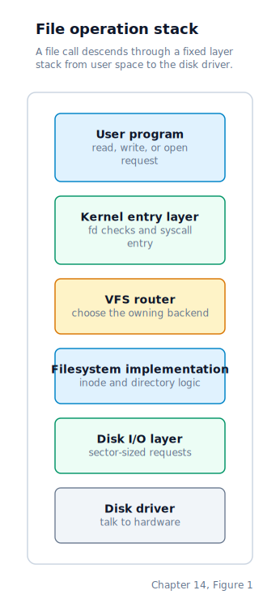

\newpage

## Chapter 14 — The Virtual Filesystem Switch

### Why the Kernel Uses a VFS Layer

Chapter 13 left us with two disk filesystems: DUFS v3 as the compact teaching filesystem, and ext3 as the Linux-compatible root filesystem Drunix boots by default. In both cases an inode number stands in as the stable handle for an open file. The code that calls filesystem operations does not call DUFS or ext3 functions directly. Instead it talks to a narrow indirection layer. That keeps the ELF loader, `start_kernel`, and the rest of the kernel decoupled from filesystem-specific details, and it allows the namespace to be assembled from more than one backend.

The call stack for any file operation flows downward through a fixed set of layers. Each layer knows about exactly the one below it:



By default we mount ext3 from `/dev/sda1` at `/`, DUFS from `/dev/sdb1` at `/dufs`, a synthetic device filesystem at `/dev`, a synthetic process-information tree at `/proc`, and a narrow sysfs-style block-device tree at `/sys`. A `ROOT_FS=dufs` build instead mounts DUFS from `/dev/sda1` at `/` for the older root-filesystem path. Path resolution therefore walks a small mount tree rooted at `/`, always choosing the deepest mounted prefix.

### The Ops-Table

The VFS interface is defined as:

```c
typedef struct {
    uint32_t type;
    uint32_t size;
    uint32_t link_count;
    uint32_t mtime;
} vfs_stat_t;

typedef struct {
    void *ctx;
    int (*init)(void *ctx);
    int (*open)(void *ctx, const char *path,
                uint32_t *inode_out, uint32_t *size_out);
    int (*getdents)(void *ctx, const char *path, char *buf, uint32_t bufsz);
    int (*create)(void *ctx, const char *path);
    int (*unlink)(void *ctx, const char *path);
    int (*mkdir)(void *ctx, const char *name);
    int (*rmdir)(void *ctx, const char *name);
    int (*rename)(void *ctx, const char *oldpath, const char *newpath);
    int (*link)(void *ctx, const char *oldpath,
                const char *newpath, uint32_t follow);
    int (*symlink)(void *ctx, const char *target, const char *linkpath);
    int (*readlink)(void *ctx, const char *path, char *buf, uint32_t bufsz);
    int (*stat)(void *ctx, const char *path, vfs_stat_t *st);
    int (*lstat)(void *ctx, const char *path, vfs_stat_t *st);
    int (*read)(void *ctx, uint32_t inode_num, uint32_t offset,
                uint8_t *buf, uint32_t count);
    int (*write)(void *ctx, uint32_t inode_num, uint32_t offset,
                 const uint8_t *buf, uint32_t count);
    int (*truncate)(void *ctx, uint32_t inode_num, uint32_t size);
    int (*flush)(void *ctx, uint32_t inode_num);
} fs_ops_t;
```

The `mtime` field is a filesystem-provided Unix timestamp in UTC seconds. DUFS and ext3 fill it from the kernel wall clock when they mutate files. The `ctx` field lets one ops-table carry backend-specific state; the current disk filesystems mostly use global driver state, but the VFS API does not require that.

The important point is that the VFS traffic is inode-oriented, not sector-oriented:

- `open` returns an inode number and a byte size.
- `create` returns the inode number of the created or truncated file.
- `stat` reports inode metadata.
- `read`, `write`, `truncate`, and `flush` operate on an inode number inside a specific mount.
- The VFS never exposes a starting LBA to its callers.

That matches both disk filesystems from Chapter 13. The VFS sees inode numbers and mount identifiers; DUFS and ext3 privately translate those into sector or block addresses.

### Registration and Mounting

The registry is still a tiny fixed array, but the namespace now has two separate tables:

```c
#define VFS_MAX_FS     4
#define VFS_MAX_MOUNTS 8
```

Registering a backend copies the filesystem name into the first free registry slot and stores the ops-table pointer beside it. Mounting then resolves the mount's parent directory through the existing namespace, looks up the backend by name, runs its `init()` hook, and records the resulting mount point in the mount table.

Three backends are special: `"devfs"`, `"procfs"`, and `"sysfs"` are synthetic and are handled directly by the VFS layer rather than through registered ops-tables. `devfs` contributes nodes like `stdin`, `tty0`, `sda`, and `sda1` under `/dev`; `procfs` synthesises live process, module, and mount-table state under `/proc`; `sysfs` exposes the block topology under `/sys/block`.

At boot the sequence is:

1. register DUFS as an available backend,
2. register ext3 as an available backend,
3. enable interrupts so ATA I/O is safe,
4. mount the configured root backend from `/dev/sda1` at `/` (`ext3` by default, `dufs` for `ROOT_FS=dufs`),
5. during an ext3-root boot, mount the secondary DUFS image from `/dev/sdb1` at `/dufs`,
6. mount `devfs` at `/dev`,
7. mount `procfs` at `/proc`,
8. mount `sysfs` at `/sys`.

The root mount happens only after interrupts are live and ATA reads can complete safely. The optional `/dufs` mount and the synthetic `/dev`, `/proc`, and `/sys` subtrees are then layered on top of that root namespace. Mount records keep the user-facing source, filesystem type, path, and option string, so `/proc/mounts` can report `/dev/sda1 / ext3 rw 0 0` instead of a hard-coded placeholder.

### The Public API

The public API is deliberately small:

- `vfs_resolve(path, &node)`
- `vfs_open_file(path, &ref, &size)`
- `vfs_read(ref, offset, buf, count)`
- `vfs_write(ref, offset, buf, count)`
- `vfs_truncate(ref, size)`
- `vfs_flush(ref)`
- `vfs_getdents(path, buf, bufsz)`
- `vfs_create(path)`
- `vfs_unlink(path)`
- `vfs_mkdir(name)`
- `vfs_rmdir(name)`
- `vfs_rename(oldpath, newpath)`
- `vfs_link(oldpath, newpath, follow)`
- `vfs_symlink(target, linkpath)`
- `vfs_readlink(path, buf, bufsz)`
- `vfs_stat(path, st)`
- `vfs_lstat(path, st)`
- `vfs_mount(path, name)`
- `vfs_mount_with_source(path, name, source)`
- `vfs_mount_count()`
- `vfs_mount_info_at(index, info)`

Path resolution is the core service: it normalises the path, finds the deepest matching mount, and reports whether the result is a regular file, a directory, a character device, a TTY node, a block device, or a synthetic procfs/sysfs file. `SYS_OPEN` uses that richer result to install either a filesystem file descriptor, a device-backed one, or a synthetic read-only one.

Mutation helpers first identify the mount that owns the target path. They reject mount points themselves as mutation targets, and renames reject cross-mount moves. Optional operations such as `mkdir`, `rmdir`, `rename`, and `stat` are still checked for `NULL` before the function pointer is called.

### Disk Filesystems Through the VFS

The DUFS registration installs a table with native implementations for root-level and nested file operations:

```c
static const fs_ops_t dufs_ops = {
    .ctx      = &g_dufs_sda1,
    .init     = dufs_vfs_init,
    .open     = dufs_vfs_open,
    .getdents = dufs_vfs_list,
    .create   = dufs_vfs_create,
    .unlink   = dufs_vfs_unlink,
    .mkdir    = dufs_vfs_mkdir,
    .rmdir    = dufs_vfs_rmdir,
    .rename   = dufs_vfs_rename,
    .link     = dufs_vfs_link,
    .symlink  = dufs_vfs_symlink,
    .readlink = dufs_vfs_readlink,
    .stat     = dufs_vfs_stat,
    .lstat    = dufs_vfs_lstat,
    .read     = dufs_vfs_read,
    .write    = dufs_vfs_write,
    .truncate = dufs_vfs_truncate,
    .flush    = dufs_vfs_flush,
};
```

The ext3 registration installs the same broad shape, but its operations point at the Linux-compatible backend:

```c
static const fs_ops_t ext3_ops = {
    .init     = ext3_init,
    .open     = ext3_open,
    .getdents = ext3_getdents,
    .create   = ext3_create,
    .unlink   = ext3_unlink,
    .mkdir    = ext3_mkdir,
    .rmdir    = ext3_rmdir,
    .rename   = ext3_readonly_rename,
    .link     = ext3_readonly_link,
    .symlink  = ext3_readonly_symlink,
    .readlink = ext3_readlink,
    .stat     = ext3_stat,
    .lstat    = ext3_lstat,
    .read     = ext3_read,
    .write    = ext3_write,
    .truncate = ext3_truncate,
};
```

So the live kernel supports more than lookup and directory listing. Through VFS, user space can create files, delete them, create and remove directories, rename or move entries when the owning backend implements rename, read symbolic links when the backend exposes them, and fetch metadata. ext3 currently treats rename, hard-link creation, and symlink creation as unsupported mutations while still supporting `readlink` for symlinks already present in the image.

Directory enumeration is where the mount tree shows most clearly. `vfs_getdents` asks the owning backend for the directory's entries, filters out any names shadowed by child mounts, and then appends those child mount points as synthetic directory entries. In the default ext3 boot, listing `/` therefore shows `dufs/`, `dev/`, `proc/`, and `sys/` even though those names are mount points from the VFS table rather than ordinary ext3 directory entries.

`procfs` also shows why the VFS returns richer node types than just "file or directory". `/proc/<pid>/status`, `/proc/<pid>/vmstat`, `/proc/<pid>/fault`, `/proc/<pid>/maps`, `/proc/<pid>/fd/<n>`, `/proc/modules`, and `/proc/kmsg` are openable files, but they do not have DUFS inode numbers. The syscall layer therefore treats them as synthetic read-only files whose contents are rendered on demand from scheduler, page-table, file-descriptor, module-loader, and kernel-log state.

At the top level, `/proc` enumerates one numeric directory per live PID plus the synthetic `modules` and `kmsg` files. Each `/proc/<pid>/` directory contains `status`, `vmstat`, `fault`, `maps`, and an `fd/` subdirectory. `vmstat` and `fault` provide compact summaries, while `maps` remains the detailed virtual-memory layout view; all three are generated from the same process-memory forensics model, so they stay internally consistent. The VFS does not cache any of that output as on-disk metadata; every open, stat, getdents, and read call asks `procfs` to re-render the current kernel state. That is why `/proc/<pid>/fd/` naturally reflects descriptor duplication, pipes, TTY bindings, and even previously opened procfs files without any separate update path, and why `/proc/kmsg` always reflects the kernel's current retained log buffer rather than a stale snapshot written to disk.

### What the VFS Does Not Do

This VFS is intentionally much smaller than Linux's:

- no per-file descriptor objects inside the VFS
- no **dentry** (directory entry cache — Linux's in-memory index of recently looked-up path components) or inode cache beyond whatever the concrete filesystem provides
- no unmount operation
- no bind mounts or mount options
- no cross-mount rename or move

It is still enough to keep the rest of the kernel from depending on DUFS's or ext3's on-disk layout.

### Where the Machine Is by the End of Chapter 14

Our file-facing code is now structured around a stable interface instead of a concrete filesystem implementation. `start_kernel`, the ELF loader, and the module loader all talk to `vfs_*` helpers and receive inode-oriented or node-oriented answers. By default ext3 provides the root filesystem at `/`, DUFS is available at `/dufs`, and the VFS layer itself synthesises `/dev` and `/proc`; all of them are reached through the same path-resolution machinery rather than through backend-specific call sites.
