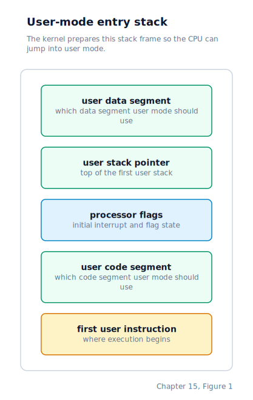
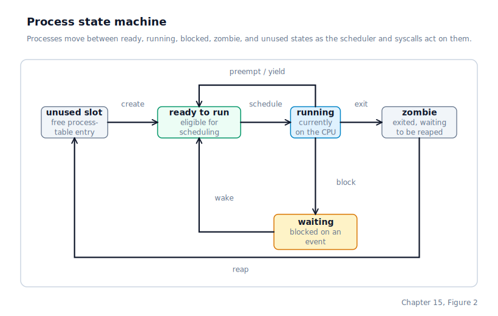
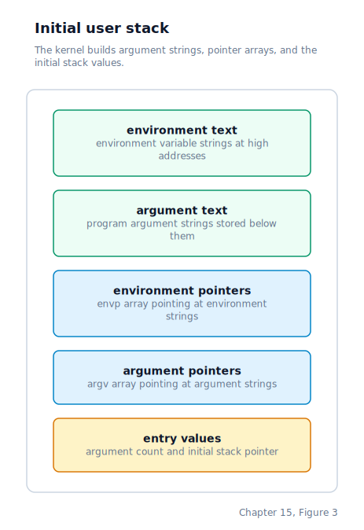
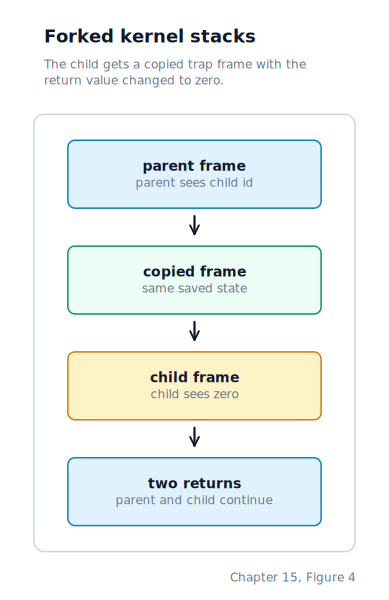

\newpage

## Chapter 15 — ELF Loader and Process Management

### Why the Kernel Needs to Separate Itself From User Code

Chapter 14 left us with a VFS layer in place and the kernel able to open and read files by name through a stable interface. Everything described in the book so far runs at **ring 0** — the CPU's most privileged execution level, where any instruction is legal and any memory address can be accessed. A bug in ring-0 code can corrupt anything in the system, because nothing is protected from it. That is acceptable while the kernel is the only code running, but the moment you want to run a user program, the rules have to change.

A real operating system runs user programs at **ring 3** — the least privileged execution level on x86. Ring 3 code cannot talk to hardware directly, cannot read or write kernel memory, cannot modify control registers, and cannot disable interrupts. Any attempt to do any of those things raises a fault that the kernel catches. This boundary — between the kernel in ring 0 and the user in ring 3 — is enforced by hardware on every single instruction and every single memory access, not by software checks the kernel has to remember to make.

This chapter adds everything required to cross that boundary. By the end, we will read an **ELF** file (Executable and Linkable Format, the standard binary format on Linux and most Unix systems) off the disk, unpack its contents into a fresh private address space, and hand control to ring 3 with a single CPU instruction called `iret`. From there, the user program communicates with the kernel exclusively through **system calls** triggered by `int 0x80` — the same interface the 32-bit Linux kernel used for decades.

### What the CPU Requires Before It Will Enter Ring 3

Four hardware structures must be in place before the `iret` instruction can legally transfer from ring 0 to ring 3.

**First, the GDT must contain ring-3 segment descriptors.** The GDT set up in Chapter 2 had only kernel code and kernel data segments at DPL 0 (Descriptor Privilege Level 0 — accessible only by ring 0). The kernel now rebuilds the GDT in C code, expanding it from three entries to seven:

| Index | Offset | Selector | DPL | Type | Purpose |
|-------|--------|----------|-----|------|---------|
| 0 | `0x00` | `0x00` | — | Null | Required trap entry |
| 1 | `0x08` | `0x08` | 0 | Code | Kernel code segment |
| 2 | `0x10` | `0x10` | 0 | Data | Kernel data & stack segment |
| 3 | `0x18` | `0x1B` | 3 | Code | User code segment |
| 4 | `0x20` | `0x23` | 3 | Data | User data & stack segment |
| 5 | `0x28` | `0x28` | 0 | TSS | Runtime task state segment |
| 6 | `0x30` | `0x30` | 0 | TSS | Dedicated double-fault task state segment |

The selector value has the requested privilege level encoded in its low two bits, so a user selector is not the same number as the offset: `0x18 | 3 = 0x1B` and `0x20 | 3 = 0x23`. When the CPU sees a selector with DPL 3 loaded into `CS`, it knows the code running under that selector is ring-3 code.

**Second, the kernel has to install a Task State Segment.** The **TSS** is a 104-byte structure whose main job is to tell the CPU which kernel stack to switch to when an interrupt fires while ring-3 code is running. Ring-3 code has its own stack (the user stack), and the kernel cannot safely run on that stack — a user program could have corrupted it, and the kernel handler would corrupt itself trying to save state. So the CPU reads two fields from the runtime TSS, `ESP0` and `SS0`, which contain the kernel stack pointer and kernel stack segment, and it switches to that stack automatically before pushing the interrupt frame. Without a valid TSS, the first `int 0x80` from ring 3 would fail with a general protection fault.

The runtime TSS is installed as a **system segment** in the GDT at index 5 (selector `0x28`), and the CPU is told about it with the `ltr` ("load task register") instruction.

The current kernel also keeps a second TSS in the GDT specifically for `#DF` (Double Fault). `TSS.ESP0` only helps when the CPU is crossing from ring 3 into ring 0. It does **not** help if the CPU is already in ring 0 and the current kernel stack is bad. That is exactly the situation a double fault usually represents. To survive long enough to print diagnostics, the kernel installs IDT vector 8 as a task gate to a dedicated double-fault TSS whose `EIP` points at a panic routine and whose `ESP` points at a fixed emergency stack. When `#DF` occurs, the CPU performs a hardware task switch into that TSS and the panic code can still run even if the ordinary kernel stack is unusable.

**Third, the INT 0x80 gate must be marked as callable from ring 3.** Every IDT entry has a privilege level, and the CPU refuses to let user code trigger a software interrupt whose gate is more privileged than the caller. For IDT entry 128, we use the `type_attr` byte `0xEF`, whose bit pattern means: present, DPL 3 (ring-3 code is allowed to invoke this), 32-bit trap gate. All other IDT entries use `0x8E` (DPL 0, interrupt gate). The difference between a trap gate and an interrupt gate is that a trap gate leaves hardware interrupts enabled while the handler runs — essential so the keyboard can continue to fire its IRQ while we are inside a `SYS_READ` call.

**Fourth, each process needs its own page directory.** The kernel cannot use a single shared page directory because user code must not be able to read or write kernel memory. Each process gets a fresh page directory whose entries cover the kernel's 0–128 MB region *without* the `PG_USER` flag set, and whose user-segment pages (mapped starting at `0x400000`) are set with `PG_USER | PG_WRITABLE | PG_PRESENT`. When a ring-3 instruction tries to reach a kernel address, the missing `PG_USER` bit causes a page fault; when ring-0 kernel code runs in the same address space, it ignores `PG_USER` and can reach anything it needs.

### Rebuilding the GDT in C

`gdt_init` builds a seven-entry GDT in static memory and hands it to a tiny assembly routine called `gdt_flush`. The assembly code is necessary because reloading segment registers involves a sequence that cannot be expressed in C without stepping on itself: it has to execute `lgdt`, then write the new kernel data selector into `DS`, `ES`, `FS`, `GS`, and `SS`, then perform a **far jump** to reload `CS`. A plain C assignment to `CS` is impossible on x86 — the only way to change it is through a jump, call, or return that specifies a segment. After the far jump lands, the assembly routine also executes `ltr` with the runtime TSS selector to register that TSS with the CPU.

One subtle detail: all parameters must be saved into registers *before* the segment reloads begin. Reloading `SS` in the middle of a `push`/`pop` sequence would leave a brief window where `SS` and `ESP` disagreed about which stack was active, and a stray interrupt in that window would crash the system.

### Per-Process Page Directories

The paging module from Chapter 8 is extended with two new functions.

`paging_create_user_space` allocates a fresh 4 KB page directory from the physical memory manager and copies the kernel's thirty-two page directory entries into it (those entries cover the kernel's 0–128 MB identity mapping). Because the kernel is identity-mapped, the physical address of the new page directory is also its virtual address, and we can write to it directly without switching `CR3`.

`paging_map_page` installs a single page table entry in an arbitrary page directory. If there is no page table yet for the target virtual address, it allocates one and marks the page directory entry with `PG_USER` so the CPU will descend into it on ring-3 lookups. If the existing page table was inherited from the kernel (that is, shared between processes), the function makes a private copy first — a crucial point, because otherwise a second process would overwrite the first process's user mappings in the shared kernel table and crash the first process the next time it ran.

### The ELF Loader

An ELF file begins with a header that describes the layout of the file. The header contains, among other things, a pointer to a table of **program headers**, each of which describes a region of memory the loader must map before jumping to the entry point. For our purposes, only one type of program header matters: **`PT_LOAD`** (a Loadable segment — one that the ELF loader must copy into memory at a specific virtual address before execution begins).

`elf_load` reads the binary from the ATA disk one 512-byte sector at a time into a static buffer. For each `PT_LOAD` segment it performs five steps:

1. Round the virtual address range up to 4 KB page boundaries, since every mapping must be page-aligned.
2. Ask the physical memory manager for one physical page per virtual page the segment covers.
3. Map each virtual page into the process's page directory with the flags `PG_PRESENT | PG_WRITABLE | PG_USER`.
4. Zero every byte in every page — this handles the common case where the segment's in-memory size (`p_memsz`) is larger than its on-disk size (`p_filesz`), which happens when the segment contains a BSS region.
5. Copy the segment's on-disk bytes into the newly allocated physical pages. Because the kernel is identity-mapped, we write directly to the physical page through its identity-mapped kernel address without switching `CR3`.

After every `PT_LOAD` segment has been processed, the loader records three addresses: the ELF header's entry point, the lowest mapped `PT_LOAD` address, and the page-rounded end of the highest mapped segment. The first is where ring 3 begins execution. The second and third let the kernel remember the loaded image range explicitly; the page-rounded high end also becomes the initial `heap_start` and `brk`, and the image range is what `/proc/<pid>/maps` later labels as the executable image.

### The Moment the CPU Enters Ring 3

The final step is an `iret` instruction, which in this context does something it was never originally designed for: it performs a controlled drop from ring 0 to ring 3. The trick is that `iret` always pops a frame from the stack containing `EIP`, `CS`, and `EFLAGS`, and *when the popped `CS` has a different privilege level from the current one*, it also pops `ESP` and `SS`. We exploit this by manually constructing a fake interrupt frame on the stack that looks exactly like what the CPU would have pushed if it had interrupted a ring-3 program, and then executing `iret` to "return" to that fake state.

The assembly helper `process_enter_usermode` builds the frame and executes the `iret`. The frame it pushes contains, from bottom to top: the user data selector `0x23` (as `SS`), the user stack pointer the new process should start with, the flags register with the interrupt enable bit set so the user program will receive interrupts, the user code selector `0x1B` (as `CS`), and the ELF entry point (as `EIP`).

The stack just before the `iret` executes looks like this:



When `iret` executes, the CPU atomically:

- Switches the current privilege level from 0 to 3.
- Loads the new `CS` and `EIP`, so the next instruction fetched is the user program's first instruction.
- Pops the new `ESP` and `SS`, so the user program has its own stack.

The data segment registers (`DS`, `ES`, `FS`, `GS`) are also set to `0x23` before the `iret`, because ring-3 code needs consistent segment selectors and `iret` does not touch those four.

### System Calls: The Only Way Back Into the Kernel

Once the CPU is in ring 3, the only way the user program can reach the kernel is by triggering an `int 0x80`. The IDT entry for vector 128 points at an assembly stub that saves all registers, loads the kernel data segment, and branches into the syscall dispatcher.

The handler reads the saved frame to find the syscall number (in `EAX`) and up to three arguments (in `EBX`, `ECX`, and `EDX`) and dispatches to the right handler. The trampoline runs with the **process's page directory still active** in `CR3`, which means we can follow pointers the user program passed without switching address spaces — the user's pages are still mapped for ring-0 access because the kernel PDEs were copied without `PG_USER` but ring-0 ignores that flag.

The C handler returns a `uint32_t`. The trampoline takes that return value and writes it into the saved `EAX` slot on the kernel stack before executing `popa`, so when the `iret` at the end of the stub returns to the user program, the return value appears in user-visible `EAX` without any extra work on the caller's part.

The relevant syscalls at this stage are `SYS_EXIT` (terminate a process), `SYS_WRITE` (print a string), `SYS_READ` (block until a keystroke arrives), `SYS_EXEC` (replace the current process image with another program), and `SYS_WAIT` (block until a child exits).

### Waiting for a Child to Exit

Without a wait primitive, the shell's `fork()` + `SYS_EXEC` launch path would leave the parent shell runnable while the child was still printing, producing interleaved output. `SYS_WAIT` fixes this.

When the shell calls `SYS_WAIT` with the child's PID, the kernel blocks the shell on that specific child's embedded `state_waiters` queue. The shell's process state becomes `PROC_BLOCKED`, and the process descriptor records both the queue it is sleeping on and the intrusive `wait_next` link needed to sit in that queue. When the child later exits or stops, the scheduler wakes every waiter on that child's queue, and the shell resumes from `sched_waitpid` to re-check the child's state. This still mirrors Linux's `TASK_INTERRUPTIBLE`/`wake_up` pattern, but the wait channel is now a reusable queue object rather than a handwritten `wait_pid` field.

### Preemptive Round-Robin Scheduling

With the ring-3 machinery in place the next step is running **multiple processes concurrently**. The **scheduler** uses a hardware timer to interrupt the running process every ten milliseconds and hand the CPU to the next one waiting.

The `process_t` struct gains several new fields to support this:

```c
typedef struct __attribute__((aligned(16))) {
    uint32_t pd_phys;
    uint32_t entry;
    uint32_t user_stack;
    uint32_t kstack_bottom;
    uint32_t kstack_top;
    uint32_t saved_esp;     /* kernel ESP captured at last preemption */
    uint32_t pid;
    uint32_t state;         /* proc_state_t — one of the values below */
    wait_queue_t *wait_queue;
    process_t    *wait_next;
    uint32_t wait_deadline;
    uint32_t wait_deadline_set;
    wait_queue_t state_waiters;
    uint8_t  fpu_state[512];
} process_t;
```

We keep a static `proc_table` of eight entries and a pointer `g_current` to the currently running one. Every process moves through a state machine as syscalls and interrupts fire:



When `RUNNING` code makes a blocking call or receives a stopping signal, the process now moves through a smaller set of scheduler states:

| State | Meaning | Leaves state when |
|---|---|---|
| `READY` | Runnable, waiting for a CPU slice | the scheduler selects it |
| `RUNNING` | Currently executing on the CPU | preempted, blocked, stopped, or exited |
| `BLOCKED` | Asleep on a wait queue or timed deadline | a waiter is woken, a deadline expires, or a signal interrupts the sleep |
| `STOPPED` | Suspended by `SIGSTOP` or `SIGTSTP` | `SIGCONT` or `SIGKILL` arrives |
| `ZOMBIE` | Exited, waiting for a parent to reap status | `waitpid` reaps the slot |

`ZOMBIE` is a terminal state: the process has exited but its slot is kept alive so the parent can collect the exit status via `SYS_WAITPID`.

The key change is that the scheduler no longer needs a different enum value for each blocking reason. A pipe embeds one `wait_queue_t`, a TTY embeds another, and every process embeds `state_waiters` for parents waiting on child state changes. `sched_block(&queue)` links the current process into that queue and marks it `PROC_BLOCKED`; `sched_block_until(deadline)` records a wake tick without any queue at all.

When every slot is blocked and nothing is `RUNNING`, the scheduler enters an idle loop — it enables interrupts, executes `hlt`, and retries when any interrupt fires. This is the same idle pattern Linux uses.

**Every process has its own kernel stack.** When a hardware interrupt fires while ring-3 code is running, the CPU reads `TSS.ESP0` and switches to that address before pushing the interrupt frame. If two processes shared a single kernel stack, saving the first process's frame and then taking an interrupt for the second would overwrite the first process's state. `process_create` therefore allocates a dedicated 16 KB stack for each process, and every context switch updates `TSS.ESP0` to point at the new current process's stack top. The double-fault path is separate: it does not use the current process's `ESP0`, but instead switches into the dedicated emergency TSS described earlier.

**The timer is driven by the PIT.** The **PIT** (Programmable Interval Timer, specifically the Intel 8253/8254) is a legacy chip found on every x86 PC. Its channel 0 is programmed with a divisor that produces a periodic interrupt on IRQ0 — in this case roughly 100 Hz, or every ten milliseconds. The PIT is configured in `pit_init` using port writes to `0x43` (mode register) and `0x40` (channel 0 data), and the PIC mask is updated so that both IRQ0 (timer) and IRQ1 (keyboard) are enabled.

**The wall clock starts from the RTC and advances on PIT ticks.** During boot, `clock_init` reads the **RTC** (Real-Time Clock), a battery-backed timekeeping chip housed in the **CMOS** (Complementary Metal-Oxide Semiconductor) chip on the motherboard, through I/O ports `0x70` and `0x71`, waits for a stable sample, converts the RTC date into Unix time, and stores it as UTC seconds since 1970-01-01. Each PIT interrupt calls `clock_tick` before `sched_tick`, so the wall-clock counter advances once every 100 timer ticks even though the RTC is only read at boot.

**The timer interrupt is where the handoff happens.** When the periodic timer IRQ arrives, the CPU has already saved a register frame on the current process's kernel stack. After the IRQ handler finishes, the scheduler gets one chance to decide whether the current process should continue or whether some other ready process should run next. If it chooses a different process, the kernel switches to that process's saved kernel stack and returns from the interrupt there instead.

The context switch itself does four things in order:

1. The outgoing process's floating-point and SSE register state is saved into its process descriptor.
2. The outgoing process's kernel stack pointer is recorded in its descriptor and the process is marked as ready to run again.
3. The process table is scanned round-robin for the next ready process.
4. The incoming process's page directory, kernel stack, and FPU state are installed, and execution is resumed from that process's saved register frame.

From the CPU's point of view, the final return from interrupt is ordinary. It restores registers from whichever kernel stack is active at that moment, so once the kernel has switched stacks, the rest of the return path naturally resumes the incoming process as if the timer interrupt had always been destined for it.

**A process running for the first time needs a synthetic frame.** A freshly created process has never been preempted, so there is no real saved frame to resume yet. The scheduler manufactures one on the new process's kernel stack: the saved segment registers are set to the user data selector, the general-purpose registers are zeroed, and the `iret` frame is built to drop into ring 3 at the ELF entry point with interrupts enabled. The kernel then records the stack pointer to that synthetic frame as the place where the process should later resume.

**A new process enters `main` with `argc`, `argv`, and `envp` already on its stack.** When the kernel allocates and maps the four user stack pages, it does not stop at the empty stack top — it lays down a full System V i386 **ABI** (Application Binary Interface, the set of register and stack conventions the compiler assumes at function-call boundaries) argument frame first and hands back the resulting `ESP` as the process's initial stack pointer. That way, by the time the `iret` transfers control to ring 3, the user stack already looks like a conventional Unix process image, including an environment array.

The frame is built from the top of the stack page downward:

| Region | Content |
|---|---|
| Argv+env strings | All `argv` strings followed by all `envp` strings, concatenated and NUL-terminated, written at the top of the page. |
| 0–3 bytes of zero padding | Enough to 4-byte align the pointer arrays below. |
| `envp[]` pointer array | `envc` user-space pointers into the string region above, followed by a NULL terminator. |
| `argv[]` pointer array | `argc` user-space pointers into the string region above, followed by a NULL terminator. |
| `char **envp` | A pointer to the first entry of the envp array. |
| `char **argv` | A pointer to the first entry of the argv array. |
| `int argc` | ← initial ESP |



Because the page directory and page tables live in the kernel's identity-mapped 0–128 MB region, the kernel can resolve the physical frame backing the top stack page and write the whole initial stack image through that kernel-visible pointer. No **CR3** reload is required, and no temporary mapping has to be torn down. The same path handles `argc == 0` and `envc == 0` gracefully, writing zero counts and NULL-terminated empty arrays in each case, so the ring-3 startup stub can always pop all three words off the stack without a special case.

To keep the frame inside a single 4 KB stack page, the kernel enforces four caps: at most 32 argv entries, at most 1 024 bytes total across all argv strings, at most 32 environment entries, and at most 1 024 bytes total across all environment strings. The `SYS_EXEC` path copies every argv and envp string into fixed-size kernel scratch buffers before building the new image, because the caller's address space is about to be replaced and any raw user pointers would then reference the wrong pages.

**The same context-switch path is used for voluntary yields.** Timer-driven preemption is not the only way one process hands the CPU to another. `SYS_YIELD` (voluntary yield), `SYS_WAIT` (park the caller until a child exits), and `SYS_EXIT` (terminate the caller) all leave the current process unable or unwilling to continue. In each case, the kernel saves the same kind of frame, chooses the next `PROC_READY` entry, and resumes somewhere else. The asynchronous timer path and the voluntary handoff path therefore converge on one mechanism.

### Process Observability Through `/proc`

Core dumps are still the deep post-mortem debugging tool, but the live kernel now exposes lighter-weight process state through `procfs`. The VFS mounts `procfs` at `/proc`, and the synthetic files under that tree are rendered directly from scheduler, fd-table, memory-management, module-loader, and kernel-log state rather than from DUFS inodes.

At the top level, `/proc` contains one numeric directory per live PID plus the synthetic `modules` and `kmsg` files. For each live PID, `/proc/<pid>/status` reports the fields that are already present in `process_t`: executable name, run state, PID, PPID, process-group and session IDs, controlling TTY, image range, heap range, current mapped stack floor, pending and blocked signals, open-fd count, and the best-effort command line captured in `psargs`.

`/proc/<pid>/maps` walks the process's user page tables, coalesces adjacent present PTEs, and labels the ranges that overlap the loaded ELF image, the heap, and the stack. Because the output is generated from the live page tables, it reflects current committed mappings and current PTE permissions, so permission changes applied with `mprotect()` show up once there is a present page to report. The same implementation detail is also the current limitation: untouched lazy reservations that exist only in the VMA table, such as a never-faulted anonymous `mmap()` region, do not appear until at least one page has actually been materialized. `/proc/<pid>/fd` is a directory whose numbered entries describe the process's open descriptors — DUFS files, pipes, TTYs, stdout, and even synthetic procfs descriptors that were opened earlier — and each `/proc/<pid>/fd/<n>` file renders a one-line description of that fd's current target.

`/proc/kmsg` complements those per-process views with a system-wide diagnostic stream. The `klog` layer now keeps a fixed-size ring buffer of recent kernel log records, each tagged with a boot-relative timestamp, a severity level, a subsystem tag, and the message text. Reading `/proc/kmsg` renders that retained history in order, so the user can recover context that has already scrolled off the visible console or been covered by the desktop.

That matters for shell tooling because `ls /proc`, `cat /proc/3/status`, `cat /proc/3/maps`, `cat /proc/3/fd/1`, `cat /proc/modules`, and `dmesg` now work through the ordinary `SYS_OPEN` and `SYS_READ` paths. The shell no longer has to infer process state only from blocking behaviour or wait statuses, and the kernel no longer relies solely on a fatal crash or whatever still happens to be visible on screen to make system state inspectable.

### Forking a Process

`SYS_EXEC` replaces the current process image in place by loading a fresh ELF binary. `SYS_FORK` does something fundamentally different: it makes a second process that resumes at the same instruction pointer with the same registers and the same open files. The memory is not copied eagerly any more. Parent and child leave `fork()` sharing the same user frames, and only the first write to a shared writable page triggers a private copy. The only immediate architectural difference between them is the return value of `fork()` itself: the parent receives the child's PID, and the child receives zero.

This is the mechanism Linux programs rely on to spawn new work: fork first, then decide which branch you are in by checking the return value, and have the child call `exec()` if you want it to run a different program. This section describes how we make the split happen.

#### Cloning the Address Space

The first job of `fork()` is still to give the child its own page directory and its own user page tables. The difference is that the user frames underneath those page tables are now shared initially rather than copied immediately.

To do that, the kernel allocates a new page directory and private user page tables for the child, but it leaves the user frames underneath them shared at first. Writable user pages are rewritten in both address spaces as read-only copy-on-write mappings, and the physical frame's reference count is incremented so the memory manager knows the frame now has two owners. Read-only user pages are also shared into the child, but they stay genuinely read-only so later writes still fault as true protection violations.

This is the copy-on-write model Linux uses too: the expensive physical copy is deferred until a later write fault proves one side needs a private version. The immediate consequence is that `fork()` can now return quickly without copying every page in the process up front.

#### Splitting the Return Value

After cloning the address space, the kernel must arrange for the parent and child to resume execution at the same place but see different values in `EAX`. This is the tricky part of fork.

The trick is that the kernel already has exactly the right data structure for this moment: the saved syscall-return frame sitting on the parent's kernel stack. That frame contains the user registers that will be restored when the kernel returns to ring 3, including the return register `EAX`.

Fork works by copying that saved frame onto the child's kernel stack and then editing only one field in the child's copy: the saved `EAX` value is changed to zero.



The next time the scheduler chooses the child, the normal return-from-kernel path restores that copied frame, so the child resumes at the same user `EIP` as the parent with `EAX = 0`. The parent returns through its own original frame and sees the child's PID in `EAX`. No special second return path is needed; both branches reuse the ordinary syscall-return mechanism.

One additional detail: before the kernel copies the process descriptor, it forces a fresh save of the parent's floating-point and SSE state. Otherwise the child would inherit whatever stale snapshot happened to be left from the last preemption rather than the parent's actual live FPU state.

### Tasks, Thread Groups, And Clone

The scheduler now treats `process_t` as the runnable task descriptor. Its `tid` is the scheduler identity: every runnable task has a distinct TID, and `gettid()` returns that value. Its `tgid` is the process identity: all tasks in the same thread group share one TGID, and `getpid()` returns that group ID.

`fork` always creates a new thread group. The child starts as the leader of that group, with `tid == tgid`, a private kernel stack, and a copy-on-write user address space. `clone` is more flexible. With `CLONE_THREAD`, it creates another task in the caller's thread group, so the new task gets a fresh TID but keeps the caller's TGID. Without `CLONE_THREAD`, `clone` behaves like a process-shaped child and creates a separate group.

The resource flags decide which process-shaped state is shared. `CLONE_VM` shares the address-space object and page directory; without it, the child gets the same copy-on-write address-space behavior as `fork`. `CLONE_FILES`, `CLONE_FS`, and `CLONE_SIGHAND` share the fd table, cwd/umask state, and signal-disposition table respectively. Each task still keeps its own kernel stack, signal mask, pending task-directed signals, clear-child-TID pointer, and scheduler state.

Thread groups also change the visible process model. `/proc` lists TGIDs rather than every TID, `waitpid` reaps a whole group through its leader, and `exit_group` marks every live task in the group for termination. Plain `exit` ends only the calling task; the group remains waitable after its last live task exits.

### Where the Machine Is by the End of Chapter 15

We can now:

- Read an ELF file from disk, parse its program headers, and load its segments into a fresh private address space.
- Enter ring 3 via a manufactured `iret` frame, with user-mode segment selectors and a fresh user stack.
- Service system calls through `int 0x80`, reading arguments from the user's registers and writing return values back.
- Preempt running processes every ten milliseconds via the PIT and round-robin schedule up to eight concurrent processes, saving and restoring register state, page directories, kernel stacks, and FPU/SSE state on every switch.
- Wait for a child process to exit with `SYS_WAIT`, parking the caller until the scheduler wakes it.
- Fork a running process via `SYS_FORK`, duplicating its page tables, sharing its user frames copy-on-write, and arranging for the parent and child to see different return values at the same return address.
- Create Linux-style user threads with `SYS_CLONE`, sharing VM, fd, filesystem, and signal-disposition resources according to clone flags while preserving per-task TIDs.

With this machinery in place, the first user program runs as a ring-3 process, can launch any ELF file on the DUFS disk, and waits for each child to exit before returning to the prompt.
