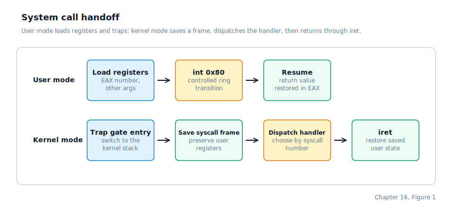

\newpage

## Chapter 16 — System Calls

### The Path of a System Call

Chapter 15 left us with a ring-3 process running ELF binaries and a context-switch path driven by the PIT. When a user program needs a service that only the kernel can perform — reading a keystroke, writing a file, spawning a child process — it cannot call the kernel directly. Ring-3 code cannot jump into ring-0 memory, and even if it could, the CPU would fault. The only legal crossing point is a software interrupt: the user program loads a syscall number and arguments into registers, then executes `int 0x80`. The CPU sees that this matches a DPL-3 trap gate in the **IDT** (Interrupt Descriptor Table) and performs a controlled ring transition — switching to the kernel stack, loading the kernel code segment, and jumping to the ISR stub. The stub saves registers, calls `syscall_handler`, writes the return value back into the saved frame, and executes `iret` to return to ring 3.

The **ABI** (Application Binary Interface — the register and stack conventions both sides agree on) is the 32-bit Linux `int 0x80` convention: `EAX` holds the syscall number on entry and the return value on exit; `EBX`, `ECX`, `EDX`, `ESI`, and `EDI` hold the first five arguments. Drunix uses Linux i386 syscall numbers for the public ABI so a tiny static Linux ELF can enter the kernel directly. Drunix-only console and debugging calls live in a private high-number range so they do not collide with Linux binaries. The IDT entry for vector 128 uses a trap gate rather than an interrupt gate, so hardware interrupts remain enabled while `syscall_handler` runs — essential for calls like `SYS_READ` that block waiting for keyboard input to arrive.

### Blocking Calls and Process States

Most syscalls complete immediately, but several must suspend the calling process until an external event occurs. `SYS_READ` on a TTY blocks until input is available. `SYS_WAITPID` parks the caller until a child exits or stops. Pipe reads and writes block on the shared pipe wait queue when the buffer is empty or full. `SYS_NANOSLEEP` suspends the caller until a future scheduler tick.

In each case we use the same mechanism: we change the calling process's state from `PROC_RUNNING` to `PROC_BLOCKED`, record either a wait queue or a wake deadline in the process descriptor, and call the scheduler to switch to another ready task. A TTY reader sleeps until keyboard input arrives; a `waitpid` caller sleeps until a child exits; a pipe endpoint sleeps until the buffer drains or fills; a sleep call simply sleeps until a deadline expires. When the relevant event fires, the sleeping process is transitioned back to ready and the scheduler picks it up on the next tick.

This is still the same Linux idea: blocking calls are state transitions plus wakeups, not busy loops. A blocked syscall can also be cut short by a **signal** — an asynchronous notification delivered to a process from the kernel or from another process that causes the process to take some action, often interrupting whatever it was doing. The user runtime builds `sleep(3)` on top of Linux-shaped `SYS_NANOSLEEP`.

### Path Resolution Per Process

Every filesystem-touching syscall — open, creat, unlink, mkdir, rmdir, rename, stat, execve, getdents, and the private Drunix module loader — resolves its path argument against the calling process's **cwd** (current working directory) before passing it to the VFS. The rules are simple: a path starting with `/` is root-relative; an empty cwd means the process is at the root; otherwise the cwd is prepended. This means a process whose cwd is `projects/src` can call `open("main.c")` and the kernel opens `projects/src/main.c` without the user program constructing the full path.

The cwd lives in the process descriptor, not in user space. It is inherited across `fork`, so a child starts in the same directory as its parent. `SYS_CHDIR` validates the target through the VFS — confirming that the path exists and is a directory — before writing the new cwd into the descriptor. `SYS_GETCWD` copies the current cwd string back to a user-supplied buffer.

### Pipes and File Descriptor Duplication

`SYS_PIPE` creates an anonymous pipe — a unidirectional in-kernel ring buffer with a read-end and a write-end **fd** (file descriptor). Both ends are installed in the calling process's open-file table as distinct entries sharing the same buffer. When the write end is closed by all holders, a subsequent read from the read end returns 0 (EOF), allowing a pipeline to terminate naturally.

`SYS_DUP2` duplicates one fd onto another, closing the destination first if it was already open. The shell uses this in a forked child before calling `SYS_EXECVE` to redirect stdin or stdout through a pipe. Because `SYS_EXECVE` preserves the calling process's fd table, the exec'd program sees its standard streams already connected to the pipe without any further setup.

### Virtual Memory Mappings

`SYS_BRK` is no longer the kernel's only user-space memory-management interface. The current syscall layer also exposes the classic Linux-shaped trio `SYS_MMAP`, `SYS_MUNMAP`, and `SYS_MPROTECT`, backed by a small per-process **VMA** (Virtual Memory Area — a tracked half-open virtual-address range with a shared policy for permissions and behaviour) table.

The implementation is intentionally narrow for now. `SYS_MMAP` accepts only anonymous private mappings: the caller passes an `old_mmap_args` structure through a user pointer in `EBX`, and the kernel currently accepts only `MAP_PRIVATE | MAP_ANONYMOUS`, `fd = -1`, and `offset = 0`. If the optional hint is page-aligned and the requested hole is free, the kernel uses it; otherwise it scans downward from the current stack window and places the mapping high in user space, above the `brk()` heap and below the reserved stack range. No physical page is allocated at `mmap()` time. The VMA is recorded immediately, and the first access later raises a page fault that the kernel handles by allocating a physical frame and installing the mapping on demand.

`SYS_MUNMAP` removes only generic anonymous mappings, not the ELF image, the `brk()` heap, or the reserved stack VMA. It first updates the VMA table, then walks the covered page-table entries and drops any present frames that had already been committed. `SYS_MPROTECT` likewise updates only generic anonymous mappings. It rewrites the VMA metadata first, then adjusts any present PTEs in place so later faults and `/proc/<pid>/maps` output observe the new permissions. Together, the three calls are enough for user space to reserve, release, and retag anonymous regions without abusing `brk()`.

### Process Creation and the exec/fork Split

`SYS_EXECVE` replaces the calling process in place. The PID, parent linkage, process-group/session membership, cwd, signal mask, and open-file table survive; the user address space, heap, user stack, entry point, and process metadata derived from argv are rebuilt from the new ELF image. On success the old image never resumes. This is what makes the shell's `fork(); execve(); waitpid();` path genuinely Unix-shaped rather than a spawn wrapper in disguise.

`SYS_FORK` takes the opposite approach: it clones the calling process's register frame, FPU state, open-file table, and paging structures, but it shares the existing user frames copy-on-write rather than copying them eagerly. Parent and child resume at the same instruction; the parent's return value is the child's PID, and the child's return value is 0. Fork plus exec together form the classic Unix process-creation idiom that every shell relies on.

`SYS_CLONE` exposes the Linux i386 `clone(2)` subset used by raw user-space threading. Drunix accepts `CLONE_VM`, `CLONE_FS`, `CLONE_FILES`, `CLONE_SIGHAND`, `CLONE_THREAD`, `CLONE_SETTLS`, `CLONE_PARENT_SETTID`, `CLONE_CHILD_SETTID`, and `CLONE_CHILD_CLEARTID`. `CLONE_SIGHAND` requires `CLONE_VM`, and `CLONE_THREAD` requires `CLONE_SIGHAND`. Namespace flags, ptrace events, `vfork` parent suspension, robust futex lists, futex wakeups for joins, and SMP behavior are intentionally outside this subset.

`SYS_EXIT` stores the exit code in the process descriptor, marks the process `PROC_ZOMBIE`, and transfers to the scheduler. The zombie slot is kept alive until the parent calls `SYS_WAITPID` to collect the exit status, at which point the slot is freed.

### Syscall Reference

The complete syscall table:

| Number | Name | Description |
|--------|------|-------------|
| 1  | `SYS_EXIT`          | Mark process zombie with exit status |
| 2  | `SYS_FORK`          | Clone the current process |
| 3  | `SYS_READ`          | Read from stdin or an open fd |
| 4  | `SYS_WRITE`         | Write bytes to an fd |
| 5  | `SYS_OPEN`          | Open a file read-only |
| 6  | `SYS_CLOSE`         | Close a file descriptor |
| 7  | `SYS_WAITPID`       | Wait for a PID and write Linux-encoded status |
| 8  | `SYS_CREAT`         | Create or truncate a file, open writable |
| 10 | `SYS_UNLINK`        | Delete a file |
| 11 | `SYS_EXECVE`        | Replace the current process image with an ELF file |
| 12 | `SYS_CHDIR`         | Change the process working directory |
| 19 | `SYS_LSEEK`         | Reposition the file offset of an open fd |
| 20 | `SYS_GETPID`        | Return the calling process's PID |
| 37 | `SYS_KILL`          | Send a signal to a PID or process group |
| 38 | `SYS_RENAME`        | Rename or move a file or directory |
| 39 | `SYS_MKDIR`         | Create a directory |
| 40 | `SYS_RMDIR`         | Remove an empty directory |
| 42 | `SYS_PIPE`          | Create a pipe; return two fds |
| 45 | `SYS_BRK`           | Query or move the heap break; pages commit on fault |
| 57 | `SYS_SETPGID`       | Set a process's process group |
| 63 | `SYS_DUP2`          | Duplicate one fd onto another |
| 64 | `SYS_GETPPID`       | Return the calling process's parent PID |
| 67 | `SYS_SIGACTION`     | Install or query a per-signal handler |
| 90 | `SYS_MMAP`          | Create an anonymous private mapping |
| 91 | `SYS_MUNMAP`        | Remove an anonymous mapping range |
| 106| `SYS_STAT`          | Retrieve file or directory metadata |
| 119| `SYS_SIGRETURN`     | Return from a user-space signal handler |
| 120| `SYS_CLONE`         | Create a process-shaped child or thread-group task |
| 125| `SYS_MPROTECT`      | Change protections on an anonymous mapping range |
| 126| `SYS_SIGPROCMASK`   | Modify the signal blocking mask |
| 132| `SYS_GETPGID`       | Return a process's process group |
| 141| `SYS_GETDENTS`      | Enumerate directory entries |
| 158| `SYS_YIELD`         | Voluntarily yield the CPU |
| 162| `SYS_NANOSLEEP`     | Suspend the process for a timespec duration |
| 183| `SYS_GETCWD`        | Copy the process cwd into a user buffer |
| 265| `SYS_CLOCK_GETTIME` | Read a kernel clock into a `timespec` |
| 340| `SYS_PRLIMIT64`     | Read stable Linux process resource limits |
| 4000| `SYS_DRUNIX_CLEAR`       | Clear the active console or desktop shell |
| 4001| `SYS_DRUNIX_SCROLL_UP`   | Page backward through terminal history |
| 4002| `SYS_DRUNIX_SCROLL_DOWN` | Page forward toward the live console |
| 4003| `SYS_DRUNIX_MODLOAD`     | Load a relocatable kernel module |
| 4004| `SYS_DRUNIX_TCGETATTR`   | Read the TTY termios configuration |
| 4005| `SYS_DRUNIX_TCSETATTR`   | Write a new TTY termios configuration |
| 4006| `SYS_DRUNIX_TCSETPGRP`   | Set the TTY foreground process group |
| 4007| `SYS_DRUNIX_TCGETPGRP`   | Get the TTY foreground process group |

### Where the Machine Is by the End of Chapter 16

We now expose a stable ring-3 ABI whose public surface follows Linux i386 numbering. Every service Drunix user programs depend on — console I/O, process creation and waiting, heap growth, anonymous memory mappings, filesystem operations, pipes, directory enumeration, metadata queries, and signal delivery — is available through a single `int 0x80` entry point. The generic wait-queue model ensures that waiting processes consume no CPU while they sleep, regardless of whether the event source is a TTY, a pipe, a child process, or a timeout. The per-process cwd makes relative paths work naturally, and the per-process VMA table gives the memory-management syscalls a coherent view of heap, stack, and `mmap()` regions. A tiny static Linux i386 smoke binary, `/bin/linuxhello`, uses Linux syscall numbers directly to exercise that ABI without the Drunix C runtime.

Every syscall that touches a file still identifies it by inode number. The next chapter introduces the file descriptor table that sits between the syscall layer and those inodes, turning open files into the small integers every Unix program expects.
