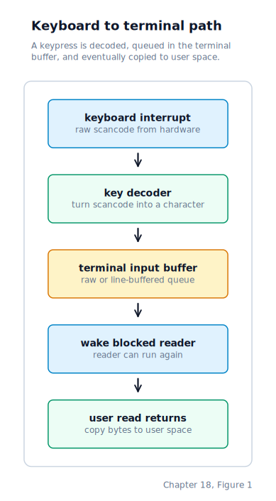
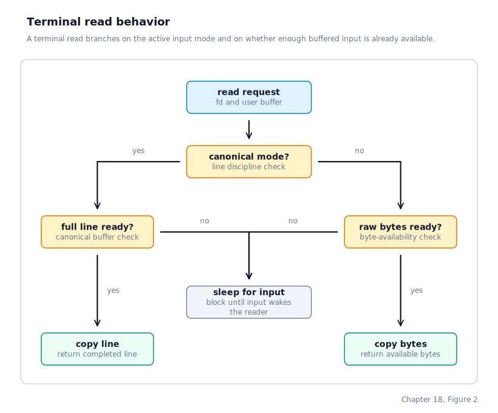

\newpage

## Chapter 18 — The TTY Line Discipline

### From File Descriptors to a Line Discipline

Chapter 17 left us with a working fd table and `SYS_READ` dispatching fd 0 reads to the keyboard ring buffer. Two shortcomings remained: reads busy-waited, and terminal-generated signals relied on a kernel-side heuristic rather than explicit process-group ownership. We fix both by adding a proper **TTY** (teletypewriter) abstraction between the keyboard driver and the programs that read from it.

### What a TTY Is

The word "TTY" is an anachronism — it originally referred to a physical Teletype machine, a combination keyboard and paper printer that a programmer used to communicate with a mainframe in the 1960s. The term has survived in Unix systems to mean the software layer that sits between the keyboard hardware and the programs that read from it.

A TTY has three jobs. The first is *line discipline*: in its default mode it buffers incoming characters until the user presses Enter, then hands the complete line to whichever program is waiting. This is called **canonical mode** (ICANON). Programs that want to react to every keystroke individually — a text editor, a game, a readline loop in a shell — switch the TTY into **raw mode** by clearing the ICANON flag, at which point characters are delivered immediately as they arrive.

The second job is *signal generation*. The TTY — not the keyboard driver — generates signals because the TTY knows which process group is in the foreground. The keyboard has no concept of process groups. Certain control characters carry meaning that goes beyond text: pressing Ctrl+C on a Unix terminal has always meant "interrupt the foreground process". The TTY translates that keypress into a **signal** — a kernel-mediated asynchronous notification that causes a process to take some action, by default terminating it — and delivers it to whichever process group currently owns the terminal. This chapter focuses on the TTY's role in generating and targeting those signals.

The third job is *echo*. When the ECHO flag is set, the TTY prints each incoming character back to the screen so the user can see what they are typing. In raw mode a program usually handles its own echo.

### The `termios` Structure

Unix programs configure a TTY's behaviour through a structure traditionally called `termios`. Our implementation keeps only the fields that are currently useful:

```c
typedef struct {
    uint32_t c_iflag;   /* input flags */
    uint32_t c_oflag;   /* output flags */
    uint32_t c_cflag;   /* control flags */
    uint32_t c_lflag;   /* local flags */
    uint8_t  c_cc[19];  /* control characters */
} termios_t;
```

The TTY starts in the same broad mode as a normal Linux terminal: canonical input, echo, signal-generating control keys, CR-to-NL input translation, and standard control characters such as Ctrl+C, Ctrl+Z, and DEL erase. It also carries the traditional raw-mode read-sizing defaults `VMIN=1` (return after at least one byte is available) and `VTIME=0` (no inter-byte timeout, so a reader simply waits until one byte arrives). Interactive programs such as editors can switch to raw mode with the ordinary termios path.

The supported local flags are:

| Flag | Bit | Meaning |
|------|-----|---------|
| `ICANON` | 0 | Buffer input by line; deliver on newline |
| `ECHO`   | 1 | Echo each character as it is typed |
| `ECHOE`  | 2 | Echo backspace as BS SP BS (erase the character visually) |
| `ISIG`   | 3 | Generate terminal signals (`SIGINT` on Ctrl+C, `SIGTSTP` on Ctrl+Z) |

The supported input flag currently used by the line discipline is `ICRNL`, which maps carriage return to newline unless a program clears it for raw input. The output and control flag fields are stored and reported through both the Drunix and Linux termios APIs so programs can round-trip the settings they expect.

Programs call `sys_tcgetattr` and `sys_tcsetattr` to read and write these settings. The `TCSANOW` action applies the change immediately; `TCSAFLUSH` additionally discards any unread input in the TTY's buffers before applying the new settings.

### Process Groups and the Foreground Group

A **process group** is a collection of related processes — typically a shell command pipeline. Every process has both a **process group ID** (PGID) and a **session ID** (SID) stored in its `process_t`. When a process is created with `process_create`, both fields start at zero; the scheduler fills them in with the process's own PID as soon as the process enters the process table, making every new process both a group leader and a session leader by default unless a parent later re-groups it.

When a process forks (via `SYS_FORK`), the child inherits the parent's PGID — it joins the same group automatically.

The TTY structure records two ownership fields:

- `ctrl_sid`: the session that owns this terminal
- `fg_pgid`: the process group inside that session that currently has the foreground

When Ctrl+C or Ctrl+Z arrives and `ISIG` is set, the terminal sends `SIGINT` or `SIGTSTP` to the foreground process group recorded in the TTY. Every process in that group sees the signal; any process outside it is untouched.

A program calls `sys_setpgid(0, 0)` to make itself a new group leader (its own PGID becomes its PID). A shell calls `sys_setpgid(0, 0)` at startup to establish its own group, then uses `sys_tcsetpgrp` to hand the terminal to a foreground child or pipeline. `SYS_TCSETPGRP` enforces the same session boundary Unix does: the caller must already belong to the terminal's controlling session, and the target PGID must exist inside that same session. The first successful caller claims the terminal for that session.

When no data is available in the TTY, the reader blocks on the terminal's wait queue and the scheduler switches to something else. When the keyboard IRQ later delivers input that the current line discipline considers readable — either a byte in raw mode or a completed line in canonical mode — the terminal wakes those blocked readers.

This replaces the busy-wait spin loop in `SYS_READ` with genuine blocking, freeing the CPU for other processes while the user is thinking.

### The TTY Structure

```c
typedef struct {
    char     raw_buf[256];   /* ring buffer for raw mode */
    uint32_t raw_head;
    uint32_t raw_tail;

    char     canon_buf[256]; /* line buffer for canonical mode */
    uint32_t canon_len;
    uint32_t canon_ready;    /* 1 = a complete line is waiting */

    termios_t termios;
    uint32_t  ctrl_sid;
    uint32_t  fg_pgid;
    wait_queue_t read_waiters;
    uint32_t  in_use;
} tty_t;
```

There is currently one TTY, `tty_table[0]`, referred to as **tty0**. Every process's standard input file descriptor (`fd 0`) is an `FD_TYPE_TTY` entry pointing at `tty_idx = 0`.

### The Data Path

The journey of a keystroke through the revised system looks like this:



On the read side, an `FD_TYPE_TTY` descriptor eventually asks the terminal layer to produce input according to the current mode:



### Prompt-Time Shell Signals

We no longer keep a fallback "guess the foreground job" path. Instead, the boot shell becomes a real process-group leader at startup, claims the foreground terminal for its own PGID, and installs `SIGINT` and `SIGTSTP` handlers for prompt time. While the shell is reading a command line, those handlers simply mark that prompt input should be abandoned and redrawn.

When the shell launches a foreground job, it hands the TTY to the child's PGID with `SYS_TCSETPGRP` and restores the default signal dispositions in the child side. That means Ctrl+C and Ctrl+Z go to the job while it owns the terminal, and to the shell while the shell owns the terminal. No kernel-side heuristic is needed.

### System Calls Added for the TTY

The TTY layer required several new syscalls. `SYS_TCGETATTR` and `SYS_TCSETATTR` read and write the `termios_t` configuration for a given file descriptor. `SYS_TCSETATTR` takes an action argument: `TCSANOW` applies the new settings immediately, while `TCSAFLUSH` additionally drains any unread bytes from the TTY's input buffers before applying the change — important when a program wants to ensure stale keystrokes from before a mode switch are not misinterpreted under the new settings.

`SYS_SETPGID` and `SYS_GETPGID` read and write a process's group membership. `SYS_TCSETPGRP` and `SYS_TCGETPGRP` control which group the TTY currently treats as foreground. `SYS_WAITPID` extends the existing wait mechanism with option flags: `WUNTRACED` causes the call to return when a child enters `PROC_STOPPED` state (so the shell can detect Ctrl+Z), and `WNOHANG` returns immediately with zero if no child has changed state.

User-space wrappers for all these calls are available in the syscall library.

### Switching Modes at Runtime

A program that wants line-buffered input with echo calls `sys_tcgetattr` to obtain the current settings, sets the `ICANON`, `ECHO`, `ECHOE`, and `ISIG` bits in `c_lflag`, and calls `sys_tcsetattr` with `TCSANOW`. From that point forward, characters accumulate in the canonical line buffer until the user presses Enter. If a reader asks for data before a full line is ready, the process blocks and the scheduler switches away. When Enter arrives, the line discipline marks the line complete, wakes the blocked readers, and the next read returns the buffered line in one piece.

The shell itself keeps its own raw readline loop unchanged — the TTY defaults to raw mode so the existing shell behaviour is preserved without any shell-side modifications.

### Where the Machine Is by the End of Chapter 18

At the end of this chapter the keyboard's characters no longer flow directly to a ring buffer — they pass through a stateful line discipline first. We have a single TTY (`tty0`) that every process's standard input is connected to. Processes that call `sys_read(0, ...)` and find no data available now sleep on the terminal instead of spinning; the CPU is genuinely free while they wait. Ctrl+C sends SIGINT and Ctrl+Z sends SIGTSTP to the foreground process group recorded in the TTY, and the TTY itself records which session owns that terminal. The `termios` API gives user-space programs the ability to switch between raw and canonical input modes. Process groups and sessions now line up with the shell's `jobs`/`fg`/`bg` builtins, so job control no longer depends on any kernel fallback path.

With the terminal, its line discipline, and its signal-generating machinery all in place, Part V closes out. The next part turns to the full user environment built on top of these primitives — signal delivery semantics, the user-space runtime that wraps these syscalls, the C library, and the shell that ties them all together.
