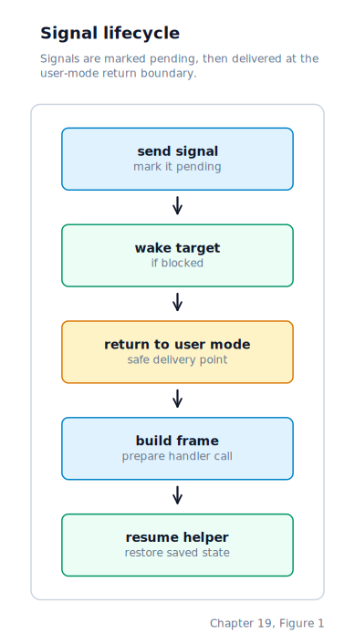
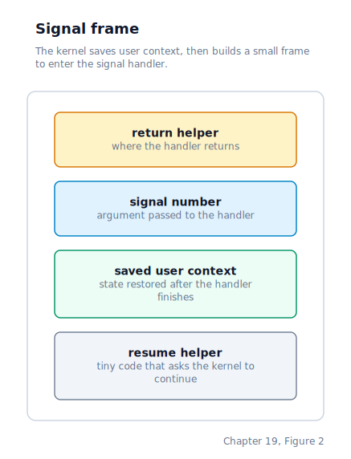

\newpage

## Chapter 19 — Signals

### What a Signal Is

Chapter 18 left us with a TTY that tracks a foreground process group and generates control-character events, but nothing to act on them yet. A **signal** is a kernel-mediated asynchronous notification delivered to a process. The word "asynchronous" is the key distinction from every other form of process-to-process or kernel-to-process communication: an ordinary read, write, or syscall takes place at a predictable moment the process chose. A signal can arrive at any point — between two instructions, in the middle of a system call, whenever the interrupted process is about to return to user space.

Linux defines signals using a standard numbering. We adopt the same numbers for the eight signals we support:

| Number | Name | Default action | When sent |
|--------|------|----------------|-----------|
| 2 | SIGINT | terminate | User presses Ctrl+C |
| 9 | SIGKILL | terminate (uncatchable) | `SYS_KILL` with signum 9 |
| 13 | SIGPIPE | terminate | Write to a broken pipe |
| 15 | SIGTERM | terminate | `SYS_KILL` with signum 15 |
| 17 | SIGCHLD | ignore | Child process exits or stops |
| 18 | SIGCONT | continue | Resumes a stopped process |
| 19 | SIGSTOP | stop (uncatchable) | `SYS_KILL` with signum 19 |
| 20 | SIGTSTP | stop | User presses Ctrl+Z |

Every process can choose to handle or ignore each signal (except SIGKILL and SIGSTOP, which cannot be caught, blocked, or ignored). Our signal subsystem has four jobs: recording that a signal is pending, choosing the moment to deliver it, killing the process or handing control to its handler, and — for the stop/continue pair — suspending or resuming execution.

### Signal State in the Process Descriptor

Each process tracks three signal-related fields in its descriptor:

```c
uint32_t  sig_pending;           /* bitmask: bit N = signal N is pending */
uint32_t  sig_blocked;           /* bitmask: bit N = signal N is masked  */
uint32_t  sig_handlers[NSIG];    /* per-signal disposition               */
```

`NSIG` is 32 — the size of a `uint32_t` bitmask. Bit N in `sig_pending` means signal N has been sent to this process but not yet delivered. Bit N in `sig_blocked` means delivery of signal N is postponed until the bit is cleared.

Each entry in `sig_handlers` holds one of three values:

- `SIG_DFL` (0) — take the platform default action. For most signals this means terminate. SIGCHLD is ignored by default. SIGSTOP and SIGTSTP stop the process. SIGCONT resumes it.
- `SIG_IGN` (1) — silently discard the signal.
- Any other value — the virtual address of a user-space function with signature `void handler(int signum)`.

Signal state is initialized to all-zero in `process_create` (no pending signals, nothing blocked, every disposition SIG_DFL). `process_fork` copies `sig_handlers` from the parent so installed handlers survive across `fork`, but clears `sig_pending` in the child — POSIX specifies that pending signals are not inherited.

### Sending a Signal

`sched_send_signal(pid, signum)` is the universal signal-sending function. It locates the target process in the process table, sets the appropriate bit in `sig_pending`, and if the process is in the generic `PROC_BLOCKED` state it calls the same wakeup helper the rest of the scheduler uses, transitioning the process back to `PROC_READY` and clearing its wait-queue linkage or timeout. Setting `g_need_switch = 1` ensures the scheduler runs at the next opportunity. This is why a sleeping process woken by a signal returns from `SYS_SLEEP` early, with the number of remaining seconds as its return value.

Two signals receive special treatment inside `sched_send_signal`:

- **SIGCONT**: if the target is in `PROC_STOPPED` state, it is immediately transitioned to `PROC_READY`. Any pending SIGSTOP or SIGTSTP bits are cleared — a continue cancels a queued stop (Linux semantics).
- **SIGSTOP / SIGTSTP**: any pending SIGCONT bit is cleared — a queued stop cancels a queued continue.

SIGKILL also receives special handling: if the target is stopped (`PROC_STOPPED`), SIGKILL forces it back to `PROC_READY` so the kill can be delivered. No other signal can wake a stopped process — only SIGCONT and SIGKILL.

From the keyboard driver, Ctrl+C and Ctrl+Z now flow through the TTY layer rather than through a foreground heuristic. `tty_ctrl_c(0)` sends `SIGINT` to `tty0`'s foreground process group; `tty_ctrl_z(0)` sends `SIGTSTP` to that same group. While the shell owns the foreground TTY, those signals are delivered to the shell itself and its prompt-time handlers redraw the prompt. While a job owns the foreground TTY, the entire foreground process group receives the signal, including both sides of a pipeline.

User programs send signals through `SYS_KILL` by passing either a positive PID or a negative process-group ID and a signal number. The call returns zero on success and −1 if the signal number is out of range.

### The Delivery Window

A signal's pending bit is set the moment `sched_send_signal` runs — possibly during an interrupt, possibly during another process's syscall. The signal is not delivered at that instant. Delivery happens at one specific location: **the moment a process is about to return to ring-3 code after a syscall or IRQ**.

The life of a signal, from send to handler return:



This is the only safe point for delivery because it is the only moment when the full user-space register context is sitting in a complete, well-defined frame on the kernel stack and can be copied and redirected without corrupting anything.

Both `syscall_common` and `irq_common` call `sched_signal_check` immediately before their final restore-and-`iret` sequence. They pass the current stack pointer as an argument; `sched_signal_check` returns the stack pointer to use for the restore — unchanged if no signal is delivered, or adjusted to point at a newly built signal frame if one was pushed onto the user stack. The trampoline loads the returned value into ESP, then falls through to the same register-pop and `iret` it would have executed anyway. The signal delivery mechanism is therefore invisible to the rest of the trampoline — it sees only "here is the frame to restore."

`sched_signal_check` computes `sig_pending & ~sig_blocked` to find deliverable signals. It picks the lowest-numbered one, clears its pending bit, and looks up the handler:

- **SIG_IGN**: nothing to do; returns unchanged `frame_esp`.
- **SIG_DFL** and fatal: calls `sched_mark_signaled(signum, dumped_core)` to encode a signal-style wait status, then calls `schedule()` to switch immediately to the next READY process. The trampoline eventually restores some other process's register frame and `iret`s to it.
- **User handler**: calls `build_signal_frame`, which constructs a signal frame on the user stack and redirects the saved EIP to the handler. Returns the unchanged `frame_esp` — the trampoline restores the (now-modified) frame and `iret`s to the handler instead of the original user code.

The ring-3 check (`frame[15] & 3 == 3`) ensures signals are never delivered when returning to kernel-mode code. Signals are strictly a user-space concept.

One subtlety remains when a process is asleep inside a blocking syscall. A signal wakeup moves the process from `PROC_BLOCKED` back to `PROC_READY`, but the resumed context is still inside the kernel loop that was implementing the syscall. Pipe reads, pipe writes, and TTY reads therefore check `cur->sig_pending` after each wakeup and return early with an interrupt-style error if a signal is pending. Control then reaches `syscall_common`, which calls `sched_signal_check` with the syscall's ring-3 iret frame, and the signal is delivered normally.

### The Signal Frame

When a user handler must be called, the kernel pushes a **signal frame** onto the user stack to save the context that was about to be restored. The frame is 32 bytes and contains everything needed to resume normal execution after the handler returns.



`ret_addr` points to the trampoline bytes at offset 24 within the same frame. After the frame is built, the kernel modifies two fields in the saved kernel register frame:

- `frame[14]` (saved EIP) is set to the handler's virtual address.
- `frame[17]` (saved ESP) is set to the new, lower user stack pointer.

When `iret` runs, the CPU jumps to the handler with `[esp]` = `ret_addr` and `[esp+4]` = `signum`. To the handler, this looks exactly like an ordinary C function call.

### Returning From a Signal Handler

The handler is an ordinary C function. When it executes `ret`, the CPU pops `ret_addr` from the stack and jumps to the embedded trampoline code. The trampoline executes:

```asm
mov eax, 119    ; SYS_SIGRETURN
int 0x80
```

`SYS_SIGRETURN (119)` in the kernel reads back the saved context from the signal frame. At the moment of the `int 0x80`, the user's ESP points to the `signum` slot (offset 4 in the frame), so the frame base is `user_esp − 4`. The kernel restores:

- `frame[14]` ← `sig_frame[2]` (original EIP)
- `frame[16]` ← `sig_frame[3]` (original EFLAGS)
- `frame[11]` ← `sig_frame[4]` (original EAX — the syscall return value before the signal)
- `frame[17]` ← `sig_frame[5]` (original ESP)

After this restore, the process resumes exactly where it was interrupted, with registers in the same state they had before the signal arrived.

### Registering and Masking Signals

A process changes the disposition of a signal through `SYS_SIGACTION`. Passing `SIG_DFL` (zero) restores the platform default; passing `SIG_IGN` (one) silently discards the signal. Any other value is treated as the virtual address of a handler function with signature `void handler(int signum)`. The call also accepts an optional output pointer where the previous disposition is written before the new one is installed, which lets library code chain handlers. SIGKILL and SIGSTOP have fixed dispositions — the kernel refuses to change them.

The signal mask is modified through `SYS_SIGPROCMASK`. The caller specifies both a mode and a bitmask. Mode `SIG_BLOCK` ORs the supplied bits into the current mask, adding signals to the blocked set; `SIG_UNBLOCK` clears those bits; `SIG_SETMASK` replaces the mask entirely. Regardless of mode, the kernel always strips bits 9 (SIGKILL) and 19 (SIGSTOP) from the resulting mask — those two signals cannot be blocked by any process, ever.

A signal that is both pending and blocked is held indefinitely in `sig_pending`. It will be delivered the first time the process's `sig_blocked` mask is cleared at that bit, either by an explicit `SYS_SIGPROCMASK` call or by returning from a signal handler that temporarily blocked other signals.

### Stop and Continue (Job Control Signals)

Three signals form the stop/continue mechanism that enables job control in the shell:

**SIGSTOP (19)** is the uncatchable stop. Like SIGKILL, it cannot be caught, blocked, or ignored. When `sched_signal_check` encounters a pending SIGSTOP, it calls `sched_mark_stopped(SIGSTOP)`, which transitions the process to `PROC_STOPPED`, encodes the stop signal in `exit_status` using Linux-compatible encoding `(stop_signal << 8) | 0x7F`, sends SIGCHLD to the parent, and wakes the parent if it is waiting. The scheduler then calls `schedule()` to switch away. The stopped process will not be picked by `sched_pick_next` until it receives SIGCONT.

**SIGTSTP (20)** is the terminal stop — sent to the foreground process group when the user presses Ctrl+Z. Unlike SIGSTOP, SIGTSTP *can* be caught or ignored. If the handler is SIG_DFL, the process is stopped exactly as with SIGSTOP. If the process has installed a handler, the signal is delivered as a normal signal frame, and the handler can choose to do cleanup before stopping (or to ignore the stop entirely). If the disposition is SIG_IGN, the signal is discarded.

**SIGCONT (18)** resumes a stopped process. The wake-up happens inside `sched_send_signal` itself — the target is transitioned from `PROC_STOPPED` back to `PROC_READY` immediately, before any signal-check pass. If the process has installed a SIGCONT handler, the handler is delivered the next time the process returns to user space. Otherwise the signal is silently discarded after the wake-up.

The Ctrl+Z delivery chain mirrors the Ctrl+C chain. The keyboard IRQ handler detects scancode 0x2C with Ctrl held, and calls `tty_ctrl_z(0)`. The TTY driver prints `^Z\n` and, if `fg_pgid` is set, sends SIGTSTP to the foreground process group via `sched_send_signal_to_pgid`.

### Wait Status Encoding

When a parent waits for a child via `SYS_WAIT` or `SYS_WAITPID`, the kernel returns a Linux-compatible encoded status word rather than the raw exit code. This encoding lets the caller distinguish between a child that exited normally and one that was stopped by a signal:

| Condition | Encoding | Macro |
|-----------|----------|-------|
| Normal exit (code N) | `(N << 8) \| 0x00` | `WIFEXITED(s)` true, `WEXITSTATUS(s)` = N |
| Stopped by signal S | `(S << 8) \| 0x7F` | `WIFSTOPPED(s)` true, `WSTOPSIG(s)` = S |

`SYS_WAITPID (188)` extends `SYS_WAIT` with option flags:

- **WUNTRACED**: also return when a child enters `PROC_STOPPED` (needed for the shell to detect Ctrl+Z).
- **WNOHANG**: return 0 immediately if no child has changed state (used by `jobs` to check background processes without blocking).

The shell uses `sys_waitpid(pid, WUNTRACED)` when running a foreground program. If the child is stopped, the shell adds it to its job list and re-prompts. The `fg` builtin later calls `sys_kill(pid, SIGCONT)` and `sys_waitpid(pid, WUNTRACED)` to resume and re-wait.

### Terminal Ownership

Two syscalls manage which process group owns the terminal. `SYS_TCSETPGRP` sets the TTY's `fg_pgid` to a given process group ID; the shell calls it before launching a foreground child to hand the terminal over, and calls it again after the child exits or stops to reclaim it. `SYS_TCGETPGRP` reads the current `fg_pgid` back — useful when a process wants to check whether it is still in the foreground before performing terminal I/O.

### Where the Machine Is by the End of Chapter 19

Every process now carries a 32-entry signal disposition table and two bitmasks. The keyboard driver sends SIGINT on Ctrl+C and SIGTSTP on Ctrl+Z. Signals are held as pending bits until the target process is about to return to user space, at which point `sched_signal_check` delivers them — terminating the process (SIG_DFL for fatal signals), stopping it (SIGSTOP/SIGTSTP), or building a signal frame on the user stack to redirect execution to an installed handler.

A stopped process enters `PROC_STOPPED` and is invisible to the scheduler until SIGCONT (or SIGKILL) arrives. The shell detects this via `SYS_WAITPID` with `WUNTRACED`, adds the stopped child to its job list, and offers `fg`, `bg`, and `jobs` builtins for resuming or inspecting jobs.

The signal path now covers the full lifecycle: asynchronous delivery, handler invocation and return, process stop and continue, and wait-status reporting that distinguishes exit from stop. Together with the TTY's foreground process group tracking (Chapter 18), this gives us a complete job control subsystem.
