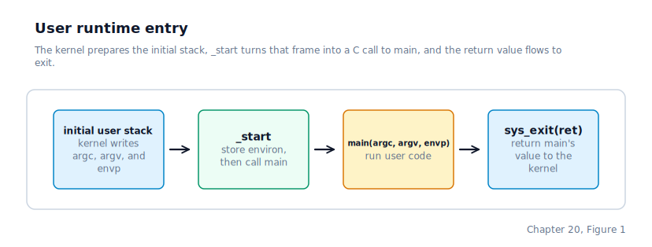

\newpage

## Chapter 20 — User-Space Runtime Library

### What a Runtime Library Is, and Why User Programs Need One

Chapter 19 left us with a complete signal subsystem and a process that can handle asynchronous notifications. Until now, every user program we wrote has been responsible for its own `_start` entry point and its own inline-assembly wrappers for `int 0x80`. That boilerplate has to be copied into every new program, and the programs themselves cannot be written as plain C with a `main` function.

On Linux, a user program written in C looks like this: you write `main`, you call `printf`, you return 0, and the compiler does the rest. What the compiler actually does is invisible to the programmer, but a lot is happening behind the scenes. A small startup object called **crt1.o** (the "C runtime, version 1") is linked into every executable. That object defines `_start`, the real entry point the kernel jumps to, which calls `main` and then passes `main`'s return value to `exit`. **libc** (the C standard library) provides `printf`, `write`, `read`, and every other standard C function, and each of those eventually issues a system call to ask the kernel to do the actual work.

We build with `-nostdlib -ffreestanding`, two compiler flags that explicitly turn off every automatic library. Nothing is linked in by default — not crt1.o, not libc, not even the runtime helpers GCC would normally provide. We build a shared user-space runtime library — a minimal equivalent of crt1.o and libc — so that every user program can be written as plain C with a `main` function.

### The Startup File

The **ELF** entry point `_start` is declared in the user linker script and read by the ELF loader from the file's header. Defining `_start` in a shared startup assembly file means every user program gets it for free.

By the time `_start` begins executing, the kernel's `process_create` has already laid a full argument and environment frame at the top of the user stack in **SysV i386 ABI** (System V Application Binary Interface for 32-bit x86, the calling-convention standard that defines how arguments are passed, registers are used, and stacks are managed) order. The word at the lowest stack address is `argc`, the word above it is a `char **argv` pointer, and the word above that is a `char **envp` pointer. The pointer arrays and raw strings live at higher addresses.

The bridge from the kernel's `iret` to user `main` looks like this:



`_start` pops all three words, stores the `envp` pointer into the global `environ` variable (so that library functions like `getenv` can find it without being passed it explicitly), then pushes all three back in cdecl order before calling `main`. After `main` returns, `_start` discards the three argument slots, pushes the return value as the argument to `sys_exit`, and calls `sys_exit`. An unreachable infinite loop follows in case something goes wrong.

Because the kernel always writes `argc`, `argv`, and `envp` — even for processes launched with no arguments, where it emits `argc = 0` and NULL-terminated empty arrays — `_start` can pop all three unconditionally. A user program declaring `int main(int argc, char **argv)` still works correctly: the third stack word is never read by the C code, and the cdecl calling convention makes `_start` responsible for cleaning up the extra slot.

### The Syscall Library

All `int 0x80` inline assembly now lives in exactly one library file. User programs include the companion header and call the wrappers as ordinary C functions — no inline assembly, no register constraints visible to the caller.

The convention the wrappers follow is straightforward: `EAX` holds the syscall number, `EBX` holds the first argument, `ECX` the second, and `EDX` the third. The wrappers use **GCC** (GNU C Compiler) extended-assembly syntax to bind C variables to those specific registers before executing `int 0x80`, and to extract the return value from `EAX` afterwards. The complete table of syscall numbers and their argument conventions was documented in Chapter 16.

One wrapper deserves a special note: `sys_read`. It passes a buffer pointer in `ECX`, and the kernel writes the character it reads into that buffer through the pointer. If the wrapper were written with an output constraint on the buffer — an extended-asm annotation that tells GCC the inline-asm block *writes* to that C variable — GCC might believe the buffer is an output to be regenerated by compiler-generated code, overwriting the character the kernel just deposited. The fix is to capture the return value in a separate local variable and leave the buffer as a plain pointer input. The result is that `EAX` carries the byte count back to the caller and the buffer contains the byte the kernel wrote, with no compiler interference.

`sys_exit` ends with an infinite loop. This tells the compiler the function never returns, suppressing warnings when the startup stub calls it and then reaches what would otherwise look like unreachable fall-through code.

### Rewriting the User Programs to Use the Library

With the runtime in place, every user program shrinks to an ordinary C file that declares `int main(int argc, char **argv)`, includes `lib/syscall.h`, and calls the wrapper functions. There is no inline assembly, no `_start`, and no duplicated boilerplate.

The shell undergoes the same transformation. Its original version had six duplicated inline-asm wrappers. Those are deleted, and the old `_start` is renamed to `main`. The shell gains nothing and loses nothing in behaviour, but the code is shorter, and adding a new user program no longer requires copying assembly from an existing one.

### The Heap: malloc and sbrk

User programs built so far can only allocate memory from the stack. Stack allocation works for buffers whose size is known at compile time, but it cannot support data structures that grow at runtime — variable-length inputs, linked lists, dynamically sized tables.

The heap fills that gap. Think of the heap like a table at a restaurant. You start with a small surface. As you need more room you push the edge back (`brk`) to claim more real estate. The page-fault handler is the kitchen staff who only lay down plates (physical pages) when you actually seat a guest there.

Every user process has a heap region that sits between the end of the ELF binary's **BSS** (uninitialised data segment) and the bottom of the user stack. At the moment a process starts, the heap region is empty — no physical pages back it. As the process requests memory, the kernel maps fresh pages into the region on demand. Two addresses per process define the heap's extent:

- **`heap_start`**: the first virtual address of the heap — the page-aligned end of the last loaded ELF segment. Set once when the process is created.
- **`brk`**: the **program break** — the current boundary between the backed heap and the unmapped region above it. Advancing `brk` is how the heap grows.

The mechanism that moves the break is the `SYS_BRK` system call. The kernel now treats `brk()` as an address-space reservation rather than an eager allocation: it validates that the new break stays below the reserved stack window, stores the new value, and returns. Physical pages are committed later, one page at a time, when the process first touches the reserved range and the page-fault handler installs the missing mapping. The `SYS_BRK` contract still mirrors Linux: passing zero queries the current break without changing it; any other value requests a new break; on success the return equals the requested value; on failure the return equals the unchanged old break.

The user-space bridge is `sbrk`. It queries the current break, requests `old_brk + increment`, checks whether the kernel accepted the request, and returns either the start of the newly usable region or `(void *)-1` on failure.

On top of `sbrk`, the user heap implements a first-fit free-list allocator. The heap needs to carve memory into blocks and reclaim them. The strategy: each allocation carries a header with its size and status; free blocks are chained so malloc can scan for a fit. Every allocation is preceded by an 8-byte block header:

```c
typedef struct {
    uint32_t size;    /* payload bytes, not including this header */
    uint32_t flags;   /* bit 0: 1 = allocated, 0 = free */
} block_hdr_t;
```

Free blocks store a pointer to the next free block in the first four bytes of their payload, threading them into a singly-linked free list. `malloc` walks this list for the first block large enough to satisfy the request. If the leftover space after carving out the requested bytes is large enough to hold a new header and a minimum payload, the tail is split into a new free block. If no existing block fits, `malloc` calls `sbrk` to extend the heap. `free` prepends the released block to the front of the free list. `realloc` returns the existing pointer unchanged if the block is already large enough, otherwise allocates a new block, copies the data, and frees the old one.

### Build System Changes

The build system compiles the runtime library once and links it into every user program. Three components are produced: the startup stub, the syscall wrappers, and the heap allocator. Each user ELF is linked against all three, with the startup stub listed first so `_start` lands at the very beginning of the executable — which is where the ELF entry point must be.

### Where the Machine Is by the End of Chapter 20

At this point the user-space boundary is clean and self-contained. Every `int 0x80` instruction in user programs has been moved into the syscall library; all user programs are plain C files with a `main` function. Adding a new user program requires only writing a C file — no boilerplate assembly to copy, no entry-point glue to write.

The `_start` stub receives `argc`, `argv`, and `envp` from the kernel-built stack frame, stores `envp` into the global `environ` pointer so library functions can find it, and forwards all three to `main`. After `main` returns, `_start` passes the return value to `sys_exit`, which transfers control back to the kernel and never returns.

User programs also have access to `malloc`, `free`, `realloc`, and `sbrk`, backed by `SYS_BRK` heap-growth. The heap starts empty; `sbrk` reserves more virtual space as the allocator exhausts its current region, and the CPU's page-fault path commits physical pages lazily on first touch.
