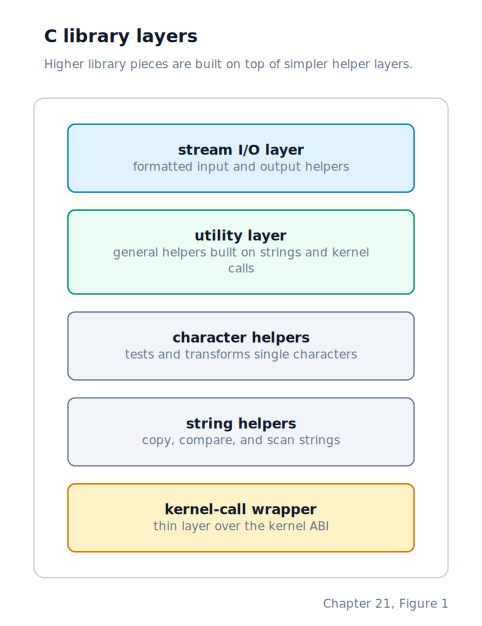

\newpage

## Chapter 21 — A Minimal C Standard Library

### The Foundation a libc Builds On

By the end of Chapter 20, user programs have three things: a startup stub that bridges the kernel's `iret` into `main`, a syscall wrapper library that hides every `int 0x80` behind ordinary C function calls, and a heap allocator backed by the `SYS_BRK` syscall. Those three pieces are enough to write programs that allocate memory and talk to the kernel. They are not enough to write programs that look like ordinary C — programs that call `printf`, compare strings with `strcmp`, classify characters with `isdigit`, or open files with `fopen`.

The **libc** (C standard library) is the layer that provides those familiar names. On a Linux system it is `glibc` or `musl`; our libc implementation sits on top of the raw syscall wrappers and heap allocator.

### The Dependency Hierarchy

The modules form a strict layering. Each module is only allowed to call modules below it. That rule prevents circular dependencies and keeps the linker from being surprised.



The two bottom layers — `string.c` and `ctype.c` — are **pure**: no system calls, no global state, no dependencies on anything but `<stddef.h>` for the `size_t` type. Everything above them may call downward but never sideways or upward.

### Why string.c Must Exist at the Bottom

`string.c` is not optional. GCC in `-ffreestanding` mode — the flag we use for all user code — still emits implicit calls to `memcpy`, `memset`, `memmove`, and `memcmp` for struct assignments and local zero-initialisation. A user program that does `struct point p = origin;` will compile into code that calls `memcpy` under the hood. If those four symbols are not linked in, the program fails at link time with an undefined reference — even if the programmer never wrote `memcpy` anywhere in the source. Shipping `string.c` is therefore not just a convenience for string-handling code; it is a linker requirement for any non-trivial C program.

One implementation subtlety deserves mention: `memmove` must produce the correct result even when the source and destination regions overlap. The straightforward forward copy that `memcpy` uses would overwrite source bytes before they are read when the destination falls above the source in memory. `memmove` detects this case with a pointer comparison and copies backward — from the highest address downward — so each source byte is consumed before the destination pointer reaches it.

### Character Classification Without Double-Evaluation Bugs

The standard C library on most systems implements character-classification functions as macros that index into a 256-entry lookup table. That approach is fast but carries a well-known hazard: macros evaluate their argument more than once, so `isdigit(*p++)` would advance `p` twice. We use out-of-line functions instead. For a project of this scale the call overhead is irrelevant, and the single-evaluation guarantee means the functions compose safely with expressions that have side effects.

The classification ranges are defined entirely by the **ASCII** (American Standard Code for Information Interchange) character encoding — to the CPU they are just integers. Because uppercase and lowercase ASCII letters are exactly 32 positions apart, `toupper` subtracts `0x20` from a lowercase letter and `tolower` adds it. No lookup table is needed.

### One Format Engine, Multiple Destinations

Every `printf` variant does the same thing: walk a format string, substitute arguments, and send the result somewhere. The "somewhere" varies — `printf` goes to `stdout`, `sprintf` goes into a caller-supplied buffer. A naive implementation would be one copy of the format walker per destination type. The libc here uses one shared format engine that writes to an abstract **sink**.

```c
typedef struct {
    char  *buf;    /* chunk buffer (stream mode) or destination buffer (buffer mode) */
    size_t cap;    /* buffer capacity */
    size_t pos;    /* current write position within buf */
    int    total;  /* total characters that would have been emitted */
    int    fd;     /* >= 0: stream mode; < 0: buffer mode */
} pf_sink_t;
```

When `fd >= 0` the sink is in stream mode: output accumulates in a small stack-allocated chunk buffer, and when the chunk fills up the buffer is written to the file descriptor and the position resets. When `fd < 0` the sink is in buffer mode: output accumulates into the caller's buffer up to its capacity, but `total` keeps counting beyond the limit. At the end, `total` is the return value — the number of characters that *would* have been written — which is how C99's `snprintf` contract lets callers size a buffer on a dry run and fill it on a second pass.

The number-to-ASCII conversion writes digits into a temporary buffer *in reverse order* (least significant digit first) using repeated division, then reads the buffer backwards when composing the final field. This avoids needing to know the digit count before starting to write.

### The FILE Type and Standard Streams

A `FILE` is a small struct holding a kernel file descriptor and a flags word. The three standard streams are static instances defined inside `stdio.c`:

```c
typedef struct {
    int          fd;
    unsigned int flags;
} FILE;
```

The flags word carries direction bits, error and EOF indicators, and a buffering mode. The pointers `stdin`, `stdout`, and `stderr` are global variables that point at those three static instances. Every program that includes `stdio.h` sees them; they are pre-wired to the file descriptors the kernel gives every new process (fd 0 for TTY input, fd 1 for the active console or desktop shell output path, fd 2 for unbuffered error output).

`fopen` maps a POSIX mode string to the corresponding kernel file operation: mode `"r"` opens an existing file, mode `"w"` creates or truncates one. It allocates a `FILE` on the heap with `malloc`. Closing a heap-allocated `FILE` closes the underlying descriptor and frees the allocation, but closing one of the three static standard streams is a no-op — they are statically allocated and must never be freed.

### The POSIX Wrapper Split

The POSIX wrapper layer is deliberately thin: it provides POSIX names for the same operations already in the syscall library, as one-line forwarding calls. The split serves two purposes. First, it keeps all `int 0x80` inline assembly in exactly one place. Second, it gives programs written to POSIX conventions a header they can include without pulling in any assembly knowledge. The kernel ABI lives entirely below the syscall wrappers.

The same pattern now extends to memory mapping. A tiny adapter layer exposes `mmap`, `munmap`, and `mprotect` as libc-style names while still delegating all register choreography to the raw syscall wrappers. User code therefore gets the familiar interface shape without spreading inline assembly or syscall-number knowledge beyond one file.

One wrapper requires special treatment: `write` must route through the fd-aware kernel write path rather than the old raw-console shortcut. The original console write path ignores file descriptor redirection; the fd-aware path dispatches through the per-process fd table, so `write(1, ...)` correctly follows a `dup2(pipe_fd, 1)` in a pipeline. Any program that calls the POSIX `write` function therefore works transparently inside a shell pipeline.

`isatty` also deserves a note: there is no dedicated kernel syscall for it. Instead, it probes whether an fd refers to a terminal by calling `sys_tcgetattr` and checking whether the call succeeds. If the fd is a TTY the call succeeds; if it is a file or pipe it fails. This is the same technique Linux's glibc uses.

### Calendar Time in User Space

The kernel provides exactly one time value: `clock_unix_time()`, accessible from user space through `SYS_CLOCK_GETTIME`. It returns seconds since the Unix epoch (midnight 1970-01-01 UTC). Everything else — converting that timestamp into year, month, day, hour, minute, second; determining the weekday; formatting it as a human-readable string — happens entirely in user space through `time.c`.

This mirrors Linux's design. The kernel has no concept of months, leap years, or time zones. It just keeps a counter. The C library turns that counter into calendar fields by counting the days from 1970 to the present year (accounting for leap years with the Gregorian rule: divisible by 4 but not 100, or divisible by 400), then counting days within the year to determine the month and day-of-month. No data tables are needed — leap year detection and cumulative month-day counts are computed arithmetically.

`getenv` relies on the global `environ` pointer that the startup stub initialises from the envp word on the initial stack. The function does a linear scan of the `NULL`-terminated `environ` array, comparing each `NAME=VALUE` string's prefix to the requested name. If it finds a match, it returns a pointer directly into that string at the `=` + 1 position. No copy is made; the caller reads directly from the inherited environment block.

### Where the Machine Is by the End of Chapter 21

User programs now have a complete, self-contained C runtime with no dependency on any host system library. The strict dependency hierarchy means modules can be linked individually — only the layers a program actually uses end up in the binary. The format engine, the sink abstraction, the POSIX wrapper split, and the in-userspace calendar conversion are all architectural decisions that eliminate duplication, keep assembly in one place, and correctly separate what the kernel knows (a second count) from what libc knows (months, weekdays, time zones). The raw `int 0x80` interface is completely hidden behind the syscall wrappers.
