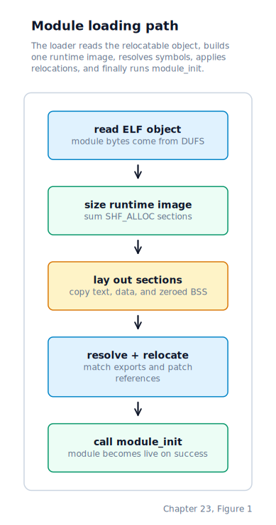

\newpage

## Chapter 23 — Runtime Loadable Modules

### Extending the Kernel at Runtime

Chapter 22 left us with a working interactive shell that can launch ELF programs, manage jobs, and pipe output between processes. Every built-in driver is still linked into the kernel image, though. We add one extension point: user space can point the kernel at a relocatable ELF object already stored in DUFS, and we can load and execute it at runtime without rebuilding the kernel image.

### The Input Format

We accept ordinary 32-bit relocatable ELF objects — the `.o` files that the compiler produces before a linker combines them into an executable. Before doing any work we validate four conditions: the file begins with the four-byte ELF magic sequence (`0x7F 'E' 'L' 'F'`), the object type field is `ET_REL` (the ELF type constant for a relocatable object, as opposed to an executable or shared library), the machine field is `EM_386` (the ELF architecture constant for 32-bit x86), and the file size does not exceed `MODULE_MAX_SIZE`.

The load request starts like any other file access: the kernel resolves the module path through the **VFS** (Virtual File System), identifies the backing inode and file size, and reads the bytes from DUFS into kernel memory. The module loader is therefore not a side door around the filesystem; it consumes the same on-disk objects the rest of user space sees.

### How a Module Is Loaded

Once the bytes are in memory, the kernel reads the ELF header and section-header table so it can understand the object's layout before committing any permanent runtime memory.

The first pass over the section-header table is a sizing pass. Every section marked `SHF_ALLOC` — the ELF section flag that means "this section must occupy memory at runtime" — contributes its size and alignment requirement to a running total. Text and read-only data sections, the initialized data section, and any zero-filled BSS regions all carry this flag. Non-allocatable sections such as debug information and the relocation records themselves do not. Once the total is known, we call `kmalloc` once for the whole module and zero-fill the resulting buffer. Zero-filling is important because BSS sections are never stored on disk; the ELF format simply records their required size and expects us to provide zeroed memory.

The second pass copies each allocatable section into its calculated position inside the module buffer, records the runtime address at which each section landed, and reads the symbol table. The symbol table lists every name the object defines or references — local functions, global data, and any external names the module expects the kernel to supply. Defined symbols are resolved first: we add each section's base address to the symbol's section-relative offset, so every locally defined function and variable gets its runtime address in the kernel heap.

Undefined symbols — those the object references but does not define — are matched against the kernel export table. That table is a fixed array of `(name, address)` pairs listing every kernel function a module is allowed to call. The matching is a linear scan by name. Any symbol that appears in the object's symbol table but not in that export table is a hard failure: the load aborts and the module buffer is freed. This bounded visibility is our small-scale equivalent of Linux's `EXPORT_SYMBOL` mechanism — we don't expose every internal function automatically, and modules cannot reach symbols that were not explicitly published.

### Applying Relocations

A relocatable object produced by the compiler contains placeholder values wherever it references a symbol whose final address is not yet known. A **relocation record** tells us exactly where one of these placeholders sits, which symbol's address should go there, and what arithmetic to apply. We handle the two relocation types that a simple C module produces.

An `R_386_32` record describes a 32-bit absolute address reference. We add the symbol's runtime address to whatever value the compiler placed at the patch site — typically zero — and write the result back. A `call` or `jmp` to an absolute address uses this form.

An `R_386_PC32` record describes a 32-bit PC-relative address reference — the signed displacement that an `E8 call` instruction encodes. We add the symbol's runtime address and then subtract the address of the patch site itself, producing the offset the CPU computes at execution time. Encountering any other relocation type is a hard failure; we have no arithmetic for it and refusing to continue is safer than leaving a partially patched module in memory.

### Memory Layout and Lifetime

All allocatable sections for one module are packed into a single contiguous heap allocation. Because this is a 32-bit kernel whose heap pages are executable, we don't need to create a separate executable mapping — text sections land in the same buffer as data sections and the CPU can fetch instructions from them directly.

Once the relocation pass completes without error, we look up the symbol named `module_init` in the resolved symbol table and call it. If `module_init` returns zero the load is considered successful; a non-zero return signals that the module itself detected a problem during its own initialization.

There is no unload path. Once `module_init` succeeds, the heap allocation remains resident for the life of the kernel. A module that registers itself with a device registry or interrupt table cannot be safely removed without knowing whether any code currently running holds a pointer into the module's text or data — a reference-counting problem we deliberately defer. We also record a small `(name, base, size)` descriptor for each successful load so `/proc/modules` can enumerate the live module set.

### How User Space Requests a Load

User space reaches the loader through the private `SYS_DRUNIX_MODLOAD` syscall. The shell's built-in `modload` command names a file that already exists on disk; the kernel validates that file, loads it into memory, resolves its symbols, applies relocations, and finally runs its initialisation entry point:

The return value travels back through the syscall frame to the caller. A zero means the module is live; any negative value means something failed before or during `module_init`.

### What a Module Can Do

A successfully loaded module can call any function in the export table and register itself with any kernel registry that table exposes. In practice that means a module can add new block devices under new names, register character devices, provide a new filesystem implementation, or install an interrupt handler — all without rebuilding the kernel image. The constraint is the export table: if a kernel function is not listed there, the module cannot reach it, and the load fails at symbol resolution rather than at runtime.

### Where the Machine Is by the End of Chapter 23

We are no longer limited to code that was linked at build time. A user process can ask us to load a relocatable ELF object from DUFS, parse its section and symbol tables, resolve its external references against the exported-symbol table, apply the two relocation types that 32-bit x86 C code generates, and call its entry point — all inside a single `SYS_DRUNIX_MODLOAD` call. The module lands in a single heap allocation, its text sections are immediately executable, and it becomes a permanent part of the running kernel for as long as the machine stays up.
