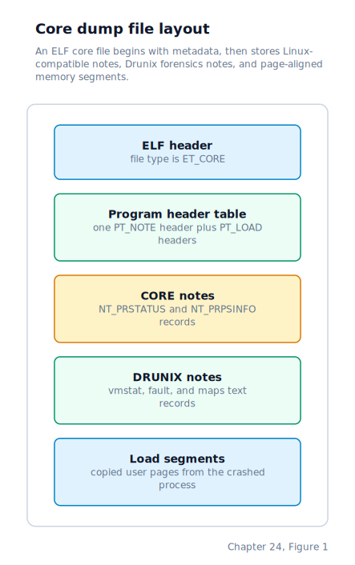

\newpage

## Chapter 24 — Core Dumps

### The Moment the Process Can No Longer Continue

Chapter 23 left us with runtime-loadable modules that extend the kernel without rebuilding the kernel image. When a fatal signal arrives and the process has not installed a handler for it, we don't simply discard the process and move on. If the signal is one of the terminating signals — SIGILL (illegal instruction), SIGSEGV (segmentation fault, sent on a bad memory access), or any unhandled SIGTERM or SIGKILL — we have enough information to write a complete snapshot of the crashed process's state to disk before cleaning up. That snapshot is a **core dump**: an ELF file containing the process's entire user-space memory and the CPU register state at the moment of the fault.

The point of the file is post-mortem debugging. Load it into GDB alongside the original binary and you can see exactly where execution was, what the stack looked like, and what values every register held. On Linux this has been standard for decades. We produce core files in the same format, so the same tools work without modification.

### When a Core Dump Fires

Signals deliver core dumps through the normal signal-delivery path described in Chapter 19. When that path finds a deliverable signal whose disposition is `SIG_DFL`, it determines whether the signal's default action is termination. If the process has a saved crash frame (set earlier by the exception handler when the fault first occurred), the kernel writes the core file before transitioning the process to the zombie state.

The crash frame is a copy of the full interrupt frame saved at the moment the CPU faulted. The exception handlers detect a ring-3 fault, copy the frame into the process's crash record, and set a valid flag before sending the appropriate signal. The process's memory may be corrupted afterward; if we tried to reconstruct the register state later the stack might be overwritten. Copying the frame in the exception handler preserves it before any cleanup. The signal is then delivered on the next scheduler pass, which is when the kernel still has both the crash context and the intact user address space available to write out.

### The ELF Core File Format

An ELF file contains a header describing the file, followed by program headers that describe how to load segments. A core file uses the same structure but with special segment types.

A core file is an ELF — Executable and Linking Format — binary with type `ET_CORE` rather than the usual `ET_EXEC` or `ET_DYN`. ELF is a standard binary format used throughout Linux and most Unix systems; its header describes what the file contains and where each section lives.

An `ET_CORE` file carries two kinds of program headers:

- **PT_NOTE** — a single segment pointing to a block of metadata notes. Each note describes some aspect of the process: the signal that killed it, the register state, the process name, the command-line arguments, and the process group it belonged to.
- **PT_LOAD** — one segment per contiguous region of user-space memory. Each describes a range of virtual addresses, its file offset, and whether the region was readable, writable, or executable.

A debugger reconstructs the process's address space by mapping each `PT_LOAD` segment to its virtual address and reading the process metadata from the `PT_NOTE` segment.

The overall file layout is:



The notes follow the program headers directly. The memory dumps are pushed past the next page boundary from the end of the notes so that each `PT_LOAD`'s file offset is page-aligned — this makes it possible for a debugger to `mmap` each segment directly if it chooses.

### ELF Notes

An ELF note section is a sequence of variable-length records. Each record starts with a fixed header:

```c
typedef struct {
    uint32_t n_namesz;  /* length of the name string including NUL */
    uint32_t n_descsz;  /* length of the descriptor data           */
    uint32_t n_type;    /* note type                               */
} Elf32_Nhdr;
```

The header is followed by the name string (zero-padded to a 4-byte boundary), then the descriptor data (also zero-padded to a 4-byte boundary). We write two notes under the name `"CORE"` and three additional notes under the name `"DRUNIX"`.

**NT_PRSTATUS (type 1)** is the register state note. Its descriptor is a 144-byte structure that matches Linux's `elf_prstatus` exactly:

```c
typedef struct __attribute__((packed)) {
    core_siginfo_t pr_info;    /* signal number, code, errno  */
    uint16_t       pr_cursig;  /* current signal              */
    uint16_t       pr_pad0;
    uint32_t       pr_sigpend; /* pending signal bitmask      */
    uint32_t       pr_sighold; /* blocked signal bitmask      */
    int32_t        pr_pid;
    int32_t        pr_ppid;
    int32_t        pr_pgrp;
    int32_t        pr_sid;
    core_timeval_t pr_utime;   /* user time (zeroed)          */
    core_timeval_t pr_stime;   /* system time (zeroed)        */
    core_timeval_t pr_cutime;
    core_timeval_t pr_cstime;
    elf_gregset_t  pr_reg;     /* architecture-defined register set */
    int32_t        pr_fpvalid;
} core_prstatus_t;
```

The `pr_reg` field — the general-purpose register set — is where the two supported architectures diverge. Everything else in `core_prstatus_t` is portable across architectures; only the register snapshot inside `pr_reg` has a layout that is specific to the CPU.

#### On x86: i386 register set in NT_PRSTATUS

On x86, the seventeen general-purpose registers in `pr_reg` are written in the order that matches the Linux i386 `user_regs_struct` layout, which is what GDB expects when it opens a 32-bit core file:

| Index | Register |
|-------|----------|
| 0 | EBX |
| 1 | ECX |
| 2 | EDX |
| 3 | ESI |
| 4 | EDI |
| 5 | EBP |
| 6 | EAX |
| 7 | DS |
| 8 | ES |
| 9 | FS |
| 10 | GS |
| 11 | orig_eax (not tracked; set to 0xFFFFFFFF) |
| 12 | EIP |
| 13 | CS |
| 14 | EFLAGS |
| 15 | user ESP |
| 16 | SS |

These values are drawn directly from the saved crash frame (`proc->crash.frame`), which was copied from the CPU's interrupt frame before any cleanup took place.

#### On AArch64: AArch64 register set in NT_PRSTATUS

*On AArch64 (planned, milestone 4): the per-arch register layout follows the AArch64 ELF ABI — `x0`–`x30`, `SP`, `PC`, `PSTATE`.*

The AArch64 ELF ABI defines thirty-three slots in the register snapshot: the thirty-one general-purpose integer registers `x0` through `x30` (where `x30` doubles as the link register), the stack pointer `SP`, the program counter `PC`, and the processor state register `PSTATE`. GDB and LLDB both expect these registers in that order when opening a 64-bit AArch64 core file. The crash frame captured by the AArch64 exception handler will already hold all of these values in the same sequence used by the kernel's exception entry path, so filling `pr_reg` is a direct copy with no reordering needed.

**NT_PRPSINFO (type 3)** is the process information note. Its descriptor is a 124-byte structure matching Linux's `elf_prpsinfo` for 32-bit targets:

```c
typedef struct __attribute__((packed)) {
    char     pr_state;      /* numeric process state (0=R, 1=S, 3=Z, 4=T) */
    char     pr_sname;      /* state as a letter: R, S, Z, or T            */
    char     pr_zomb;       /* 1 if zombie, 0 otherwise                    */
    char     pr_nice;       /* nice priority value (0)                     */
    uint32_t pr_flag;       /* process flags (0)                           */
    uint16_t pr_uid;
    uint16_t pr_gid;
    int32_t  pr_pid;
    int32_t  pr_ppid;
    int32_t  pr_pgrp;
    int32_t  pr_sid;
    char     pr_fname[16];  /* executable basename                         */
    char     pr_psargs[80]; /* first 79 chars of the command line          */
} core_prpsinfo_t;
```

When GDB opens a core file, it reads `pr_fname` to identify the binary and `pr_psargs` to show the command that was running. Without this note the debugger can still read registers and memory, but it cannot automatically find the matching executable or show you what arguments the program was called with.

### DRUNIX Text Notes for Memory Forensics

The core writer also emits three text-backed `DRUNIX` notes that mirror the live `/proc/<pid>/` memory-forensics views:

- `DRUNIX` note type `0x4458564d` (`"DXVM"`) carries the same compact per-process totals shown by `/proc/<pid>/vmstat`.
- `DRUNIX` note type `0x44584654` (`"DXFT"`) carries the same fault snapshot shown by `/proc/<pid>/fault`.
- `DRUNIX` note type `0x44584d50` (`"DXMP"`) carries the same detailed virtual-memory map text shown by `/proc/<pid>/maps`.

These notes are generated from the same internal process-memory model used by `procfs`, then copied directly into the ELF `PT_NOTE` payload during core creation. That alignment gives us a stable live/post-mortem bridge: while a process is running, `/proc/<pid>/vmstat`, `/proc/<pid>/fault`, and `/proc/<pid>/maps` show current state; after a crash, the core file preserves the same views as frozen text notes.

### Capturing the Command Line at Launch Time

The process name and command-line string cannot be recovered from memory after a crash reliably — the process may have corrupted its own stack, or `argv` may have been overwritten by the program's own data. We therefore copy them into the process descriptor at creation time, before the process ever gets to run.

During process creation, after the ELF image has been loaded and before control returns to the caller, the kernel does two things. First, it extracts the executable basename from `argv[0]` by scanning backward for the last `/` character and copying the tail into `proc->name`, capped at 15 characters plus a NUL terminator. Second, it assembles the full argument list into `proc->psargs` by concatenating all `argv[]` strings with single spaces between them, stopping at 79 characters. Both fields live in the process descriptor permanently, surviving any subsequent modification of the user-space stack.

The `name` field was introduced earlier for kernel logging; `psargs` was added alongside the `NT_PRPSINFO` note to give debuggers the command line at the moment of the crash.

### Walking User-Space Memory

For the `PT_LOAD` segments, we need to find every contiguous region of user-space memory that was mapped at the time of the crash. The page directory and page tables are still intact — the process has not been destroyed yet, only marked for termination. We walk the process's page directory looking for user-accessible, present pages, and group adjacent pages with the same permission flags into a single segment.

The permission flags on each segment reflect the page table entry (PTE) flags: a read-only code region produces a `PF_R` segment; a read-write data or stack region produces `PF_R | PF_W`. This matters for debugging: GDB uses the flags to distinguish code from data and to know which regions it can safely disassemble.

One boundary condition matters here: we enforce that only pages below `USER_STACK_TOP` are included. Pages above that address are kernel-mapped and never written to the core file, both for security and because the debugger has no use for kernel virtual addresses.

### Writing the File

The core file is written to the process's current working directory with the name `core.<pid>`. The full path is assembled as `<cwd>/core.<pid>` when the process has a working directory, or just `core.<pid>` at the filesystem root. The file is created through the VFS layer, and all subsequent writes go through the ordinary filesystem write path on the resulting inode.

The write proceeds in four passes:

1. Write the ELF header.
2. Write all program headers — first the `PT_NOTE` header, then one `PT_LOAD` header for each user-space segment identified during the walk. All program headers are written before any data, because the program header table must immediately follow the ELF header and its total size is known once the segment count is known.
3. Write the notes block at the fixed `note_off` offset (immediately after the program header table). The block begins with the two Linux-compatible `CORE` notes — `NT_PRSTATUS`, then `NT_PRPSINFO` — and then appends the three `DRUNIX` text notes for `vmstat`, `fault`, and `maps` in that order.
4. Walk user-space memory a second time and write each segment's page data at the file offset recorded in its `PT_LOAD` header.

After all data is written, the filesystem's flush step ensures the data reaches the on-disk image before the kernel returns.

### Where the Machine Is by the End of Chapter 24

When a process dies from an unhandled fatal signal and a crash frame was recorded, we now write a fully-formed ELF core file to disk before discarding the process. The file contains two Linux-compatible `CORE` notes — `NT_PRSTATUS` with register and signal context, and `NT_PRPSINFO` with process identity — plus three `DRUNIX` text notes mirroring `/proc/<pid>/vmstat`, `/proc/<pid>/fault`, and `/proc/<pid>/maps`. These are followed by the raw bytes of every user-space page that was mapped at the moment of the fault.

The portable outer shell of `NT_PRSTATUS` is identical across architectures. The only per-arch part is the `pr_reg` register snapshot inside it: on x86 the kernel writes seventeen registers in the i386 `user_regs_struct` order; on AArch64 (planned, milestone 4) it will write thirty-three registers following the AArch64 ELF ABI ordering of `x0`–`x30`, `SP`, `PC`, and `PSTATE`.

The `process_t` descriptor carries two new fields — `name` and `psargs` — populated at process-creation time so the information is available regardless of what the process did to its own stack before crashing. The file format is layout-compatible with Linux's 32-bit core format on x86, so standard tools such as GDB can load the file and restore the full crash context without any modification.
