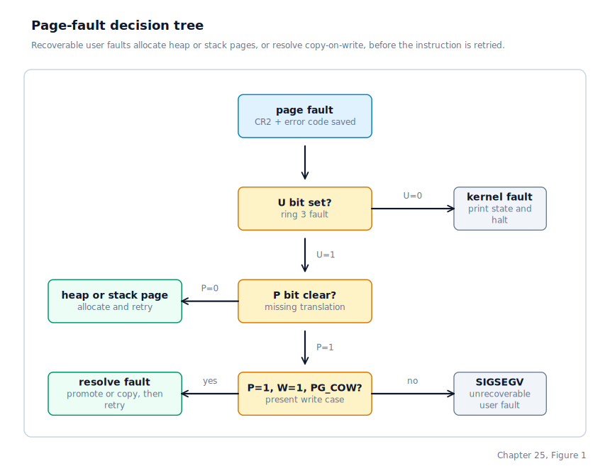
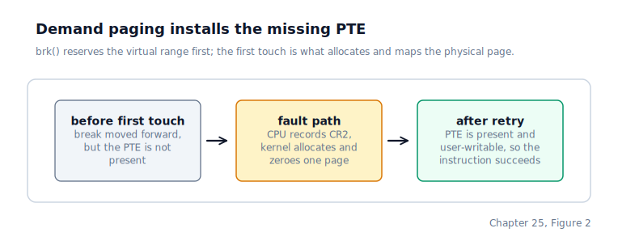

\newpage

## Chapter 25 — Page Faults and Demand Paging

### The Moment a Missing Mapping Stops Being a Crash

Recall from Chapter 20 that the process heap is a range of virtual addresses the program can request from the kernel. By the end of Chapter 24 the kernel can dump a crashed process's memory to disk, but it is still treating every ring-3 page fault as a terminal event. That was acceptable when all user pages were allocated eagerly: if the CPU faulted, the mapping was either invalid or forbidden, so the right answer really was SIGSEGV. The moment the heap becomes lazy and the user stack is allowed to grow, that assumption breaks. A fault is no longer always a bug. Sometimes it is the CPU's way of saying, "this virtual address is part of the process, but the page tables are not finished yet."

This chapter turns the page-fault path into a normal part of execution. The process asks for a larger heap with `brk()`, but the kernel does not allocate any physical memory yet. The process reaches into that heap later, the CPU faults because the page is not present, and the kernel allocates exactly one page, installs exactly one mapping, and retries exactly the same instruction. The same thing now happens when a deep call chain reaches the bottom of the four-page stack and needs one more page underneath it.

This is the shape Linux uses too: not every page fault means "kill the process". Some faults mean "finish building the mapping and continue".

### What the CPU Reports on a Page Fault

When a page fault fires, the CPU does two extra things that no other exception provides in quite the same way.

First, it records the faulting virtual address in a dedicated register. On x86, that register is **CR2** (Control Register 2, a CPU register dedicated to remembering the address that triggered the most recent page fault); the kernel reads `CR2` in the exception handler before doing anything else, because any later page fault would overwrite it. On AArch64 the same address is delivered through **`FAR_EL1`** (Fault Address Register at EL1, the AArch64 register that holds the virtual address that caused a page fault — the AArch64 analogue of x86's `CR2`).

Second, the CPU reports the cause of the fault. On x86 this comes as a page-fault error code pushed onto the interrupt frame; on AArch64 the cause bits come from `ESR_EL1` (Exception Syndrome Register at EL1, introduced in Chapter 16), which encodes the exception class and access type. The three cause bits that matter for policy are the same logical questions regardless of architecture:

| Bit | Name | Meaning when set |
|-----|------|------------------|
| 0 | `P` | The page was present, so the fault is a protection failure rather than a missing mapping |
| 1 | `W` | The access that faulted was a write |
| 2 | `U` | The fault came from unprivileged mode rather than the kernel |

The exception handler reads these bits from the saved trap frame (x86: `f->error_code`; AArch64: decoded from `ESR_EL1`).

The combination is what turns a raw fault into a policy decision. `P=0, U=1` means "user mode touched an address whose translation is missing". `P=1, W=1, U=1` means "user mode tried to write through a present but read-only mapping". The first case may be a lazy heap or stack page. The second case may be a copy-on-write promotion. Anything else is usually a real protection bug.

### The New Stop in the Fault Path

The interrupt path itself changes in only one place. Unprivileged page faults now get one chance to recover before the signal path runs. Kernel faults still print state and halt. User faults that are truly invalid still become `SIGSEGV`. The new possibility is that some user faults are now recognised as incomplete-but-valid memory accesses.

The sequence is:

1. The CPU faults on an unprivileged memory access and transfers control to the page-fault handler.
2. The kernel saves the register frame and reads the faulting address from the fault-address register (`CR2` on x86; `FAR_EL1` on AArch64).
3. The page-fault handler classifies the access and checks whether the address belongs to a valid user mapping.
4. If the fault is recoverable, the kernel installs or repairs the mapping and returns from the exception.
5. The CPU retries the exact instruction that faulted, this time against the updated page tables.
6. If the fault is not recoverable, the old `SIGSEGV` path runs unchanged.

The important point is that the retry is free. There is no second special control transfer for the resumed instruction. The exception-return instruction (`iret` on x86; `eret` on AArch64) restores the saved program counter and processor state, and the CPU simply fetches the same instruction again. This works because the CPU stopped at a well-defined point — the fault-address register holds the offending address and the faulting instruction is known, so we can simply resume it once the page is present.

### The Decision Tree

The page-fault handler starts from one question: was this a missing translation, or was it a write through a present but non-writable mapping?

The first split is the `U` bit. A page fault raised in privileged mode is still fatal here. The kernel has no recovery path for faults taken while it is executing on its own behalf, so the function returns failure immediately and the old exception path halts the CPU after printing the register dump.

The second split is the `P` bit:

- `P = 0` means the CPU could not complete the page walk because some PDE or PTE was not present.
- `P = 1` means the page walk succeeded, but the permissions on the resulting PTE rejected the access.

That distinction is what lets one handler implement both demand paging and copy-on-write without confusing the two.

### Heap Pages Are Now Committed on First Touch

`SYS_BRK` used to do all of its work eagerly. If a process moved its heap break 10 MB forward, the syscall immediately allocated and zeroed 2,560 physical pages and mapped all of them before returning. That made `brk()` expensive and meant an untouched heap reservation consumed physical memory it never used.

The new `SYS_BRK` path now does almost nothing on growth. It checks that the requested break stays inside the legal heap window, records the larger reservation, and returns. No physical page is allocated. No PTE is installed. The virtual address range between the old break and the new break becomes *valid in principle* but still unmapped in the page tables.

The first real access happens later. Suppose a process calls `sbrk(4096)` and then writes to the first byte of the newly reserved range. The CPU performs the page walk, discovers that the PTE is missing, and raises a page fault with the faulting address recorded in the fault-address register. The fault handler rounds that address down to a 4 KB page boundary, confirms that it lands inside the process's writable heap reservation, allocates one physical page from the physical memory manager, zeros it, maps it with `PG_PRESENT | PG_WRITABLE | PG_USER`, and returns success.

The mapping step itself invalidates the stale **TLB** (Translation Lookaside Buffer, the CPU's cache of recent virtual-to-physical translations) entry for that virtual page with `invlpg`, so the retried instruction will see the new PTE immediately rather than a cached "not present" result.

The result is true demand paging for the heap: the address space grows at `brk()` time, but physical memory is committed page by page as the process actually touches it.

### Shrinking the Heap Now Frees Only What Exists

Heap shrink takes the opposite path. When the break moves backward, the kernel walks the affected virtual page range. For each present PTE in that range, it decrements the frame's reference count, clears the PTE, and invalidates the TLB entry.

What matters here is that the loop skips any page that was never touched. In the old eager model, every heap page existed, so shrinking had to free a dense run of physical pages. In the new model, a 10 MB heap reservation may contain only two present PTEs because the program only touched two pages. Shrink removes exactly those two mappings and leaves the untouched holes alone because there is nothing to free.

This is why the new demand path and the refcounted physical allocator belong together. Unmapping a heap page is not always "free this frame immediately". If the page is shared for some other reason, the right operation is "drop this mapping's reference". The physical memory manager handles the final transition to free when the count reaches zero.

### A Small VMA Table Now Defines What Counts As Valid Memory

The page-fault handler no longer hard-codes "heap versus stack" by checking only raw address ranges. Each process now carries a small sorted **VMA** (Virtual Memory Area, a record describing one contiguous range of valid user addresses) table describing the user regions the kernel intentionally created:

- the `brk()` heap VMA,
- the reserved grow-down stack VMA, and
- any later anonymous private mappings created with `mmap()`.

Each VMA stores a half-open address range, a kind (`heap`, `stack`, or generic mapping), and permission flags such as readable, writable, executable, anonymous, private, and grow-down. Process creation seeds the table with the initial heap and stack entries. `SYS_BRK` adjusts the heap VMA's end. `SYS_MMAP`, `SYS_MUNMAP`, and `SYS_MPROTECT` add, split, remove, or retag generic VMAs without touching the ELF image metadata.

This matters in the fault path because the first policy question is now "which VMA contains the faulting address?" If the answer is "none", the fault is still invalid and falls through to `SIGSEGV`. If the answer is a writable anonymous VMA, the handler can allocate and map a zeroed page on demand. x86 user mappings are kept above the kernel's low 128 MB identity map, so anonymous user faults should not shadow that direct-map window. If the answer is a present but non-writable VMA and the PTE carries `PG_COW`, the same lookup confirms that the write is allowed in principle before the copy-on-write promotion proceeds.

### The User Stack Can Grow Below the Current Bottom

The user stack still starts the same way it did in Chapter 15: the kernel maps four pages just below `USER_STACK_TOP` so that `argv`, `envp`, and the first few nested function calls have somewhere to live before the process executes any user code.

The difference is that the process descriptor now records `stack_low_limit`, the lowest currently mapped stack page, and the address-space contract reserves a larger stack window: up to `USER_STACK_MAX_PAGES`, which is 64 pages or 256 KB. `USER_HEAP_MAX` is moved upward accordingly, so the heap must stop below the entire potential stack window rather than below the four pages that happen to be mapped at process start.

Stack growth stays in the page-fault handler. On a not-present unprivileged fault, after the heap test fails, the kernel computes two bounds:

- the lowest legal page in the reserved stack window, `USER_STACK_TOP - USER_STACK_MAX_PAGES * PAGE_SIZE`
- a 32-byte slack below the saved user stack pointer, or zero if the stack pointer is already near the bottom of the address space

The 32-byte slack is deliberate. On x86, instructions such as `push`, `pusha`, and `enter` can touch memory slightly below the architectural stack pointer before it is updated; AArch64 has similar pre-decrement addressing modes. Linux uses the same idea: a strict "faulting address >= stack pointer" check rejects valid stack growth patterns.

If the faulting page lies:

- above `stack_floor`,
- below the current `stack_low_limit`,
- below `USER_STACK_TOP`, and
- no more than 32 bytes below the saved user stack pointer,

then the handler allocates and maps zeroed pages from the current `stack_low_limit - PAGE_SIZE` downward until the faulting page itself is covered, updating `cur->stack_low_limit` after each successful step.

The common case is still one page per fault, but the implementation is slightly more forgiving than that wording suggests: if the process jumps several pages downward within the legal stack window, one fault can backfill the whole missing run in a single pass. Either way, the stack keeps growing until it reaches the 256 KB cap, at which point the next fault below the reserved window falls through to SIGSEGV like any other invalid access.

### Anonymous `mmap()` Regions Ride the Same Fault Path

The new `SYS_MMAP` interface deliberately reuses the same machinery rather than inventing a second allocator. A successful anonymous private `mmap()` call only records a generic VMA in the process descriptor. The returned virtual range is reserved immediately, but it is still backed by no present PTEs. The first touch to any page in that range faults exactly like a lazy heap touch does: the fault handler finds the generic VMA, sees that the mapping is anonymous and private, allocates one zeroed physical page, and installs it with permissions derived from the VMA flags.

`SYS_MUNMAP` tears the mapping down in the opposite order: it removes the VMA metadata first, then walks the covered PTEs and drops any physical frames that had actually been committed. `SYS_MPROTECT` keeps the same address range but rewrites the VMA flags and any present PTE permissions so future faults and copy-on-write decisions observe the new policy. That means heap, stack, and anonymous mappings are all now governed by one fault-time policy engine rather than by three unrelated code paths.

### Present Write Faults Usually Mean Copy-on-Write or a Real Protection Error

The other half of the decision tree is usually `P = 1, W = 1`: the CPU found a present mapping, but the access was a write and the PTE did not permit it.

There is one notable exception before the copy-on-write logic runs. A first touch on an anonymous heap, stack, or `mmap()` page can still arrive as `P = 1` if the process is looking through the inherited supervisor-only identity map rather than through a user PTE. The fault handler checks for exactly that shape — present, not user, not copy-on-write, inside an anonymous private VMA — and routes it into the same lazy-allocation path as a not-present anonymous miss.

We reserve bit 9 in the PTE as `PG_COW`, an operating-system-defined flag the hardware ignores. The invariant is:

| `PG_COW` | `PG_WRITABLE` | Meaning |
|----------|---------------|---------|
| 0 | 1 | ordinary writable mapping |
| 1 | 0 | copy-on-write mapping; a write fault should be resolved |
| 0 | 0 | genuinely read-only mapping; a write fault should fail |

If the write fault hits a PTE with `PG_COW` clear, the fault is treated as a real protection failure and falls through to the normal `SIGSEGV` path. That is how writes into true read-only mappings still behave.

If `PG_COW` is set, the handler resolves the fault in one of two ways:

- If the physical frame's reference count is 1, no other process points at it. We simply clear `PG_COW`, set `PG_WRITABLE`, invalidate the TLB entry, and resume. No copy is needed because the faulting process already owns the last reference.
- If the reference count is greater than 1, we allocate a new physical frame, copy the old 4 KB page into it, rewrite the faulting PTE to point at the new frame with `PG_WRITABLE` set and `PG_COW` clear, invalidate the TLB entry, and decrement the old frame's reference count.

The important point is the control shape: the write fault is not automatically an error. It is the deferred completion of a copy we deliberately avoided doing earlier.

### Wild Pointers Still Become SIGSEGV

Demand paging only works because the handler keeps the old failure path intact for addresses outside the process's contract.

These cases still fail:

- a not-present user fault outside the heap and outside the legal stack window,
- a write through a present but genuinely read-only PTE,
- any kernel-mode page fault, and
- any out-of-memory case while trying to allocate a demand page or a private CoW copy.

That last case is worth making explicit. We don't panic when a copy-on-write promotion runs out of memory. We also don't leave the process half-updated. The handler returns failure, `isr_handler` records the user fault, and the process takes the same SIGSEGV path as any other unrecoverable memory access. This matches the design principle the Linux memory manager uses too: out-of-memory during fault resolution is a process-level failure, not necessarily a kernel-level one.

### Where the Machine Is by the End of Chapter 25

The page-fault path is no longer just a crash chute. Unprivileged page faults now go through a recovery path that reads the fault address and cause bits from arch-specific registers (`CR2` and the error code on x86; `FAR_EL1` and `ESR_EL1` on AArch64), consults the process's VMA table, and decides whether the fault means "allocate a heap page", "grow the stack", "back an anonymous `mmap()` page", "replace a supervisor-only shadow mapping with a user page", "resolve copy-on-write", or "deliver `SIGSEGV`".

*On AArch64 (planned, milestone 3): demand paging is enabled once the AArch64 MMU and PMM bring-up land.*

`SYS_BRK` now grows the heap lazily by recording a larger reservation without allocating pages, and shrinking the heap frees only the pages that were actually committed. The user stack starts with the same four eager pages as before, but the address-space contract reserves a 64-page window and the fault handler can backfill one or more stack pages down to the faulting address in a single recovery. A small per-process VMA table now gives the kernel a unified description of heap, stack, and anonymous `mmap()` regions. The old signal path still exists, but it is now the fallback when a fault is truly invalid rather than merely incomplete.
