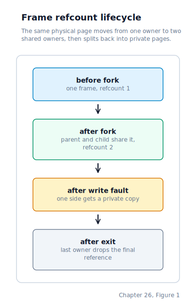
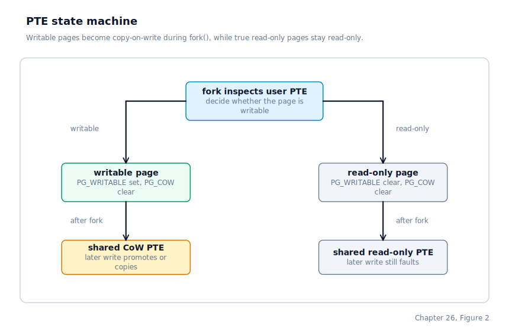

\newpage

## Chapter 26 — Copy-on-Write Fork

### Fork as a Copy That Usually Does Not Happen

Chapter 25 left us with a demand-paging fault handler that can commit heap and stack pages lazily. In the eager `fork()` model from Chapter 15, we paid the full cost of independence before either process proved it needed it. Every mapped user page in the parent was copied into a fresh physical frame for the child, even though the common Unix pattern is `fork(); exec();` — the child often throws away the copied address space almost immediately and replaces it with a new program image.

Copy-on-write changes that trade-off. Instead of copying pages at fork time, we share them first and delay the expensive part until the first write. Parent and child leave `fork()` with the same virtual addresses pointing at the same physical frames. The pages are made read-only and tagged as copy-on-write. A later write fault is what forces the split.

Linux does exactly this for ordinary anonymous memory, and for the same reason: the cheap case should be the common case. A fork that only reads, or a fork followed quickly by `exec()`, should not allocate and copy megabytes of memory that no process will ever mutate.

### Shared Pages Need a Real Ownership Count

Think of it like a library book with multiple holds. The book stays out as long as at least one patron still has a claim on it. Only when the last hold is released does it go back on the shelf. The moment two page tables point at the same physical frame, the old bitmap-only physical allocator stops being sufficient. A single bit can answer "is this frame free?", but it cannot answer "how many live mappings still refer to it?" That question matters in three places now:

- when `fork()` shares a frame into a child,
- when a copy-on-write write fault stops using the old shared frame, and
- when a process exits and tears down its page tables.

The physical memory manager therefore grows a second array beside the bitmap:

| Structure | Granularity | Meaning |
|-----------|-------------|---------|
| `bitmap[]` | 1 bit per page | whether the page is currently allocatable |
| `refcount[]` | 1 byte per page | how many live references still point at the page |

Allocating a frame now does two things at once: it marks the bitmap entry used and sets the new frame's reference count to 1. Later increments and decrements adjust that count. A frame becomes free again only when the count reaches zero, at which point the bitmap bit is cleared too.

The count saturates at 255. That value is also used to pin pages the kernel must never free through normal teardown, such as the kernel image, the identity-mapped page directory and page tables, the low-memory reserved range, and the kernel heap region. In other words, the refcount array is not only about sharing user pages. It also gives the kernel a way to say, "this page is permanently reserved; do not recycle it through the normal user-memory path."

The process teardown path from Phase 0 now leans on the same mechanism. Releasing a process's user address space drops one reference to each user frame rather than unconditionally freeing it, so a shared frame is not released prematurely and a private frame becomes free immediately.

### `fork()` Now Clones Page Tables, Not User Frames

The shape of the fork-time address-space clone changes completely. It still allocates a fresh page directory for the child, and it still allocates fresh page tables for any PDE that contains user mappings. What it no longer does is allocate a fresh 4 KB frame for every user PTE.

The new algorithm is:

1. Allocate a new child page directory.
2. Walk every present PDE in the parent.
3. If the page table contains no user PTEs, keep sharing that kernel-only page table exactly as before.
4. If the page table does contain user mappings, allocate a fresh child page table and copy the parent's page table entries into it.
5. For each present user PTE:
   - if the PTE is writable, clear `PG_WRITABLE` and set `PG_COW` in the parent,
   - copy the resulting PTE into the child page table,
   - increment the physical frame's reference count.

Kernel entries inside mixed page-table pages are preserved verbatim. The loop therefore checks the user-accessible permission bit on each PTE rather than assuming an entire top-level directory entry is user-owned.

The result is that the parent and child get:

- separate page directories,
- separate user page tables,
- the same user *frames* underneath those page tables.

The page tables are private because each process will later update its own PTEs independently. The frames are shared because no physical copy is needed until one of the processes writes.

### What the Shared Mappings Look Like

The writable-to-copy-on-write transition is encoded entirely in the PTE flags. Before `fork()`, an anonymous heap page in the parent looks like an ordinary user-writable mapping:

| Flag | Value |
|------|-------|
| `PG_PRESENT` | 1 |
| `PG_USER` | 1 |
| `PG_WRITABLE` | 1 |
| `PG_COW` | 0 |

After `fork()`, the parent's PTE is rewritten to:

| Flag | Value |
|------|-------|
| `PG_PRESENT` | 1 |
| `PG_USER` | 1 |
| `PG_WRITABLE` | 0 |
| `PG_COW` | 1 |

The child receives the same PTE bits. Both page tables now point at the same physical frame, and the physical memory manager's count for that frame is 2.

Read-only pages follow a slightly different path. If a user PTE was already non-writable before `fork()` — for example, a code page or true read-only data — the kernel leaves `PG_COW` clear and simply shares the same frame into the child while incrementing the physical reference count. That means one rule remains intact: writing to a genuinely read-only page still produces SIGSEGV rather than copy-on-write promotion. The presence or absence of `PG_COW` is our explicit promise about whether a write fault is recoverable.

> **Note:** The read-only marker is the inverse of the writable bit in an x86 PTE, and the AP bits — the access-permission field in an AArch64 page-table entry that gates read/write/execute access for EL0 and EL1 — in an AArch64 PTE. TLB invalidation after rewriting a PTE uses `invlpg` on x86 and `TLBI` (TLB Invalidate, introduced in Chapter 8) on AArch64; the mechanism differs but the purpose is identical: ensure the CPU's cached translation reflects the new permission before the faulting instruction retries.

*On AArch64 (planned, milestone 3): CoW fork is enabled once the AArch64 MMU bring-up lands.*

### The First Write Splits the Shared Frame

Once parent and child return from `fork()`, reads are cheap. Both page tables translate the same virtual page to the same physical frame, and a plain load works without any involvement from the kernel. The deferred cost appears only when one process writes.

Suppose the parent writes to a shared heap page first:

1. The CPU performs the page walk, finds a present PTE, sees that the write bit is clear, and raises a page-fault exception indicating a present-page write from user mode.
2. The fault handler inspects the live PTE and sees `PG_COW` set.
3. The handler reads the physical frame's reference count.

From there, two cases are possible.

**Case 1: the refcount is greater than 1.**  
This means some other mapping still points at the same frame. The handler allocates a new 4 KB physical page, copies the old frame into it, rewrites the faulting process's PTE to point at the new frame with `PG_WRITABLE` set and `PG_COW` clear, invalidates the TLB entry, and decrements the old frame's refcount.

The other process keeps pointing at the original frame. The faulting process now has a private writable copy. Both are correct, and neither saw the copy until the write demanded it.

**Case 2: the refcount is 1.**  
This means the faulting process already owns the last reference to the old frame. Perhaps the sibling process exited and tore down its page tables first. In that case, there is nothing left to copy. The handler simply flips the PTE back to writable in place by clearing `PG_COW` and setting `PG_WRITABLE`, invalidates the TLB entry, and resumes.

This is the quiet second half of copy-on-write and the reason the refcount matters so much. A write fault does not always imply an actual data copy. Sometimes it only means, "the page used to be shared, but it is private now, so make the PTE match reality again."

### Out-of-Memory and Partial Failure Paths

Two failure paths become important once `fork()` stops being a monolithic memcpy loop.

The first is **partial failure during the clone itself**. The clone uses a two-pass strategy so that an OOM is trivially rolled back. Pass 1 allocates every child page table the clone will need without touching any parent PTEs. If any allocation fails, the kernel frees the child page tables allocated so far plus the child page directory and returns failure — the parent's address space is completely unmodified. Only after every allocation succeeds does Pass 2 apply CoW flags to the parent and child PTEs and bump frame refcounts. Because Pass 2 cannot fail, the clone either completes fully or never begins modifying shared state.

The second is **out-of-memory during a later CoW write fault**. That case is handled in Chapter 25's fault path: if the fault handler cannot allocate a private replacement frame, it returns failure and the process falls through to SIGSEGV. The rest of the system remains consistent because the original shared frame and original PTE are left untouched.

Both failure paths follow the same design rule: either the fork or the write fault completes all the way to a consistent new mapping, or we leave the old state in place and report failure to the process.

### Reclaiming Shared Pages on Exit

Copy-on-write only stays safe if every path that drops an address space also drops its references to shared frames.

That is why Phase 0 landed first. A process still becomes `PROC_ZOMBIE` before it is fully reaped, because it is still executing on its own kernel stack at the moment it exits. The real cleanup happens later when a waiting parent observes the zombie state and reaps it. At that point the kernel:

1. reads the encoded exit status,
2. drops the user-space frame references,
3. frees the kernel stack, and
4. returns the process-table slot to `PROC_UNUSED`.

The crucial interaction with copy-on-write is that exit no longer "frees" a shared frame in the old absolute sense. It drops one reference. If the sibling process still points at the frame, the reference count remains non-zero and the frame stays live. If the exiting process was the last owner, the count reaches zero and the physical memory manager puts the frame back on the free list.

### How the Common Unix Case Gets Cheaper

The classic shell pattern is:

1. the shell calls `fork()`,
2. the child rearranges file descriptors if needed,
3. the child calls `exec()`.

Under the eager model, step 1 copied the shell's full address space even though step 3 was about to discard it. Under copy-on-write, step 1 mostly allocates page-table pages and increments refcounts. The expensive 4 KB data copy moves to the uncommon case where either side actually writes into a shared page before the child calls `exec()`.

That does not make `fork()` free. We still allocate a new page directory, new user page tables, and a new kernel stack for the child. We still copy the saved syscall frame so that the parent and child can return with different return values. But the cost now scales with the number of page tables that contain user mappings, not with the number of user frames those tables point at.

For real workloads, that is the right asymmetry. A process can reserve a large heap, read from it, fork, and continue almost immediately. Only the pages that either side later dirties will be copied.

### Where the Machine Is by the End of Chapter 26

`fork()` no longer deep-copies every user frame up front. It allocates a new page directory and private user page tables for the child, rewrites writable shared pages as read-only copy-on-write mappings in both address spaces, and increments the physical frame's reference count. Read-only user pages are also shared, but they remain genuinely read-only rather than becoming copy-on-write.

The physical memory manager now tracks frame ownership explicitly with a refcount array, so shared frames survive until the last mapping drops them. A write fault against a copy-on-write mapping either promotes the page in place when the refcount has already fallen to 1 or allocates a private replacement frame and copies 4 KB of data when the page is still shared. Process exit, heap shrink, and fork failure cleanup all use the same reference-counted release path, which means the memory subsystem now has a consistent answer to the question "who still owns this frame?"

With fork now deferred and memory shared until write-time, the kernel is ready to wire up the remaining devices — starting with the mouse, which will bring the desktop to life.
