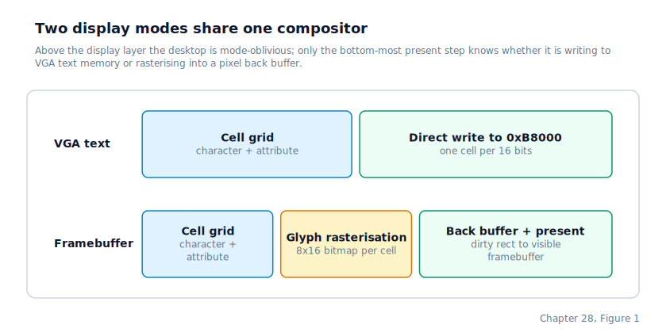
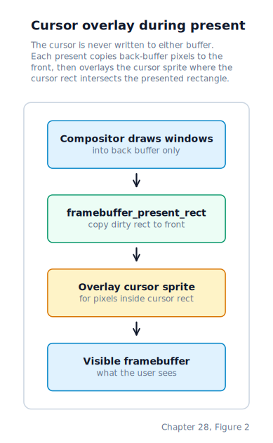
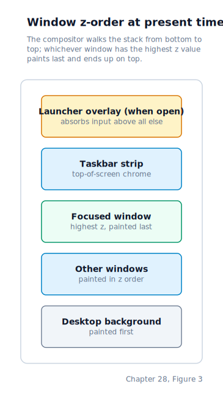

\newpage

## Chapter 28 — Desktop

### From a Pointer Event to a Windowed Display

Chapter 27 left us with a global pointer position, motion-coalesced IRQ dispatch, and a single callback — `desktop_handle_pointer` — whose implementation was a stub. This chapter builds that implementation: a compositor that paints a windowed desktop, routes pointer and keyboard events to the right surface, and gives the shell a terminal window to live inside. By the end of the chapter the machine no longer looks like a kernel hiding behind a command prompt; it looks like a graphical operating system whose shell happens to be one of its apps.

The compositor has to run on two very different displays. On bare **VGA text mode** — 80 columns by 25 rows of character cells, where each cell is a one-byte ASCII code plus a one-byte attribute — the desktop degrades into a text-mode imitation with cell-level chrome and no cursor sprite. On a **VESA framebuffer mode** — a linear region of raw pixel data along with width, height, pitch, and channel layout — it is a real composited UI with a back buffer, a cursor sprite, and per-pixel draw primitives. The same compositor code path supports both; only the bottom-most "present" step knows the difference.

### Two Display Modes

A multiboot-compliant bootloader hands us a description of the video state the firmware left the machine in. If that description contains a linear VESA framebuffer — a contiguous physical region of raw pixel data, along with its width, height, pixel pitch (bytes per scanline) and colour-channel layout — and the firmware chose a mode whose dimensions fit our reserved back-buffer region, we use it. Otherwise we fall back to the legacy VGA text buffer at physical address `0xb8000`, where each 16-bit cell holds an ASCII byte and an attribute byte.

The two paths diverge only at the bottom of the stack. Both route through the same `gui_display_t` grid of character cells: the VGA path writes each cell directly into video memory; the framebuffer path rasterises each cell into an 8×16 pixel glyph and composites the result into a pixel back buffer. Everything above the display layer — the compositor, the window manager, the event router, the mini-apps — is mode-oblivious.



### The Framebuffer Abstraction

A VESA framebuffer is more variable than it looks. Width, height, and bits-per-pixel are the obvious parameters, but each also has a **pitch** — the byte stride between scanlines, which may be larger than `width × bytes-per-pixel` for alignment reasons — and a **channel layout** describing how red, green, and blue are packed into each pixel word. The driver stores all of it in a single struct populated from the multiboot hand-off:

```c
typedef struct framebuffer_info {
    uintptr_t address;
    uint32_t pitch;
    uint32_t width, height, bpp;
    uint8_t red_pos, red_size;
    uint8_t green_pos, green_size;
    uint8_t blue_pos, blue_size;
    uint32_t cell_cols, cell_rows;
    uintptr_t back_address;
    uint32_t back_pitch;
    framebuffer_cursor_t cursor;
} framebuffer_info_t;
```

Whenever the compositor asks for a colour — say, the window title bar's blue — the request runs through `framebuffer_pack_rgb()`, which shifts each component into its native position and width. The same colour constant produces a different 32-bit pixel word on different firmware configurations, without any code outside the framebuffer layer needing to know.

### The Back Buffer and Tear-Free Presents

Drawing directly into the visible framebuffer is tempting but visually broken. Every intermediate state — clear, fill, draw text, draw cursor — is briefly on screen, which appears as flicker or tearing. The cure is the classic **back buffer**: a second pixel region, the same dimensions as the visible buffer, that every draw operation writes into. The back buffer is invisible to the display hardware. Only after a complete frame is drawn do we copy dirty regions onto the visible framebuffer.

Our back buffer is a statically reserved `.bss` array sized for a 1024×768 32-bit display. `framebuffer_attach_back_buffer()` points the framebuffer info at it at boot. If the firmware gave us a larger framebuffer than we reserved space for, the attach fails and the compositor falls back to drawing directly into the visible buffer — correct, but with the flicker we were trying to avoid.

Rather than flush the whole buffer every frame, the compositor computes a **dirty rectangle** — the bounding box of whatever changed — and calls `framebuffer_present_rect()` to copy only that region. The desktop's structure makes this cheap: most frames only re-composite the cursor rect and maybe one window.

### A Cell Grid on Top of Pixels

Underneath the pixel primitives sits a simpler abstraction: a two-dimensional grid of character cells, each holding one ASCII byte and one attribute byte — the same layout VGA text mode uses natively.

```c
typedef struct {
    uint8_t character;
    uint8_t attribute;
} gui_cell_t;
```

Why keep the cell abstraction once we have per-pixel drawing? Because it lets the same higher-level code — window frames, taskbar labels, mini-app text — work in both modes. Writing a line of text into the cell grid is identical whether it will ultimately land in VGA memory or be rasterised into pixels. `gui_display_present_to_vga()` copies the grid to `0xb8000` in one shot. `gui_display_present_to_framebuffer()` walks the grid, calls `framebuffer_draw_glyph()` for each cell, and paints the result into the back buffer.

### Font Rasterisation

A glyph is an 8×16 pixel bitmap: a 16-byte table, one byte per row, where each bit selects foreground or background for one pixel. The font covers printable ASCII plus a handful of line-drawing characters used by window borders and the taskbar. `framebuffer_draw_glyph()` walks the bitmap, picks the foreground or background colour per bit, and writes one 32-bit pixel per iteration.

There is no anti-aliasing here. The font is deliberately bitmap-exact — the same pixel pattern you would have seen on a 1980s text terminal — to keep the draw loop small and deterministic.

### The Cursor as an Overlay

The mouse cursor is a special case. It is the only element that moves without anything else changing, and it is also the element most sensitive to redraw latency. If the cursor were drawn into the back buffer, moving it by one pixel would require us to repaint whatever window content sat under the old position and then redraw the cursor in the new one — a surprising amount of work for a pointer twitch.

Instead, the cursor is never written to either buffer. It lives as an **overlay sprite** composited on top of each presented rectangle:



`framebuffer_present_rect()` walks the source rectangle in the back buffer, copies pixels to the visible framebuffer, and — for any pixel inside the cursor's current bounding rect — overlays the cursor sprite instead of the back-buffer pixel. Moving the cursor by one pixel requires only two presents: one on the old cursor rect (which reveals whatever was under it in the back buffer) and one on the new cursor rect (which replaces the freshly-copied back-buffer pixels with the sprite). No window has to redraw.

### Windows, Z-Order, and Focus

The compositor manages up to four **mini-app windows** plus a **taskbar** strip at the top of the screen and a **launcher** overlay that opens when the user hits Escape. Z-order ensures the most recent window appears on top; focus routing ensures your keystrokes go to the window you're looking at, not a window hidden behind. Every window has:

- a pixel rectangle that defines its position and size,
- a character-cell content rectangle inside that pixel rectangle, after trimming for the one-cell title bar and one-cell border,
- a z-order index that decides which window paints on top when two rectangles overlap, and
- a focus flag that decides which window receives keyboard events.

Opening a new window assigns it the next free id, bumps the global `next_z` counter so the new window paints above all others, and sets it as focused. Closing a window clears the slot and, if the window was focused, shifts focus to whichever remaining window has the highest z-order.



Drag-to-move is driven by pressing the left button on a title bar. The compositor remembers the dragged window's id, the cursor offset inside the title bar, and updates the window's pixel rect on every motion event until the button is released.

### Event Routing

Every pointer event enters through `desktop_handle_pointer()`. The compositor hit-tests the pixel coordinates against, in priority order: the launcher overlay (if open), the taskbar, each window's title bar (top-down by z-order), each window's content area. The first rectangle that matches receives the event. A click that falls outside everything dismisses the launcher if it was open and otherwise does nothing.

Keyboard events enter through `desktop_handle_key()`. The compositor routes them to whichever surface currently holds focus. The launcher — when open — absorbs arrow keys and Enter for menu navigation. A focused mini-app window calls into its app's own key handler. A focused shell window forwards the key to the shell process via the same ring-buffer path the keyboard driver from Chapter 10 already uses, so that the shell's next `SYS_READ` returns it as if it had been typed in raw text mode.

The key handler returns one of two results — forward or consumed — telling the caller whether the keystroke should continue through to other consumers. That matters because some keys (Escape, Alt, Tab) are policy keys the desktop wants to claim before anything else sees them.

### Mini-Apps

A mini-app is a small read-only view that renders into a window. Each app owns a fixed-size view buffer (up to 32 lines of 64 characters each), a selection index for menu-style apps, and a scroll offset. We ship four built-in apps:

- **Files** browses the VFS tree rooted at `/`. Arrow keys change the selection; Enter descends into a directory.
- **Processes** lists live processes from `/proc`, refreshed lazily on open.
- **Help** shows a static text page describing the desktop's keybindings.
- **Shell** is special: instead of a static view it hosts a full terminal emulator that mirrors the shell process's output stream.

An app's key handler can close its window by returning a "close" result, which the compositor translates into a `desktop_close_window()` call.

### The Shell Window and Process Ownership

The shell window is the first window the desktop opens, before the user has done anything. It hosts a full ANSI-aware terminal emulator with a 500-line scrollback buffer, colour-attribute state, and line-wrap handling.

The terminal is wired to a real user-space process through two fields on the desktop state: `shell_pid` and `shell_pgid`. The kernel's `SYS_WRITE` implementation, when called on stdout from a process whose pid-group matches `shell_pgid`, routes the bytes through `desktop_write_console_output()` — which feeds them into the terminal's input path. The reverse direction is already covered by Chapter 10: a keystroke that reaches the focused shell window lands in the kernel's input ring buffer, where the shell's next `SYS_READ` finds it.

Binding ownership to both pid and pgid matters when the shell forks a pipeline. A pipe such as `writer | reader` creates two processes in one foreground process group, and the compositor accepts output from either of them — but rejects writes from an unrelated process. That keeps one app's output from accidentally landing in another app's terminal.

### The Critical Section During Present

Framebuffer presents happen in the kernel's top half, while mouse and keyboard IRQs fire in the bottom half. Without coordination, a mouse IRQ could arrive mid-present and mutate window state — change the focused window, start a drag — while the compositor is in the middle of walking the window list. A keyboard IRQ could enqueue a character into a terminal the compositor is currently rasterising.

The simplest cure, and the one we use, is to bracket the present with `cli`/`sti`: disable interrupts across the copy from back buffer to front, re-enable them when the present completes. Only the compositor can modify window state and the framebuffer, so we protect just that operation rather than adding locks everywhere an IRQ might land. Because the present only touches pixel memory and never blocks, the critical section is short enough that even the PIT's 100 Hz timer does not notice. The compositor never holds locks outside this one window, and no kernel code path waits on the compositor, so nothing else has to coordinate with it.

### Startup

Putting it all together, the desktop comes up in four steps near the end of `start_kernel`:

1. **Choose a display mode.** If the multiboot handoff contained a framebuffer and it fits the reserved back-buffer region, use it; otherwise fall back to VGA text.
2. **Initialise the cell grid and the compositor state.** This wires the display to the desktop, sets up the taskbar and shell-window rectangles, and clears the window table.
3. **Attach a presentation target.** For VGA, point the compositor at physical address `0xb8000`. For framebuffer, attach the off-screen back buffer with `framebuffer_attach_back_buffer()`. From this point on, every draw writes into the back buffer, not the visible framebuffer.
4. **Open the shell window, render once, then create the shell process** and call `desktop_attach_shell_process()` to bind its pid and pgid to the shell window. The first real frame shows the desktop with an empty terminal; the next frame, triggered by the shell writing its prompt, shows the prompt.

### Where the Machine Is by the End of Chapter 28

The machine now presents a real windowed desktop. Framebuffer modes composite through an off-screen back buffer and flush dirty rectangles, with the cursor overlaid at present time so pointer motion is cheap. VGA text mode still works as a fallback. The shell runs inside a terminal window whose input comes from the keyboard ring buffer and whose output comes from the shell process's stdout, filtered by pid-group ownership. Mouse events reach windows through hit-testing; keyboard events reach the focused surface. Four mini-apps — Files, Processes, Help, and the shell terminal — give the user something to click on. With all of that built, the next part can turn to development work on top of the running system: debugging it when it misbehaves, and widening the userland language support.
