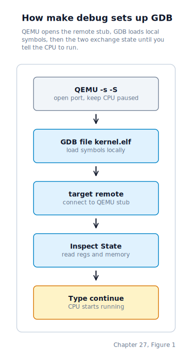
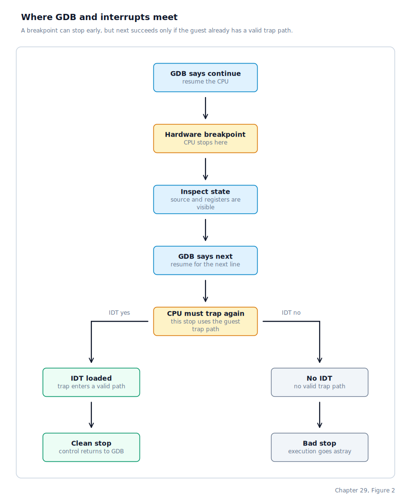

\newpage

## Chapter 29 — Debugging

### Why Kernel Debugging Feels Different

Chapter 28 brought up a windowed desktop on top of everything the previous chapters built. With that final piece in place, the machine is a small but complete operating system — and a complete operating system is something that will eventually misbehave. Throughout all of the work in the previous chapters, debugging the kernel required a different mindset from debugging a user program. A user program is comfortable to debug because the operating system is already alive around it — the debugger can stop the process, inspect registers, read memory, and resume execution while the kernel keeps the rest of the machine stable. Kernel debugging removes that safety net. When the kernel itself is the thing being debugged, there is no deeper layer to catch mistakes. A bad stack pointer, an invalid descriptor-table entry, or an interrupt delivered too early can tear control away from the debugger and leave the CPU executing nonsense.

That is why early-boot debugging is mostly about establishing a valid exception path before doing anything ambitious. The debugger does not only need symbols. It needs the target CPU to be able to enter a trap handler and return from it cleanly.

### What Happens When GDB Attaches

GDB does not talk to the kernel directly. It talks to QEMU's built-in remote stub. The `make debug` target starts QEMU with `-s -S`. `-s` opens the GDB remote port on `localhost:1234`. `-S` starts the virtual CPU paused, before the guest executes any further instructions.

GDB is then started with a short command script. `file kernel.elf` loads symbols into GDB itself; that step is local and does not send the binary into the guest. It simply tells GDB how to decode addresses as kernel functions, source lines, and variables. Next, `target remote localhost:1234` connects GDB to QEMU's remote stub. From then on, GDB can ask QEMU for register contents, read guest memory, and send control commands such as "resume", "single-step", or "insert breakpoint".

At this stage the guest is still paused. Attaching does not automatically run the kernel. That is why the Makefile ends with an explicit `continue`. Up to that moment, the kernel does not need to do anything special. No exception has to be delivered inside the guest, no IDT entry has to run, and no interrupt handler has to exist yet. The CPU is simply being held still from the outside while GDB learns how to interpret the machine state.

### What Happens When a Breakpoint Hits

When execution reaches a breakpoint, the machine stops and control goes back to GDB. A hardware breakpoint can do this very early in boot because the stop is arranged by the debugger and the CPU's debug hardware, not by an ordinary device IRQ such as the timer or keyboard. That is why `hbreak start_kernel` can stop at the entry to the function even when almost nothing is initialized yet.

That first stop is useful, but it does not mean the machine is ready for ordinary source-level stepping. Hitting one breakpoint and taking the *next* stop are two different problems. The first stop only proves that the debugger could halt the CPU. The next stop depends on whether the guest itself can take an exception and get back out of it cleanly.

The boot path now separates interrupt setup into two distinct phases:

1. `gdt_init()` installs the kernel's final **GDT** (Global Descriptor Table) and **TSS** (Task State Segment).
2. `idt_init_early()` builds the **IDT** (Interrupt Descriptor Table) and loads it with `lidt`.
3. The kernel registers IRQ handlers and initializes early devices.
4. `interrupts_enable()` remaps the PIC, programs the PIT, and executes `sti`.

That split exists for debugging as much as for correctness. `lidt` is enough to tell the CPU where exception and trap handlers live. `sti` is the later step that allows real hardware devices to interrupt the kernel asynchronously. In debugger terms: GDB needs a valid exception path early, but it does not need timer ticks or keyboard IRQs to be enabled.

### What Happens When You Type `next`

When GDB says `next` or `step`, it is not performing magic from outside the machine. It resumes the target and arranges for execution to stop again after a small amount of code has run. On x86 that usually means a trap or temporary breakpoint exception of some kind will be delivered back through the CPU's normal exception machinery.

This is the moment where interrupts and debugging meet. GDB asks the machine to run. The CPU runs guest code. Then the CPU needs to stop again by taking a trap. That trap is not a special debugger-only side channel inside the guest; it still enters through the same kind of exception-routing machinery the kernel uses for faults and software traps. If the kernel has not loaded its own IDT yet, there is no valid kernel-owned destination for that exception. The debugger may show a clean stop at the current instruction because QEMU's remote stub can seize the CPU externally, but the *next* stop still depends on the target being able to take a trap correctly. If it cannot, execution may appear to jump into low memory, firmware code, or an unknown address instead of returning to the expected source line.

The practical consequence is simple: stopping at the opening brace of `start_kernel` is too early for reliable source-level stepping. Stopping at `idt_init_early`, or after it has returned, is usually early enough.

### A Practical Early-Boot GDB Workflow

Our Makefile starts QEMU paused under the GDB remote stub and sets a hardware breakpoint on `idt_init_early`. That choice is deliberate: it lands at the earliest point where source-level stepping is expected to work consistently.

The safe early workflow is:

1. Break at `idt_init_early`.
2. Continue until the breakpoint hits.
3. Step through `idt_init_early` or use `finish` to return to `start_kernel`.
4. Continue stepping normally once the IDT is live.

If you truly need to inspect the very first instructions of `start_kernel`, prefer hardware breakpoints plus `continue` over source-level `next` at the function entry. Before the IDT is loaded, GDB may be able to stop *at* a hardware breakpoint, but it cannot rely on the guest to deliver the trap needed for the *next* source-level stop.

### What `sti` Changes

Loading the IDT does not by itself make the machine fully interrupt-driven. Until `sti` executes, the CPU's interrupt flag is still clear, so external hardware IRQs remain blocked. That delay is important. The timer, keyboard, and disk should not be able to interrupt the kernel until their handlers, dispatch tables, and controller configuration are all ready. Exception delivery and debugger traps can be usable before this point; ordinary hardware interrupts should not be.

This is also why the kernel has two different debugging phases:

- Before `idt_init_early()`: safe stopping is limited; source-level stepping is fragile.
- After `idt_init_early()` but before `sti`: exception and debugger-trap handling are available, but device interrupts are still quiescent.
- After `interrupts_enable()`: the machine is in its normal asynchronous state; timer ticks, keyboard interrupts, and ATA IRQs may all arrive.

The middle phase is especially pleasant for debugging because the exception path is valid while the machine is still mostly deterministic.

### Logs Still Matter

A debugger is not the only source of truth. We deliberately keep several output paths alive because the most interesting failures are often the ones that make interactive stepping awkward.

- The visible console or framebuffer desktop shows the ordinary boot narrative.
- COM1 serial logging survives many failures that leave the screen stale.
- QEMU's debug console on port `0xE9` is even simpler and often remains usable when other output paths are compromised.

Logs survive kernel crashes because serial and QEMU debug-port writes bypass the console path — they go straight to the hardware port without routing through the VGA driver, the framebuffer compositor, or any kernel layer that might itself be broken.

For fatal kernel faults, the panic path writes directly to serial and debugcon rather than depending on the normal display code path. That is why a crash can still leave readable diagnostics behind even when the framebuffer or VGA screen looks frozen.

### Live Debugging and Post-Mortem Debugging

Not every bug is easiest to catch live. Early-boot ordering bugs, descriptor-table mistakes, and interrupt-path failures are best investigated with QEMU and GDB attached to a running kernel. User-process crashes later in the booted system are often easier to inspect after the fact from a core dump.

The two techniques complement each other:

- Live debugging answers "what is the kernel doing right now?"
- Core dumps answer "what state did this process die in?"

That distinction is why we have both a live GDB workflow and the ELF core-dump writer from Chapter 24. The debugger attached to QEMU is the tool for bringing the machine up. The core file is the tool for understanding why a process came down.

The process-memory forensics path now gives an explicit end-to-end check. Recall from Chapter 24 that `/proc/<pid>/vmstat`, `/proc/<pid>/fault`, and `/proc/<pid>/maps` are synthetic procfs views of a live process's memory state — `vmstat` holds compact totals, `fault` holds the current fault snapshot, and `maps` holds the detailed layout.

1. Inspect `/proc/<pid>/vmstat` for compact totals and `/proc/<pid>/fault` for the current fault snapshot (`State: none` before a crash).
2. Trigger a deliberate user crash (for example, `crash badptr`) to generate `core.<pid>`.
3. Extract the core file and inspect its notes.
4. Confirm the three `DRUNIX` text notes (`vmstat`, `fault`, and `maps`) match the same model-backed views from live procfs.

In other words, `/proc/<pid>/maps` remains the detailed live layout view, while `vmstat` and `fault` provide condensed status; after a crash, all three survive as text notes in the core file for post-mortem inspection.

### Where the Machine Is by the End of Chapter 29

Debugging the kernel is no longer just "attach GDB and hope". The boot sequence now exposes an explicit early-debugging boundary: once `idt_init_early()` has loaded the IDT, traps and exceptions have a valid entry path even though hardware interrupts are still disabled. The later `interrupts_enable()` step turns the machine from a mostly linear boot path into a fully asynchronous system. Alongside serial logs, debugcon output, and ELF core dumps with `DRUNIX` memory-forensics notes aligned to `/proc/<pid>/vmstat`, `/proc/<pid>/fault`, and `/proc/<pid>/maps`, that split gives the kernel both live and post-mortem debugging tools that are predictable enough to rely on.
