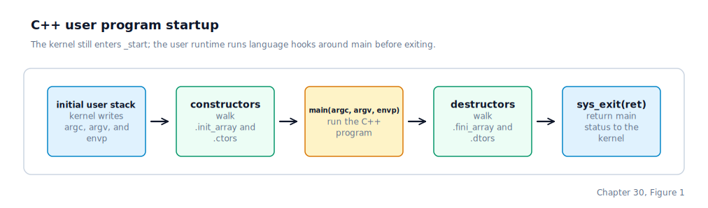
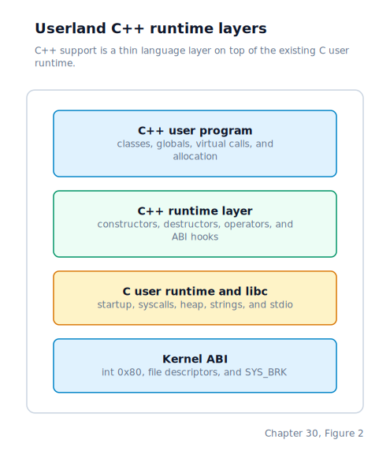

\newpage

## Chapter 30 — Userland C++ Support

### Why C++ Needs Runtime Help

Chapter 29 gave us a dependable way to inspect the machine when it misbehaves. That matters for this chapter because we are adding a language feature whose most important work happens before and after the code we usually look at. A C++ user program still enters through the same ring-3 path as a C program: the kernel loads an **ELF** (Executable and Linkable Format) binary, builds the initial stack, and returns to user mode at the executable's entry point. What changes is what has to happen around `main`.

C is almost completely satisfied by the startup path from Chapter 20. The startup stub receives `argc`, `argv`, and `envp`, stores the environment pointer, calls `main`, and exits with the returned status. C++ brings extra promises. Objects with static storage duration must be constructed before `main` begins. Their destructors should run after `main` returns. The `new` and `delete` operators need allocation hooks. Virtual dispatch needs a few **ABI** (Application Binary Interface, the binary contract between separately compiled pieces of code) symbols so that compiler-generated code has somewhere to land when a pure virtual call or finalisation hook appears.

That does not mean Drunix imports a hosted C++ environment. A hosted environment is what a normal desktop program gets from the operating system and standard libraries: `libstdc++`, `libsupc++`, exception unwinding, **RTTI** (Run-Time Type Information, the metadata C++ uses for `dynamic_cast` and `typeid`), locale support, iostreams, and a large amount of ABI glue. Drunix is still a freestanding system. We use the cross C++ compiler to produce object code, but the runtime surface that object code links against is owned by the repository and lives in `user/lib`.

### The Freestanding C++ Contract

The first C++ milestone was deliberately narrow: prove one C++ binary first, then move ordinary utilities over once the runtime behaved. The long-term contract is not "everything must become C++", though. Drunix keeps both runtime lanes first-class. User programs can be written in C or in a freestanding subset of C++ and built as ordinary **DUFS** (Drunix's native filesystem) binaries. The kernel remains C and assembly. The syscall ABI remains the same architecture-specific software-interrupt contract from Chapter 16. The process loader still sees an ELF executable with one entry point and a conventional user stack.

The supported subset covers the parts that are useful immediately:

- global constructors and destructors
- classes and virtual dispatch
- `new`, `delete`, `new[]`, and `delete[]`
- calls into the existing C user runtime and libc

Several features are intentionally outside the contract:

- exceptions
- RTTI
- `libstdc++`
- `libsupc++`
- thread-safe local statics

Those exclusions are not just philosophical. Exceptions require unwind tables, personality routines, catch-frame state, and a story for failure while unwinding. RTTI pulls in compiler ABI metadata that is only useful once the runtime has committed to supporting it. Thread-safe local statics require guard variables and locking rules. Each can be added later, but none belongs in the first slice because none is needed to prove that C++ objects, allocation, and virtual calls can run as ring-3 Drunix code.

### Startup Grows Around `main`

Recall from Chapter 20 that `_start` is the user runtime's entry stub — the first code to run in ring 3 after the kernel hands control to a new process, responsible for setting up `argc`, `argv`, and `envp` before calling `main`. The `_start` symbol is still the only entry point the kernel knows about. The ELF loader does not care whether the source file was C or C++; it reads the entry address from the ELF header and starts the process there. That is why C++ support belongs in the user runtime rather than in the kernel.

The startup stub now does a little more choreography. It pops `argc`, `argv`, and `envp` from the kernel-built stack, stores `envp` in the global `environ` pointer, and then runs the constructor lists before calling `main`. After `main` returns, it preserves the return value, runs the destructor lists, and passes the original return value to `sys_exit`.

The important design point is that constructors and destructors are attached to the executable, not discovered dynamically. The compiler emits pointers to startup functions into special ELF sections. A section is a named region inside an object file or executable; earlier chapters used sections for text, read-only data, initialized data, and **BSS** (Block Started by Symbol, the zero-filled uninitialised data section). C++ adds section families whose contents are arrays of function pointers:

- `.init_array` contains constructors that should run before `main`.
- `.ctors` is the older constructor section name used by some toolchains.
- `.fini_array` contains destructors that should run after `main`.
- `.dtors` is the older destructor section name.

The user linker script gathers those sections into contiguous ranges and defines start and end symbols around each range. The runtime code does not need to parse ELF at execution time. It only walks from start to end and calls each function pointer. Constructors run forward; destructors run in reverse so teardown mirrors setup.

Supporting both `.init_array` and `.ctors`, and both `.fini_array` and `.dtors`, makes the runtime tolerant of small toolchain differences. The current cross compiler may emit the older section names for this freestanding configuration, while newer configurations often prefer the array names. The linker script gives both shapes a stable home.

### The Runtime Layers

C++ support sits on top of the C user runtime rather than beside it. The same syscall wrappers, heap allocator, string helpers, and `printf` implementation remain the foundation. The C++ runtime adds only the symbols the compiler and C++ language rules need.

The bottom layer is still the kernel ABI: the architecture-specific syscall instruction, file descriptors, `SYS_BRK`, and the same process model every user program uses. Above that sits the C runtime from Chapters 20 and 21: `_start`, syscall wrappers, `malloc`, `free`, `stdio`, strings, and POSIX-style adapters. C programs link this layer directly. The C++ support layer is additive by comparison: constructor and destructor runners, allocation operators, and ABI hooks. C++ programs such as `cpphello`, `cat`, `grep`, and `sort` link the C runtime plus that C++ layer into single static executables.

This layering keeps C programs boring. The shell and `chello` link through the C path. The converted utilities link through the C++ path and include the C++ runtime objects explicitly. Empty constructor and destructor ranges are no-ops for programs that do not define global C++ objects, so the extra startup hooks do not change the C calling convention, the process stack, or the syscall path.

### Allocation Without Exceptions

The C++ allocation operators delegate to the existing user heap. `operator new` and `operator new[]` call `malloc`; `operator delete` and `operator delete[]` call `free`. Sized delete variants are present too, because modern C++ compilers may emit them even when the program source never names them directly.

The unusual part is failure handling. Hosted C++ normally throws `std::bad_alloc` when allocation fails. Drunix does not support exceptions in this milestone, so there is no exception object to construct and no unwinder to run. A failed C++ allocation prints a short runtime error through the syscall layer and exits the process. That is blunt, but it is honest: in this environment a failed `new` cannot be recovered through the standard hosted C++ mechanism, and pretending otherwise would make failures harder to reason about.

Zero-byte allocations are normalised to one byte before calling `malloc`. That keeps `new T[0]`-style compiler output away from ambiguous zero-size allocator behaviour and gives callers a non-null pointer when the allocation succeeds.

### ABI Glue, Not a Standard Library

The ABI also covers symbol names, calling conventions, object layout, vtable shape, and special helper functions the compiler assumes will exist. For this milestone, Drunix implements only the ABI pieces that simple freestanding C++ output needs.

Virtual dispatch mostly comes from compiler-generated vtables inside the executable itself. A vtable is a table of function pointers associated with a C++ class that has virtual methods. Calling a virtual method loads the object's vtable pointer and jumps through the appropriate slot. No kernel help is involved. The runtime does provide `__cxa_pure_virtual`, the function the compiler calls if execution ever reaches a pure virtual method body. That path is always a program error, so Drunix reports it and exits.

The runtime also provides small finalisation hooks such as `__dso_handle`, `__cxa_atexit`, and `__cxa_finalize`. In a hosted system these interact with shared libraries and dynamic unloading. Drunix user programs are statically linked, so the hooks can be minimal. Destructors are already handled by the explicit `.fini_array` and `.dtors` walk in `_start`.

What this layer does not provide is just as important as what it does. There is no C++ standard library. A program can include Drunix C headers from C++ because the public C headers use `extern "C"` guards where needed, but there are no `<vector>`, `<string>`, iostreams, locales, or exception types. Keeping that boundary sharp prevents an accidental dependency on host libraries from sneaking into a disk image that cannot support them.

### The Build Makes Hosted Dependencies Visible

The user build has separate C and C++ compiler settings. C files still compile with `x86_64-elf-gcc`; C++ files compile with `x86_64-elf-g++`. Both use freestanding, no-standard-library flags. The C++ flags also disable exceptions, RTTI, thread-safe statics, and the usual `__cxa_atexit` destructor registration path.

Linking is explicit. C++ programs link the normal user runtime objects, the C++ runtime objects, the program object, and the compiler support library selected by the cross compiler. They do not link `libstdc++` or `libsupc++`. That distinction matters during review: the Makefile names the runtime objects that Drunix owns, so a hosted library dependency would stand out instead of being hidden behind the C++ compiler driver.

There are two smoke programs. `/bin/chello` is deliberately plain C; it proves that the C runtime path remains supported and does not need the C++ runtime objects. `/bin/cpphello` proves the C++ language boundary instead of trying to be a useful application: a global object updates state before `main`, a destructor writes a message after `main`, a derived class exercises virtual dispatch, and both scalar and array allocation go through `new` and `delete`.

The rest of the non-shell command set now builds as C++ too. Most of those utilities are intentionally still plain C-style code compiled as C++; that keeps the migration behaviour-preserving while proving that real packaged programs can include the C headers, compile through `x86_64-elf-g++`, link with the owned C++ runtime, and run beside C programs. The shell is left in the C lane because it is much larger and owns the highest-risk interactive behaviour.

### Where the Machine Is by the End of Chapter 30

Drunix can now run user programs written in either C or a small freestanding C++ subset. The kernel does not know or care which language produced the ELF binary; all language-specific work happens in the user runtime. `C_PROGS` and `CXX_PROGS` make the language lane explicit in the user build, with `chello` and the shell in the C lane and the utility set in the C++ lane.

The startup path runs global constructors before `main`, preserves the program's return value while destructors run afterward, and exits through the same syscall path as every other user process. The linker script gives constructor and destructor sections explicit boundaries, and the runtime walks those ranges without parsing ELF at runtime.

The C++ runtime remains intentionally small: allocation operators sit on top of `malloc` and `free`, minimal ABI hooks cover virtual-dispatch failure and finalisation symbols, and the build keeps hosted C++ libraries out of the link. The result is not "Linux C++ in miniature"; it is Drunix C++ on Drunix terms, with every supported feature backed by code we can inspect, debug, and extend.
